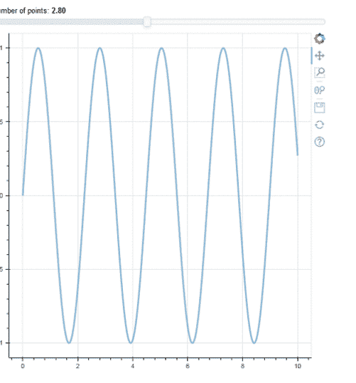

# 将交互式滑块添加到博克图

> 原文:[https://www . geesforgeks . org/add-interactive-slider-to-bokeh-plots/](https://www.geeksforgeeks.org/add-interactive-slider-to-bokeh-plots/)

**Bokeh** 是 Python 的交互式数据可视化库。它可用于创建交互式绘图、仪表板和数据应用程序。小部件只不过是附加的视觉元素，您可以将其添加到绘图中，以交互方式控制您的 Bokeh 文档。有各种类型的小部件，如按钮、div、微调器、滑块等。在本文中，我们将了解 bokeh 中的滑块小部件。

## 滑块部件

Bokeh 滑块可以配置开始和结束值、步长、初始值和标题。基本上，您需要从 bokeh.models 导入 Slider 小部件。

**语法:**

> 从 bokeh.models 导入 CustomJS，Slider

Slider()函数可用于创建滑块。

> **语法:**
> 
> 滑块(开始=0，结束=10，值=1，步长=.1，标题=“填充”)
> 
> **参数:**
> 
> *   **开始**:代表滑块开始值。
> *   **结束**:表示滑块结束值。
> *   **值:**表示滑块的当前值。
> *   **步**:表示滑块移动的间隔。
> *   **标题:**表示滑块小部件的标题。

现在使用当 on_change 事件发生时调用的 CustomJS 添加回调功能。

**语法:**

> js_on_change("value "，custom js(code = " "…)。"""))

**js_on_change** 是滑块 on_change 事件发生时调用的回调函数。而 customJS(code= " " " ")表示一旦事件发生就要执行的代码。现在使用 slider 对象调用回调函数，并创建一个您想要在浏览器上显示的所有元素的布局。

**示例:**使用 bokeh 创建滑块

## 计算机编程语言

```
from bokeh.layouts import column
from bokeh.models import ColumnDataSource, Slider, CustomJS
from bokeh.plotting import figure, output_file, show
import numpy as np

x = np.linspace(0, 10, 500)
y = np.sin(x)

source = ColumnDataSource(data=dict(x=x, y=y))

# Create plots and widgets
plot = figure()

plot.line('x', 'y', source=source, line_width=3, line_alpha=0.5)

# Create Slider object
slider = Slider(start=0, end=6, value=2,
                step=0.2, title='Number of points')

# Adding callback code
callback = CustomJS(args=dict(source=source, val=slider),
                    code="""
    const data = source.data;
    const freq = val.value;
    const x = data['x'];
    const y = data['y'];
   for (var i = 0; i < x.length; i++) {
        y[i] = Math.sin(freq*x[i]);
    }

    source.change.emit();
""")

slider.js_on_change('value', callback)

# Arrange plots and widgets in layouts
layout = column(slider, plot)

output_file('exam.html')

show(layout)
```

**输出:**

