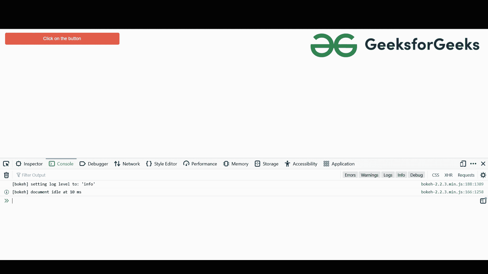
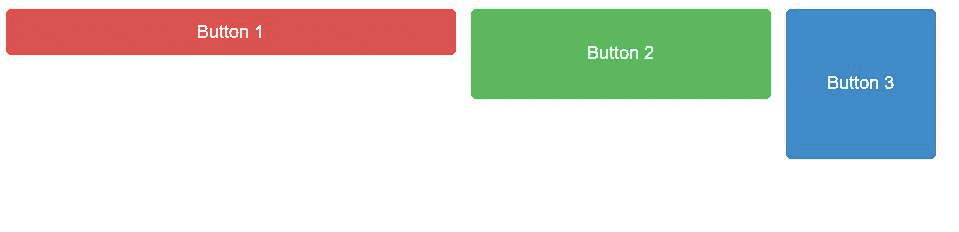

# 在 Bokeh 中添加按钮

> 原文:[https://www.geeksforgeeks.org/adding-button-in-bokeh/](https://www.geeksforgeeks.org/adding-button-in-bokeh/)

在本文中，我们将学习如何在 bokeh 中添加按钮。现在，Bokeh 为我们提供了各种各样的小部件，可以用于各种目的。其中之一就是巴顿。按钮是 bokeh.models 模块的一个小部件，帮助我们在 python 笔记本中创建一个按钮。让我们看一个例子，以便更好地理解这个概念。但是在此之前，如果您使用本地设备实现上述功能，那么请确保在设备中安装了 python，然后在命令提示符下运行这段代码，以便 bokeh 功能在代码编辑器中正常工作。

```py
pip install bokeh
```

安装完成后，让我们转到代码并学习实现。

**示例 1:在 Bokeh 中添加按钮:**

**进场:**

在下面的代码中，除了导入 show 和 button 之外，我们还在 python shell 中导入了另一个包，那就是 customJS。customJS 为用户提供了定制的行为，以响应特定事件的变化。这是一个在 bokeh 服务器应用程序中工作的 javascript 回调。在实现中，我们将使用 **js_on_click(处理程序)**，它为按钮点击设置了一个 javascript 处理程序。当点击创建的按钮时，它被激活，在其中，customJS 将被用作处理程序，消息将被打印在控制台中。

```py
js_on_click(handler)
```

**代码:**

## 蟒蛇 3

```py
# importing show from bokeh.io
# to show the button
from bokeh.io import show

# importing button and customJS package
# from bokeh.models
from bokeh.models import Button, CustomJS

# Creating a button variable where
# we are specifying the properties of the
# button such as label on the button and
# the button type(Different color)
button = Button(label = "Click on the button",
                button_type = "danger")

# js_on_click sets up a javascript handler
# for state changes and also when we 
# are clicking on the button. a message
# is printed on the console
button.js_on_click(CustomJS(code = "console.log('button: You have clicked on the button!')"))

# showing the above button
show(button)
```

**输出:**



**代码解释:**

现在，在代码中，在导入包并创建一个变量(按钮)之后，我们在其中指定按钮的不同属性，我们使用 js_on_click 处理程序，它用于按钮单击。因此，只要有人单击按钮，处理程序就会被触发，之后 customJS 回调会激活并在控制台中打印消息，可以通过鼠标右键使用“inspect element”来检查该消息。

现在，我们可以添加不同颜色的按钮，如**警告(黄色)**、**成功(黄色)**、**初级(蓝色)**等。

**示例 2:在 Bokeh 中添加多个按钮。**

让我们再举一个例子，我们将在图中添加多个按钮，按行和按列。在下面的代码中，我们正在从 **bokeh.layouts** 模块导入一个名为**行**的包，它帮助我们以行的方式显示按钮。

**代码:**

## 计算机编程语言

```py
# importing show from bokeh.io
from bokeh.io import show

# importing Button from bokeh.models
# module
from bokeh.models import Button

# importing row from bokeh.layouts module
# so that buttons can be shown side by side
from bokeh.layouts import row

# Creating a list of buttons with defining different properties
# in each of the buttons
buttons = [Button(label="Button 1", button_type="danger"),
            Button(label='Button 2', button_type='success', width=200, height=60),
                Button(label='Button 3', button_type='primary', width=100, height=100)]

# Showing all the buttons rowwise
show(row(buttons))
```

**输出:**



**代码解释:**

在上面的代码中，在导入所有必需的包之后，我们使用了可变按钮，这是一个由 3 个按钮组成的数组或列表，每个按钮都有不同的大小、颜色和标签。之后使用 **show(row(buttons))** ，e 以**【row-wise】**的方式显示所有按钮。

除此之外，我们还可以按列显示所有按钮。为此，我们需要从 **bokeh.layouts** 导入**列**包，我们需要写 show(列(按钮))，所有按钮将按列打印，而不是 show(行(按钮))。