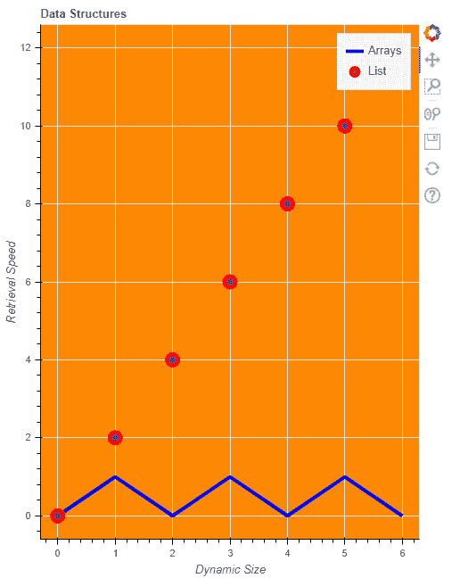
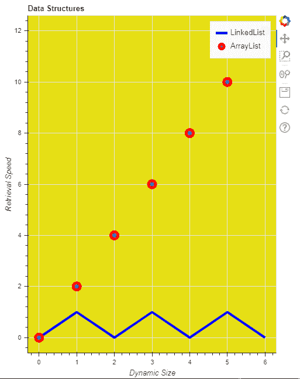

# 向博克图添加标签

> 原文:[https://www . geesforgeks . org/add-labels-to-a-bokeh-plot/](https://www.geeksforgeeks.org/adding-labels-to-a-bokeh-plot/)

Bokeh 包括几个布局选项，用于排列图和小部件。它们可以安排多个组件来创建交互式仪表板或数据应用程序。布局功能允许您构建一个由图和小部件组成的网格。您可以将任意多的行、列或网格图嵌套在一起。此外，Bokeh 布局支持多种“尺寸模式”。这些调整模式允许绘图和小部件根据浏览器窗口调整大小。

**向图中添加标签:**

我们可以给 x 轴、y 轴添加标签，给绘图添加图例标签和标题等等。标签只是一个文本，以完整的方式描述情节，它还描述了其中的各个部分。

**例 1:**

在本例中，我们将给出标题和 x 轴标签和 y 轴标签以及不同地块的标签。我们将给出 y 轴作为检索大小，x 轴作为动态大小。我们可以在 figure()方法中给出 x_axis_label 和 y_axis_label，我们还会给出 Arrays 和 List 这样的图例标签。这里我们的 currentList 包含从 0 到 6 的元素，列表 2 是 currentList 的每个元素除以 2，列表 3 是 currentList 的每个元素乘以 2。一个图是当前列表，列表 2，一个图是当前列表，列表 3。

下面是一个 python 程序，用于将标签添加到绘图中

## 蟒蛇 3

```py
# python program for adding label to pokeh plot
from bokeh.io import output_file, show
from bokeh.layouts import column
from bokeh.plotting import figure

# output will be in GFG.html
output_file("GFG.html")
currentList = list(range(7))

List2 = [i % 2 for i in currentList]
List3 = [i*2 for i in currentList]

f1 = figure(title="Data Structures",
            x_axis_label="Dynamic Size",
            y_axis_label="Retrieval Speed",
            plot_width=500,
            plot_height=650,
            background_fill_color="#fc8803")

f1.line(currentList,
        List2,
        line_width=4,
        line_color='blue',
        legend_label='Arrays')
f1.circle(currentList,
          List3, size=12,
          line_width=5,
          line_color='red',
          legend_label='List')

show(f1)
```

**输出:**



**例 2 :**

在本例中，我们将在 figure 方法之外给出 x 轴标签和 y 轴标签，或者您可以说我们将把它们的值作为属性给出，而不是作为方法参数给出。在这里，我们还将圆的图例标签命名为数组列表，将直线命名为链表，并更改了背景颜色。你也可以用自己的想法来定制它。这里我们的 currentList 包含从 0 到 6 的元素，列表 2 是 currentList 的每个元素除以 2，列表 3 是 currentList 的每个元素乘以 2。一个图是当前列表，列表 2，一个图是当前列表，列表 3。

下面是给 bokeh 图贴标签的代码。

## 蟒蛇 3

```py
# python program for giving label to plot
from bokeh.io import output_file, show
from bokeh.layouts import column
from bokeh.plotting import figure

# output will be in GFG.html
output_file("GFG.html")
currentList = list(range(7))

# creating two list from currentList
List2 = [i % 2 for i in currentList]
List3 = [i*2 for i in currentList]

# giving figure the basic attributes and labels
f1 = figure(title="Data Structures",
            plot_width=500,
            plot_height=650,
            background_fill_color="#e6df15")

f1.xaxis.axis_label = "Dynamic Size"
f1.yaxis.axis_label = "Retrieval Speed"

# giving legend labels and other attributes
f1.line(currentList,
        List2, line_width=4,
        line_color='blue',
        legend_label='LinkedList')

# giving legend labels and other attribute
f1.circle(currentList,
          List3,
          size=12,
          line_width=5,
          line_color='red',
          legend_label='ArrayList')

# showing plots
show(f1)
```

**输出:**

