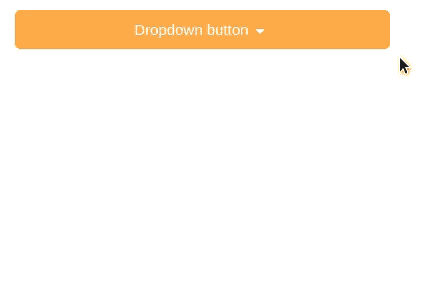
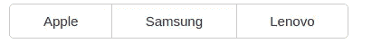
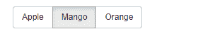
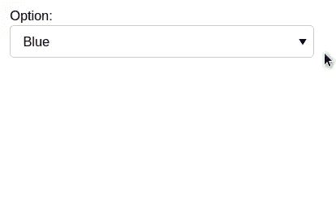

# Bokeh–添加小部件

> 原文:[https://www.geeksforgeeks.org/bokeh-adding-widgets/](https://www.geeksforgeeks.org/bokeh-adding-widgets/)

Bokeh 是一个 Python 数据可视化库，用于创建交互式图表和绘图。它帮助我们制作从简单的图表到仪表板的漂亮图形。使用这个库，我们可以在不编写任何脚本的情况下创建 javascript 生成的可视化。

### 什么是小部件？

小部件是交互式控件，我们可以与 bokeh 应用程序一起使用，使交互界面可视化。要使用小部件，我们可以将它们添加到文档中&定义它们的功能，或者我们可以将它们直接添加到文档根，添加到布局中。bokeh 中允许两种方式来定义回调功能的方法:

*   使用 CustomJS 回调进行交互，这在 HTML 文档中有效。
*   使用 bokeh 服务器和设置事件处理程序。on_change 或。点击。

这些事件处理程序是 python 中用户定义的函数，可以添加到小部件中，然后在小部件中采取某些操作或更改属性时调用。在向可视化添加小部件之前，我们需要从 bokeh 库中导入一些包，如:

*   **。io** 用于显示小部件&以制作输出文件。
*   **。小部件框的布局**将其中的所有小部件包装起来。
*   **.models.widgets** 所有类型交互小部件的基类。

而在下面的例子中，我们已经使用 **output_file()** 函数将结果存储到文件&中 **show()** 来显示浏览器中的小部件。

### 纽扣

它是一个可点击的按钮小部件，在构造函数中接受三个参数:

*   **标签:**字符串参数，用作按钮显示的文本标签或标题。
*   **图标:**可选参数，用于在按钮标题左侧显示图像。
*   **回调:**当发生某些变化(如按钮点击)时要调用的自定义 javascript 函数。

这里我们使用了 button_type 来指定主要颜色(蓝色)、警告(黄色)、成功(绿色)、危险(红色)。

## 蟒蛇 3

```
from bokeh.io import output_file, show
from bokeh.layouts import widgetbox
from bokeh.models.widgets import Button

output_file("button.html")

b1 = Button(label = "Back", button_type = "primary")

show(widgetbox(b1))
```

**输出:**


### 下拉菜单

这是一个选项列表，每个选项垂直包含一个菜单。当您单击其中一个选项时，主菜单下方会出现一个选项下拉列表。

**需要三个参数:**

*   **标签:**作为菜单标题显示的文本。
*   **按钮类型:**指定按钮类型。
*   **菜单:**指定菜单中可供选择的选项。

## 蟒蛇 3

```
from bokeh.io import output_file, show
from bokeh.layouts import widgetbox
from bokeh.models.widgets import Dropdown

output_file("dropdown_menu.html")

menu = [("Item 1", "item_1"), ("Item 2", "item_2"),
        ("Item 3", "item_3")]
dropdown_menu = Dropdown(label = "Dropdown button",
                         button_type = "warning",
                         menu = menu)

show(widgetbox(dropdown_menu))
```

**输出:**



### 复选框按钮组

通过这个小部件，我们可以一次选择多个选项。

**这里给出两个参数:**

*   **标签:**指定要选择的选项的名称。
*   **激活:**定义一次选择哪个选项(如第一个选项为 0，第二个选项为 1&等等)。

## 蟒蛇 3

```
from bokeh.io import output_file, show
from bokeh.layouts import widgetbox
from bokeh.models.widgets import CheckboxButtonGroup

output_file("checkbox_button.html")

cbg= CheckboxButtonGroup(
        labels=["Apple", "Samsung", "Lenovo"], active=[0, 1])

show(widgetbox(cbg))
```

**输出:**



### 单选按钮组

这个小部件允许一次最多选择一个按钮。

**参数:**

*   **标签:**定义选项名称。
*   **激活:**这里我们只能给出一个值，因为在单选按钮组中一次只能选择一个按钮。

## 蟒蛇 3

```
from bokeh.io import output_file, show
from bokeh.layouts import widgetbox
from bokeh.models.widgets import RadioButtonGroup

output_file("radio_button.html")

radio_button = RadioButtonGroup(
        labels = ["Apple", "Mango", "Orange"],
  active = 0)

show(widgetbox(radio_button))
```

**输出:**



### 挑选

它是一个单一选择小部件，允许从选项列表中选择一个值。

这里使用的参数是:

*   **标题:**指定选择小部件的标题。
*   **值:**用于指定从选项中选择哪个值。
*   **选项:**指定可用的选项。

## 蟒蛇 3

```
from bokeh.io import output_file, show
from bokeh.layouts import widgetbox
from bokeh.models.widgets import Select

output_file("single_select.html")

select = Select(title="Option:", value="Blue",
                options=["Red", "Yellow", "Blue", "Green"])

show(widgetbox(select))
```

**输出:**



### 滑块

滑块有参数，如开始或结束值、步长、初始值和标题。

*   **开始:**滑块应该从哪个值开始。
*   **结束:**滑块停止的结束值。
*   **值:**其中值滑块将停止。
*   **步长:**该参数指定步长值意味着值之间的跳跃。
*   **标题:**滑块停止的值的标题。

## 蟒蛇 3

```
from bokeh.io import output_file, show
from bokeh.layouts import widgetbox
from bokeh.models.widgets import Slider

output_file("slider.html")

slider = Slider(start = 0, end = 12,
                value = 5, step = .1,
                title = "Average")

show(widgetbox(slider))
```