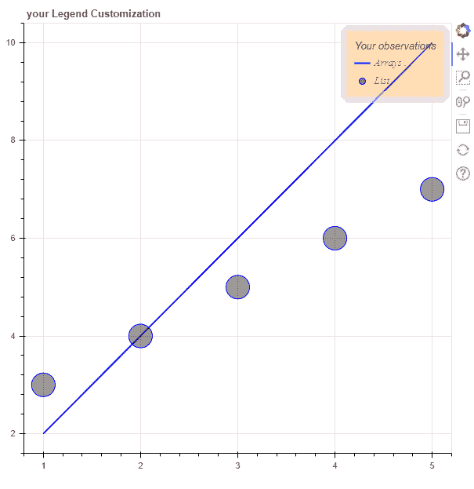
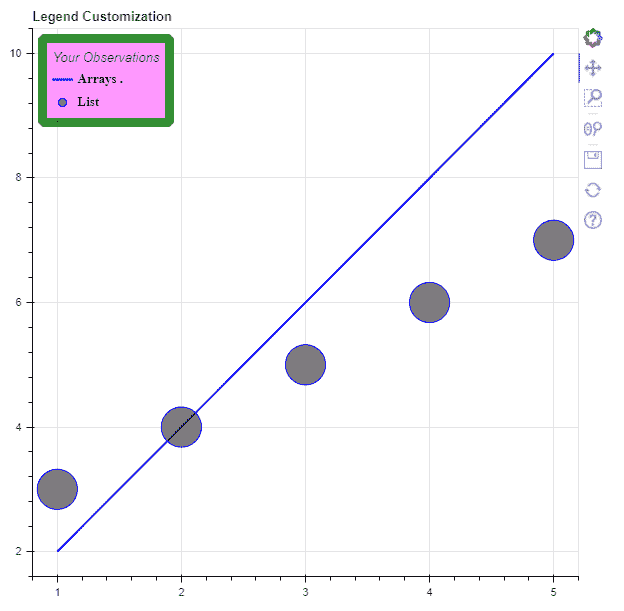
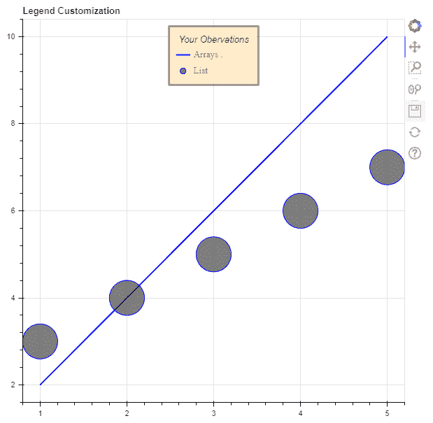

# 博克-定制图例

> 原文:[https://www.geeksforgeeks.org/bokeh-customising-legends/](https://www.geeksforgeeks.org/bokeh-customising-legends/)

图表的图例反映了图表 Y 轴中显示的数据。在博克，传说对应于字形。本文介绍了如何自定义 bokeh 剧情中出现的传说。

我们可以自定义图例的几个属性，如位置、颜色、线条颜色、字体大小、字体样式的线条宽度。我们可以使用带有所需属性名称的图例属性来修改它。

> **语法:** legend.property_name=value
> 
> **参数:**
> 
> 这里属性名可以采用以下值
> 
> *   位置
> *   标题
> *   label_text_font
> *   标签 _ 文本 _ 字体 _ 样式
> *   label_text_color
> *   边框 _ 线条 _ 宽度
> *   边框 _ 线条 _ 颜色
> *   边框 _ 线条 _alpha
> *   背景 _ 填充 _ 颜色
> *   背景 _ 填充 _alpha

**接近**

*   导入模块
*   画一个普通的图
*   相应地定制
*   显示图

**例 1:**

## 蟒蛇 3

```py
# import module
from bokeh.plotting import figure, show

# create data
currentList = [1, 2, 3, 4, 5]
List1 = [i*2 for i in currentList]
List2 = [i+2 for i in currentList]

# plot data
plots = figure(title=" your Legend Customization")

line = plots.line(
    currentList,
    List1,
    legend_label="Arrays .",
    line_color="blue",
    line_width=2
)

circle = plots.circle(
    currentList,
    List2,
    legend_label="List",
    fill_color="black",
    fill_alpha=0.4,
    line_color="blue",
    size=30,
)

# display legend in top right corner
plots.legend.location = "top_right"

# give title to legend
plots.legend.title = "Your observations"

# customize legend appearance
plots.legend.label_text_font = "times"
plots.legend.label_text_font_style = "italic"
plots.legend.label_text_color = "red"

# customize border and background of legend
plots.legend.border_line_width = 15
plots.legend.border_line_color = "pink"
plots.legend.border_line_alpha = 0.5
plots.legend.background_fill_color = "orange"
plots.legend.background_fill_alpha = 0.3

# display plot
show(plots)
```

**输出:**



**例 2 :**

## 蟒蛇 3

```py
# import module
from bokeh.plotting import figure, show

# create data
currentList = [1, 2, 3, 4, 5]
List1 = [i*2 for i in currentList]
List2 = [i+2 for i in currentList]

# plot data
plots = figure(title="Legend Customization")

line = plots.line(currentList,
                  List1,
                  legend_label="Arrays .",
                  line_color="blue",
                  line_width=2
                 )

circle = plots.circle(
    currentList,
    List2,
    legend_label="List",
    fill_color="black",
    fill_alpha=0.5,
    line_color="blue",
    size=40,
)

# display legend in top left corner
plots.legend.location = "top_left"

#give title to legend
plots.legend.title = "Observation of plot"

#customize legend appearance
plots.legend.label_text_font = "times"
plots.legend.label_text_font_style = "bold"
plots.legend.label_text_color = "black"

# customize border and background of legend
plots.legend.border_line_width = 9
plots.legend.border_line_color = "green"
plots.legend.border_line_alpha = 0.7
plots.legend.background_fill_color = "magenta"
plots.legend.background_fill_alpha = 0.2

show(plots)
```

**输出:**



**例 3 :**

## 蟒蛇 3

```py
# import module
from bokeh.plotting import figure, show

# create data
currentList = [1, 2, 3, 4, 5]
List1 = [i*2 for i in currentList]
List2 = [i+2 for i in currentList]

# plot data
plots = figure(title="Legend Customization")

line = plots.line(currentList,
                  List1,
                  legend_label="Arrays .",
                  line_color="blue",
                  line_width=2
                  )

circle = plots.circle(
    currentList,
    List2,
    legend_label="List",
    fill_color="black",
    fill_alpha=0.5,
    line_color="blue",
    size=50,
)

# display legend in top right corner
plots.legend.location = "top_center"

# give title to legend
plots.legend.title = " Your Observations "

# customize legend appearance
plots.legend.label_text_font = "times"
plots.legend.label_text_font_style = "normal"
plots.legend.label_text_color = "red"

# customize border and background of legend
plots.legend.border_line_width = 3
plots.legend.border_line_color = "grey"
plots.legend.border_line_alpha = 0.8
plots.legend.background_fill_color = "orange"
plots.legend.background_fill_alpha = 0.2

show(plots)
```

**输出**

