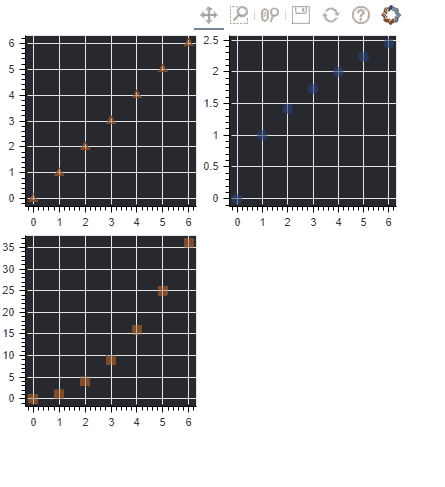
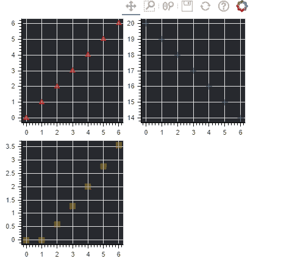

# 博克-地块的网格布局

> 原文:[https://www.geeksforgeeks.org/bokeh-grid-layout-of-plots/](https://www.geeksforgeeks.org/bokeh-grid-layout-of-plots/)

[Bokeh](https://www.geeksforgeeks.org/introduction-to-bokeh-in-python/) 包括多个布局选项，用于排列地块和小部件。它们可以安排多个组件来创建交互式仪表板或数据应用程序。布局功能允许您构建一个由图和小部件组成的网格。您可以将任意多的行、列或网格图嵌套在一起。此外，Bokeh 布局支持多种“尺寸模式”。这些调整模式允许绘图和小部件根据浏览器窗口调整大小。

**网格布局:**

网格布局基本上意味着你所有的图都将是基于网格的格式，那些使用过一些基本 css、bootstrap 的人可以很容易地理解网格代表什么。

**如何安装 bokeh :**

```py
pip install bokeh
```

**所有示例的基本方法:**

*   首先计算列表 1、列表 2、列表 3 这三个是通过对 currentList 执行一些操作得到的列表，这三个都将具有相同的长度，并且列表 1 与 currentList 相同(列表 1=currentList)。
*   列表 2 和列表 3 将是在 currentList 上执行的不同操作，在每个示例中，操作将是不同的。
*   最后在计算完列表 2、列表 3 之后，我们将使用 Bokeh 网格布局绘制其中的三个列表 1、列表 2、列表 3。
*   网格布局基本上就是说我们将(currentList，List1)，(currentList，List1)，(currentList，List1)以网格的形式表示出来，懂 bootstrap 和 css 的人可以很容易的在这里联系到网格的含义。

**例 1:**

*   这里我们将给出从 0 到 6 的 currentList 值，这就是为什么我们使用 range(7)，然后我们在 List()构造函数中传递这个值，然后我们把它赋给 List1。
*   现在，列表 2 将表示 currentList 中每个元素的平方根**列表 2=[i**0.5 表示 currentList 中的 I]**列表 3 将表示 currentList 中每个元素的平方根**列表 3=[i**2 表示 currentList 中的 I]**我们知道，在 python 中，我们可以使用**运算符轻松执行幂运算，因为我们使用**0.5 计算平方根，使用**2 计算平方。
*   对于(当前列表，列表 1)图，我们将使用圆来表示图上的点，对于(当前列表，列表 2)三角形和(当前列表，列表 3)正方形。输出将在 GFG.html 生成，如代码中所述。
*   **f1 =图(background_fill_color = # 27292 e)**中 background _ fill _ color 代表的背景颜色你也可以自定义一下。
*   **f1.triangle(currentList，y0，size=9，alpha=0.5，color="#de040f")** 这里 size =9 表示图面上点的大小，color 表示点的颜色，alpha 表示你想要多暗或者多亮，你也可以尝试改变这些属性来更好的理解。
*   现在显示网格布局中的所有地块**显示(gridplot([[f1，f2]，[f3，无]]，plot_width=200，plot_height=200))。**

**语法:**

```py
output_file("GFG.html")
currentList = list(range(7))

# writing logics for List1,List2,List2
# creating plots with these attributes 
# color,backgroundcolor,alpha ,size
# splots are f1,f2,f3
# using grid layout
show(gridplot([[f1, f2], [f3, None]], plot_width=200, plot_height=200))
```

下面是实现:

## 蟒蛇 3

```py
# python program for bokeh grid layout
from bokeh.io import output_file, show
from bokeh.layouts import gridplot
from bokeh.plotting import figure

# output will be produced in GFG.html
output_file("GFG.html")

# list will contain from 0 to 6
currentList = list(range(7))

# y0 is equals to x no change
List1 = currentList

# y1 square root of x
List2 = [i**0.5 for i in currentList]

# y2 square  of x
List3 = [i**2 for i in currentList]

# now creating plots f1,f2,f3
f1 = figure(background_fill_color="#27292e")
f1.triangle(currentList, List1, size=9, alpha=0.5, color="#de040f")

f2 = figure(background_fill_color="#27292e")
f2.circle(currentList, List2, size=9, alpha=0.5, color="#0828a8")

f3 = figure(background_fill_color="#27292e")
f3.square(currentList, List3, size=9, alpha=0.5, color="#b3810c")

# using grid layout on f1,f2,f3 plots
show(gridplot([[f1, f2], [f3, None]], plot_width=200, plot_height=200))
```

**输出:**



**例 2 :**

*   请注意，在这个例子中，我们只改变了计算列表 2、列表 3 的逻辑，其他东西都是一样的。
*   这里我们将给出从 0 到 6 的 currentList 值，这就是为什么我们使用 range(7)，然后我们在 List()构造函数中传递这个值，然后我们将它分配给 List1。
*   现在让我们计算列表 2，这里的列表 3 列表 2 将代表 20 和 currentList 的每个元素之间的绝对差值**列表 2=[abs(20-i)代表 I 在 currentList 中]** 列表 3 代表 currentList 的每个元素和该元素的平方根之间的绝对差值**列表 3=[abs(i-i**0.5)代表 I 在 currentList 中]。**
*   为什么我们使用 abs()函数，因为在某些情况下，可能会得到一个负值来将其转换为正值，所以我们使用 abs()。
*   现在我们将再次在三个图(当前列表，列表 1)、(当前列表，列表 2)和(当前列表，列表 3)上使用网格。
*   在这里，我们用圆来表示第一张图上的一个点，用三角形来表示第三张图上的第三个点。
*   输出将显示在 GFG.html，如代码中所写。
*   **f1 =图(background_fill_color = # 27292 e)**中 background _ fill _ color 代表的背景颜色你也可以自定义一下。
*   **f1.triangle(currentList，y0，size=9，alpha=0.5，color="#de040f")** 这里 size =9 表示图面上点的大小，color 表示点的颜色，alpha 表示你想要多暗或者多亮，你也可以尝试改变一下这些属性来更好的理解。
*   现在显示网格布局中的所有地块**显示(gridplot([[f1，f2]，[f3，无]]，plot_width=200，plot_height=200))。**

**语法:**

```py
output_file("GFG.html")
currentList = list(range(7))

# writing logics for List1,List2,List3
# creating plots with these attributes 
# color,backgroundcolor,alpha,size
# plots are f1,f2,f3
# using grid layout
show( gridplot([[f1, f2], [f3, None]], plot_width=200, plot_height=200))
```

下面是实现:

## 蟒蛇 3

```py
# python program for bokeh grid layout
from bokeh.io import output_file, show
from bokeh.layouts import gridplot
from bokeh.plotting import figure

# output will be produced in GFG.html
output_file("GFG.html")

# list will contain from 0 to 6
currentList = list(range(7))

# List1 is equals to currentList no change
List1 = currentList

# List2 square root of currentList
List2 = [abs(20-i) for i in currentList]

# List3 square  of currentList
List3 = [abs(i-i**0.5) for i in currentList]

# now creating plots f1,f2,f3
f1 = figure(background_fill_color="#27292e")
f1.triangle(currentList, List1, size=9, alpha=0.5, color="#de040f")

f2 = figure(background_fill_color="#27292e")
f2.circle(currentList, List2, size=9, alpha=0.5, color="#0828a8")

f3 = figure(background_fill_color="#27292e")
f3.square(currentList, List3, size=9, alpha=0.5, color="#b3810c")

# using grid layout on f1,f2,f3 plots

show(gridplot([[f1, f2], [f3, None]], plot_width=200, plot_height=200))
```

**输出:**

