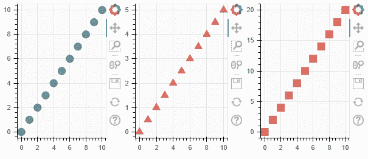
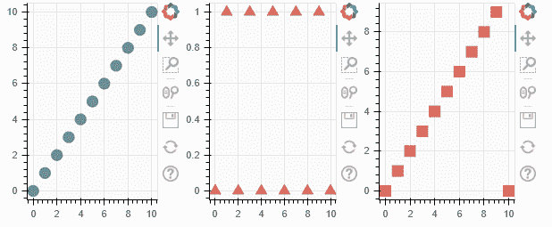

# 博克-地块的水平布局

> 原文:[https://www . geesforgeks . org/bokeh-水平-地块布局/](https://www.geeksforgeeks.org/bokeh-horizontal-layout-of-plots/)

Bokeh 包括几个布局选项，用于排列图和小部件。它们可以安排多个组件来创建交互式仪表板或数据应用程序。布局功能允许您构建一个由图和小部件组成的网格。您可以将任意多的行、列或网格图嵌套在一起。此外，Bokeh 布局支持多种“尺寸模式”。这些调整模式允许绘图和小部件根据浏览器窗口调整大小。

在 Bokeh **行布局**中，所有的图将只显示在一行中。这可以使用 Bokeh 支持的行布局功能来完成:

**语法:**

> 行（ plot1， plot2， .... ， plot）

**进场:**

*   导入模块
*   创建数据
*   通常创建多个图，就好像它们彼此独立一样。
*   使用行()将它们组合成一个布局
*   显示图表

**示例:**

## 蟒蛇 3

```
# python program for bokeh row layout
from bokeh.io import output_file, show
from bokeh.layouts import row
from bokeh.plotting import figure

# output will be in output.html
output_file("output.html")

x = list(range(11))
# y will be same as x
y = x
# y0 divide every element of x by 2
y0 = [i/2 for i in x]
# y1 multiply every element of xby 2
y1 = [i*2 for i in x]

# now creating three plots
plot1 = figure(plot_width=200, plot_height=250, background_fill_color="#fafafa")
plot1.circle(x, y, size=12, color="#53777a", alpha=0.8)

plot2 = figure(plot_width=200, plot_height=250, background_fill_color="#fafafa")
plot2.triangle(x, y0, size=12, color="#c02942", alpha=0.8)

plot3 = figure(plot_width=200, plot_height=250, background_fill_color="#fafafa")
plot3.square(x, y1, size=12, color="#d95b43", alpha=0.8)

# now creating row layout
show(row(plot1, plot2, plot3))
```

**输出:**



**示例:**

## 蟒蛇 3

```
from bokeh.io import output_file, show
from bokeh.layouts import row
from bokeh.plotting import figure

output_file("output.html")

x = list(range(11))
# y0 is same as x
y0 = x
# y1 is every element of x %2
y1 = [i % 2 for i in x]
# y1 is every element of x %10
y2 = [i % 10 for i in x]

plot1 = figure(plot_width=200, plot_height=250, background_fill_color="#fafafa")
plot1.circle(x, y0, size=12, color="#53777a", alpha=0.8)

plot2 = figure(plot_width=200, plot_height=250, background_fill_color="#fafafa")
plot2.triangle(x, y1, size=12, color="#c02942", alpha=0.8)

plot3 = figure(plot_width=200, plot_height=250, background_fill_color="#fafafa")
plot3.square(x, y2, size=12, color="#d95b43", alpha=0.8)

show(row(plot1, plot2, plot3))
```

**输出:**

