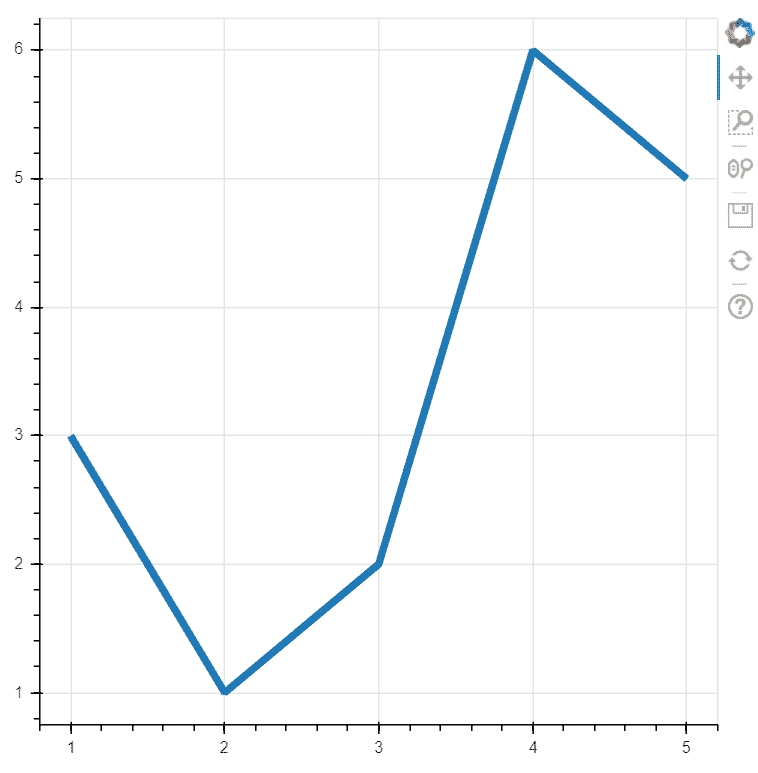
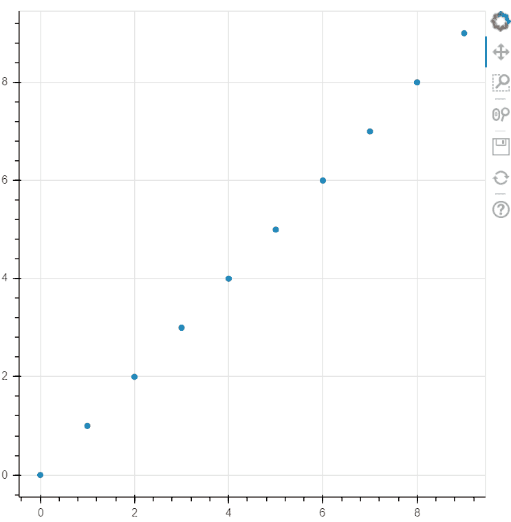
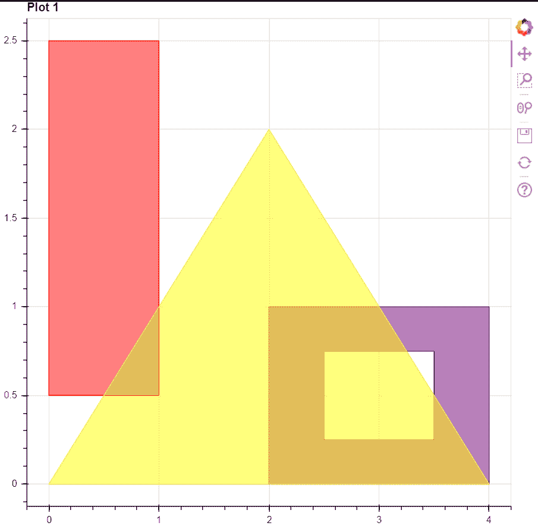
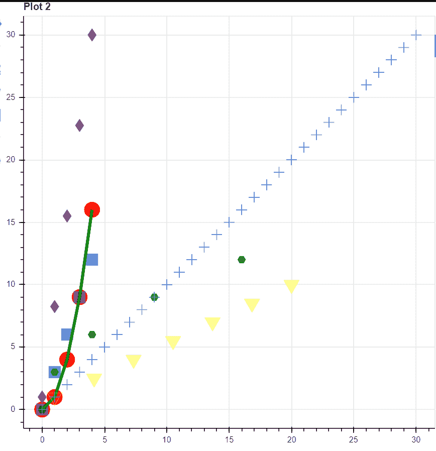
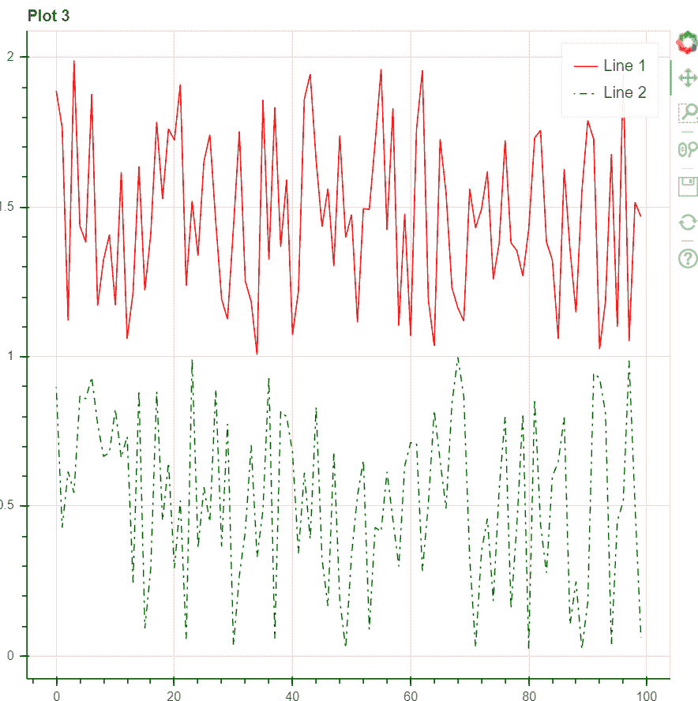
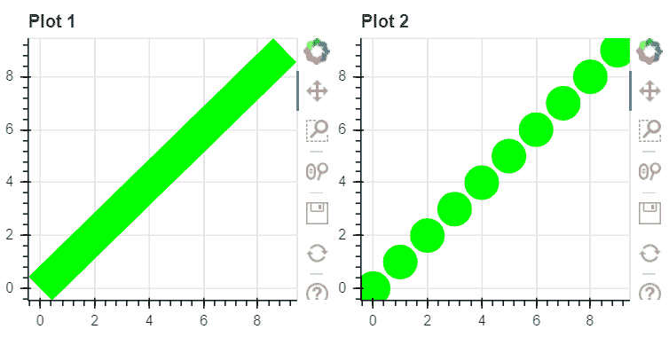
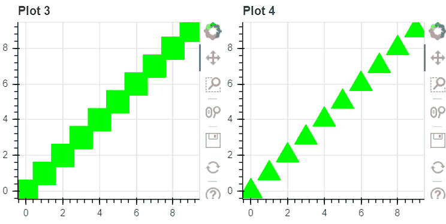
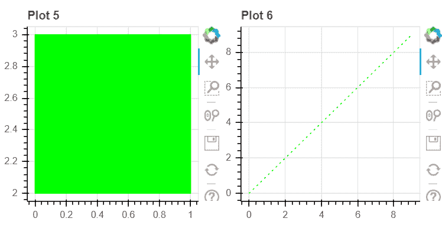

# 博克-多幅图

> 原文:[https://www.geeksforgeeks.org/bokeh-multiple-plots/](https://www.geeksforgeeks.org/bokeh-multiple-plots/)

**先决条件:**[Python Bokeh 入门](https://www.geeksforgeeks.org/introduction-to-bokeh-in-python/)

在本文中，我们将讨论如何使用 Python 中的 Bokeh 绘制多个图。我们将使用 *bokeh.layouts* 模块的 **row()** 方法，它在 *bokeh.io* 库的 **show()** 方法中作为参数使用 *bokeh* 来描绘多个地块。

**语法:**

> show(第行(图 1、图 2、图 3…..

其中*图 1、图 2* 等是 *bokeh .标绘*模块中类图的对象。

### **接近**

*   导入所需模块
*   使用**图形**类分配坐标和描绘地块。
*   在**行()中使用**图形**对象作为参数**方法。
*   使用 **show()** 方法描绘从**行()**方法返回的可视化。

**例 1:**

同一页中的不同图

## 蟒蛇 3

```
# import modules
from bokeh.io import output_file, show
from bokeh.layouts import row
from bokeh.plotting import figure

# create a new plot
fig1 = figure(plot_width=500,
              plot_height=500)
fig1.line([1, 2, 3, 4, 5],
          [3, 1, 2, 6, 5],
          line_width=5)

# create another plot
x = y = list(range(10))
fig2 = figure(plot_width=500,
              plot_height=500)
fig2.circle(x, y, size=5)

# depict visualization
show(row(fig1, fig2))
```

**输出:**

 

**例 2:**

同一帧上的不同图

## 蟒蛇 3

```
# import modules
from bokeh.io import output_file, show
from bokeh.layouts import row
from bokeh.plotting import figure
import numpy as np
import random

# create a new plot
# instantiating the figure object
fig1 = figure(title="Plot 1")

# coordinates
x = [[[[0, 0, 1, 1]]],
     [[[2, 2, 4, 4], [2.5, 2.5, 3.5, 3.5]]],
     [[[2, 0, 4]]]]
y = [[[[2.5, 0.5, 0.5, 2.5]]],
     [[[1, 0, 0, 1], [0.75, 0.25, 0.25, 0.75]]],
     [[[2, 0, 0]]]]

# color values of the poloygons
color = ["red", "purple", "yellow"]

# fill alpha values of the polygons
fill_alpha = 0.5

# plotting the graph
fig1.multi_polygons(x, y,
                    color=color,
                    fill_alpha=fill_alpha)

# create another plot
# coordinates
x = np.arange(5)
y = x**2
z = x*3
p = np.linspace(1, 20, 7)
q = np.linspace(1, 10, 7)
r = np.linspace(1, 30, 5)
a = np.arange(31)

# creating an empty figure with specific plot
# width and height
fig2 = figure(title="Plot 2")

# plotting the points in the form of
# circular glyphs
fig2.circle(x, y, color="red", size=20)

# plotting the points in the form of
# square glyphs
fig2.square(x, z, color="blue", size=15, alpha=0.5)

# plotting the points in the form of
# hex glyphs
fig2.hex(y, z, color="green", size=10, alpha=0.7)

# drawing a line between the plotted points
fig2.line(x, y, color="green", line_width=4)

# plotting the points in the form of
# inverted triangle glyph
fig2.inverted_triangle(p, q, color="yellow", size=20, alpha=0.4)

# plotting the points in the form of
# diamond glyphs
fig2.diamond(x, r, color="purple", size=16, alpha=0.8)

# plotting the points in the form of
# cross glyphs
fig2.cross(a, a, size=14)

# create a third plot
# generating the points to be plotted
x = []
y = []
for i in range(100):
    x.append(i)
for i in range(100):
    y.append(1 + random.random())

# parameters of line 1
line_color = "red"
line_dash = "solid"
legend_label = "Line 1"

fig3 = figure(title="Plot 3")

# plotting the line
fig3.line(x, y,
          line_color=line_color,
          line_dash=line_dash,
          legend_label=legend_label)

# plotting line 2
# generating the points to be plotted
x = []
y = []
for i in range(100):
    x.append(i)
for i in range(100):
    y.append(random.random())

# parameters of line 2
line_color = "green"
line_dash = "dotdash"
line_dash_offset = 1
legend_label = "Line 2"

# plotting the line
fig3.line(x, y,
          line_color=line_color,
          line_dash=line_dash,
          line_dash_offset=line_dash_offset,
          legend_label=legend_label)

# depict visualization
show(row(fig1, fig2, fig3))
```

**输出:**

  

**例 3:**

连续多个图

## 蟒蛇 3

```
# import modules
from bokeh.io import output_file, show
from bokeh.layouts import row
from bokeh.plotting import figure

# assign coordinates
x = y = list(range(10))
xs = [[[[0, 0, 1, 1]]]]
ys = [[[[3, 2, 2, 3]]]]

# create a new plot
fig1 = figure(title="Plot 1", plot_width=250,
              plot_height=250)
fig1.line(x, y, line_width=25, color="lime")

# create another plot
fig2 = figure(title="Plot 2", plot_width=250,
              plot_height=250)
fig2.circle(x, y, size=25, color="lime")

# create another plot
fig3 = figure(title="Plot 3", plot_width=250,
              plot_height=250)
fig3.square(x, y, size=25, color="lime")

# create another plot
fig4 = figure(title="Plot 4", plot_width=250,
              plot_height=250)
fig4.triangle(x, y, size=25, color="lime")

# create another plot
fig5 = figure(title="Plot 5", plot_width=250,
              plot_height=250)
fig5.multi_polygons(xs, ys, color="lime")

# create another plot
fig6 = figure(title="Plot 6", plot_width=250,
              plot_height=250)
fig6.line(x, y, line_dash="dotted", color="lime")

# depict visualization
show(row(fig1, fig2,
         fig3, fig4,
         fig5, fig6))
```

**输出:**

  