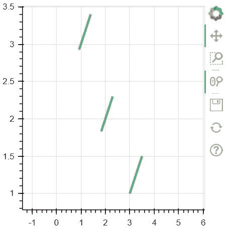
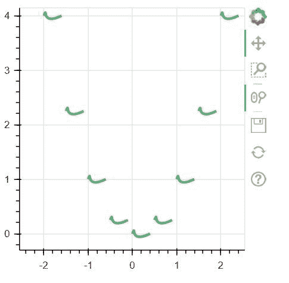

# Python 中的 bokeh . ploting . figure . bezier()函数

> 原文:[https://www . geesforgeks . org/bokeh-绘图-图形-贝塞尔-python 中的函数/](https://www.geeksforgeeks.org/bokeh-plotting-figure-bezier-function-in-python/)

**[Bokeh](https://www.geeksforgeeks.org/python-data-visualization-using-bokeh/#:~:text=Python%20%7C%20Data%20visualization%20using%20Bokeh, in%20Django%20and%20flask%20apps.)** 是 Python 中的数据可视化库，提供高性能的交互式图表和图，输出可以通过笔记本、html、服务器等多种媒介获得。**图形类**创建一个新的图形用于绘图。它是绘图的一个子类，通过默认轴、网格、工具等简化绘图创建。

## bokeh . ploting . figure . bezier()函数

bokeh 库绘图模块中的 **bezier()函数**用于配置 bezier 字形并添加到本图中。

> **语法:** bezier(x0，y0，x1，y1，cx0，cy0，cx1，cy1，* line _ alpha = 1.0，line_cap='butt '，line_color='black '，line_dash=[]，line_dash_offset=0，line_join= '斜角'，line_width=1，name=None，tags=[]，**kwargs)
> 
> **参数:**该方法接受以下描述的参数:
> 
> *   **x0:** 此参数为起点的 x 坐标。
> *   **y0:** 此参数为起点的 y 坐标。
> *   **x1:** 该参数为终点的 x 坐标。
> *   **y1:** 该参数为终点的 y 坐标。
> *   **cx0:** 此参数为第一个控制点的 x 坐标。
> *   **cy0:** 此参数为第一个控制点的 y 坐标。
> *   **cx1:** 该参数为第二个控制点的 x 坐标。
> *   **cy1:** 此参数为第二个控制点的 y 坐标。
> *   **line_alpha:** 该参数为步骤的 line alpha 值，默认值为 1.0。
> *   **line_cap:** 此参数是默认值为 butt 的步骤的线帽值。
> *   **line_color:** 此参数是默认值为黑色的步骤的线条颜色值。
> *   **线划:**此参数是步骤的线划值，默认值为[]。
> *   **线划偏移量:**此参数是默认值为 0 的步骤的线划偏移量。
> *   **线连接:**该参数是斜面默认值的步骤的线连接值。
> *   **线宽:**该参数为步长的线宽值，默认值为 1。
> *   **模式:**该参数可以是三个值中的一个:【“之前”、“之后”、“中心”】。
> *   **名称:**此参数是用户为此型号提供的名称。
> *   **标签:**此参数是用户为此模型提供的值。
> 
> **其他参数:**这些参数是**kwargs，描述如下:
> 
> *   **alpha:** 此参数用于一次性设置所有 alpha 关键字参数。
> *   **颜色:**此参数用于一次性设置所有颜色关键字参数。
> *   **legend_field:** 此参数是数据源中应该用于分组的列的名称。
> *   **legend_group:** 此参数是数据源中应该用于分组的列的名称。
> *   **legend_label:** 此参数是图例条目，与此处提供的文本完全一致。
> *   **静音:**该参数包含 bool 值。
> *   **名称:**此参数是可选的用户提供的名称，用于附加到渲染器。
> *   **来源:**此参数为用户提供的数据源。
> *   **视图:**该参数是过滤数据源的视图。
> *   **可见:**该参数包含布尔值。
> *   **x_range_name:** 此参数是用于映射 x 坐标的额外范围的名称。
> *   **y_range_name:** 此参数是用于映射 y 坐标的额外范围的名称。
> *   **等级:**此参数指定此字形的渲染等级顺序。
> 
> **返回:**该方法返回 GlyphRenderer 值。

以下示例说明了 bokeh . ploting . figure . bezier()函数在 bokeh . ploting:
**示例 1:**

```
# Implementation of bokeh function

import numpy as np 
from bokeh.plotting import figure, output_file, show

plot = figure(plot_width = 300, plot_height = 300)

plot.bezier(x0 =[1, 2, 3], y0 =[3, 2, 1], 
            x1 =[1.4, 2.3, 3.5], y1 =[3.4, 2.3, 1.5], 
            cx0 =[1.4, 2.3, 3.5], cy0 =[3.4, 2.3, 1.5],
            cx1 =[.4, 1.3, 2.5], cy1 =[2.4, 1.3, .5],
            color ="green", alpha = 0.6, line_width = 3)

show(plot)
```

**输出:**


**例 2:**

```
# Implementation of bokeh function

import numpy as np 
from bokeh.plotting import figure, output_file, show

N = 9
x = np.linspace(-2, 2, N)
y = x**2

xp02 = x + 0.4
xp01 = x + 0.1
xm01 = x-0.1
yp01 = y + 0.2
ym01 = y-0.2

plot = figure(plot_width = 300, plot_height = 300)

plot.bezier(x0 = x, y0 = y,
            x1 = xp02, y1 = y,
            cx0 = xp01, cy0 = yp01,
            cx1 = xm01, cy1 = ym01, 
            color ="green", alpha = 0.6,
            line_width = 3)

show(plot)
```

**输出:**
