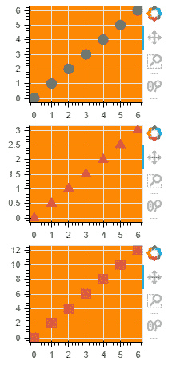
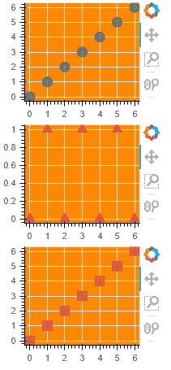

# 博克-地块垂直布局

> 原文:[https://www . geesforgeks . org/bokeh-垂直-地块布局/](https://www.geeksforgeeks.org/bokeh-vertical-layout-of-plots/)

Bokeh 包括几个布局选项，用于排列图和小部件。它们可以安排多个组件来创建交互式数据应用程序。布局功能有助于构建由图和小部件组成的网格。它支持根据需要将尽可能多的行、列或地块网格嵌套在一起。此外，Bokeh 布局支持多种“尺寸模式”。这些调整模式允许绘图和小部件根据浏览器窗口调整大小。

在 bokeh 中，多个布局可以显示在一个单独的列中。

**语法:**

> 列(plot1，plot2，…，plotn)

**接近**

*   导入模块
*   创建多个地块
*   使用列对齐()
*   显示图

**例 1:**

## 蟒蛇 3

```py
# python program for bokeh column layout
from bokeh.io import output_file, show
from bokeh.layouts import column
from bokeh.plotting import figure

# output will be in GFG.html
output_file("GFG.html")
currentList = list(range(7))

# creating three Lists List1,List2,List3
List1 = currentList
List2 = [i/2 for i in currentList]
List3 = [i*2 for i in currentList]

# creating three plots f1,f2,f3
f1 = figure(plot_width=200, plot_height=150, background_fill_color="#fc8803")
f1.circle(currentList, List1, size=12, color="#53777a", alpha=0.8)

f2 = figure(plot_width=200, plot_height=150, background_fill_color="#fc8803")
f2.triangle(currentList, List2, size=12, color="#c02942", alpha=0.8)

f3 = figure(plot_width=200, plot_height=150, background_fill_color="#fc8803")
f3.square(currentList, List3, size=12, color="#d95b43", alpha=0.8)
# show plots in column
show(column(f1, f2, f3))
```

**输出:**



**例 2 :**

## 蟒蛇 3

```py
# python program for bokeh column layout
from bokeh.io import output_file, show
from bokeh.layouts import column
from bokeh.plotting import figure

# output will be in GFG.html
output_file("GFG.html")
currentList = list(range(7))

List1 = currentList
List2 = [i % 2 for i in currentList]
List3 = [i % 10 for i in currentList]

f1 = figure(plot_width=200, plot_height=150, background_fill_color="#fc8803")
f1.circle(currentList, List1, size=12, color="#53777a", alpha=0.8)

f2 = figure(plot_width=200, plot_height=150, background_fill_color="#fc8803")
f2.triangle(currentList, List2, size=12, color="#c02942", alpha=0.8)

f3 = figure(plot_width=200, plot_height=150, background_fill_color="#fc8803")
f3.square(currentList, List3, size=12, color="#d95b43", alpha=0.8)

show(column(f1, f2, f3))
```

**输出:**

