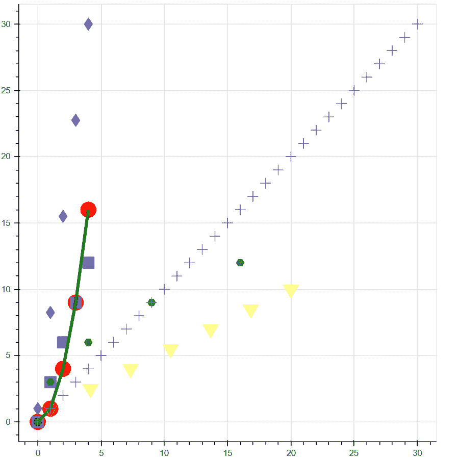
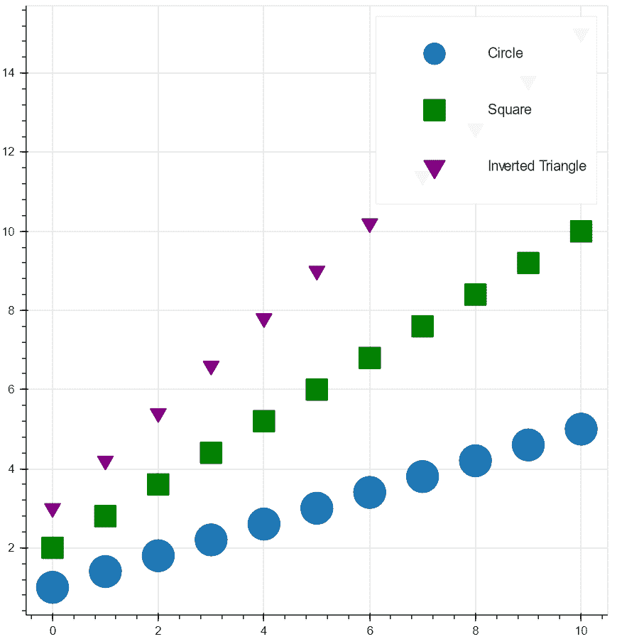
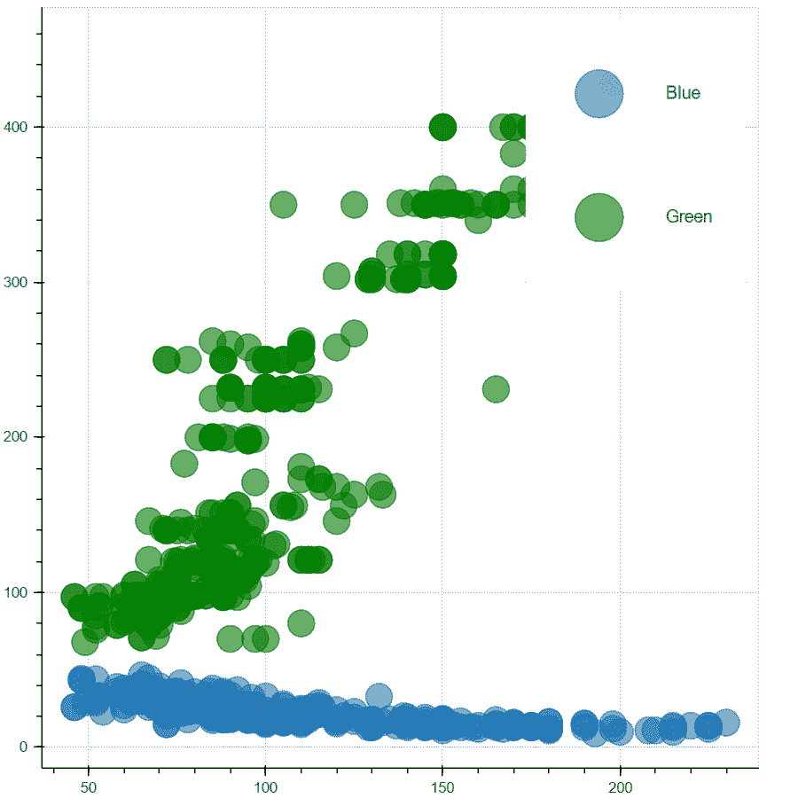

# 使用 Python Bokeh 创建具有多个字形的绘图

> 原文:[https://www . geeksforgeeks . org/create-a-plot-with-multi-glyph-use-python-bokeh/](https://www.geeksforgeeks.org/create-a-plot-with-multiple-glyphs-using-python-bokeh/)

在这篇文章中，我们将学习**多个字形**，还将学习**在**博克**中添加一个传说**。现在 bokeh 为我们提供了各种字形，可以用来表示图中的一个点。部分字形有**圆、方、紫苑、倒 _ 三角()、三角()**等。

### 装置

这个模块没有内置 Python。要安装它，请在终端中键入以下命令。

```
pip install bokeh
```

## **博克多字形**

在这个例子中，我们将探索 bokeh 中不同类型的字形。下面实现中的每个字形都有不同的属性来标识自己。所以，让我们转向代码来理解这个概念。

**代码:**

## 蟒蛇 3

```
# importing numpy package
import numpy as np

# importing figure and show from
# bokeh.plotting module
from bokeh.plotting import figure, show

# using numpy package to
# create a list of 5 numbers
x = np.arange(5)

# y is stored with the square
# of the numbers in x
y = x**2

# z is storing 3 times the value
# of the elements in x
z = x*3

# storing 7 numbers in p between
# 1 to 20
p = np.linspace(1,20,7)

# storing 7 numbers in q between
# 1 to 10
q = np.linspace(1, 10, 7)

# storing 5 numbers in r between
# 1 to 30
r = np.linspace(1, 30, 5)

# creating 31 elements in a list
a = np.arange(31)

# creating an empty figure with specific plot
# width and height
fig = figure(plot_width = 600 , plot_height = 600)

# plotting the points in the form of
# circular glyphs
fig.circle(x, y, color = "red", size = 20)

# plotting the points in the form of
# square glyphs
fig.square(x, z, color = "blue", size = 15, alpha = 0.5)

# plotting the points in the form of
# hex glyphs
fig.hex(y, z, color = "green", size = 10, alpha = 0.7)

# drawing a line between the plotted points
fig.line(x, y, color = "green", line_width = 4)

# plotting the points in the form of
# inverted triangle glyph
fig.inverted_triangle(p, q, color = "yellow", size = 20, alpha = 0.4)

# plotting the points in the form of
# diamond glyphs
fig.diamond(x, r, color = "purple", size = 16, alpha = 0.8)

# plotting the points in the form of
# cross glyphs

fig.cross(a, a, size = 14)

# showing the above plot
show(fig)
```

**输出:**



**说明:**

*   首先我们导入 **numpy** 、**图**、**展示不同模块的**包。
*   现在，我们使用**排列**创建一个数字范围，并将列表存储在 x 中。
*   此后，我们还初始化不同的变量，以便绘制相互之间的关系图。
*   初始化后，我们将创建一个空白图形，其绘图宽度和高度为 600。
*   因为 bokeh 为我们提供了不同类型的字形，所以我们在这个例子中用各种颜色和大小的点来实现其中的一些字形。形状为圆形的点集合的颜色为红色，大小为 20，而形状为六角形的点集合的颜色为绿色，大小为 10，颜色的不透明度为 0.7(由**α**表示)。

## **带 bokeh 图例的多个字形**

现在，让我们进入本文的下一个主题，那就是 bokeh legend。传奇在博克剧情中扮演着非常重要的角色。它们帮助我们识别不同类型的用于绘图的字形。除此之外，我们还可以改变可以区分不同字形的盒子的不同属性。

**例 1:**

在这个例子中，我们将探索多个字形以及 bokeh 图例，以识别它们，并改变区分图的框的一些属性。这一点很重要，因为在一个有各种字形的情节中，我们需要一些东西来识别它们，这就是 bokeh legend 发挥作用的时候。现在让我们进入代码实现。

**代码:**

## 蟒蛇 3

```
# importing numpy as np
import numpy as np

# importing figure and show from
# bokeh.plotting
from bokeh.plotting import figure, show

# creating a list of numbers from 0-10
x = np.arange(11)

# Creating square of the numbers and
# storing it in y
y = np.linspace(1,5,11)

# Creating an array of random values in
# z
z = np.linspace(0,2,11)

# Creating a plot with plot width and height
# as 600
p = figure(plot_height = 600 , plot_width = 600)

# Plotting first line in the form of circle
p.circle(x, y, legend_label = "Circle", size = 30)

# Creating first line in the form of square
p.square(x, y*2, legend_label = "Square", size = 20, color = "green")

# Creating forth line in the form of line
p.inverted_triangle(x, y*3, legend_label = "Inverted Triangle",
                    size = 15, color = "purple")

# Increasing the glyph height
p.legend.glyph_height = 50

# increasing the glyph width
p.legend.glyph_width = 90

# showing the above plot
show(p)
```

**输出:**



**说明:**

*   我们创建了三个不同的变量，它们有一组相互对应的值。
*   我们可以看到三个图，每个图都有不同的字形。根据代码，我们提供了大小为 30 的圆形字形、大小为 20 的方形字形和大小为 15 的倒三角形字形。此外，所有的字形也是不同的颜色。

这个例子中的主要概念是，我们已经为图中的每个图提供了标签，并且使用 bokeh 中的**图例**，我们正在更改右上角框中显示的字形的属性(这是默认的)。

**例 2:**

在最后一个示例中，我们将向代码中导入一个数据集。之后，我们将绘制不同的图形，并使用 bokeh 图例，我们将分别更改标签大小和字形大小。让我们开始实施。

**代码:**

## 蟒蛇 3

```
# importing autompg dataset from bokeh.sampledata.autompg
from bokeh.sampledata.autompg import autompg

# importing columndatasource package from
# bokeh.models module
from bokeh.models import ColumnDataSource

# importing figure and show from
# bokeh.plotting module to plot the figure
from bokeh.plotting import figure, show

# provides data to the glyphs of the plot
source = ColumnDataSource(autompg)

# Creating an empty figure
p = figure(plot_height = 600, plot_width = 600)

# Creating circular glyphs with points plotted from
# columns taken from auto-mpg dataset
p.circle(x = 'hp', y = 'mpg', size = 20,
         alpha = 0.6, source = autompg ,
         legend_label = "Blue")

# Creating circular glyphs with points plotted from
# columns taken from auto-mpg dataset  with different colors
p.circle(x = 'hp', y = 'displ', size = 20,
         alpha = 0.6, color = "green" , source = autompg,
         legend_label = "Green")

# Adjusting the label height using legend
p.legend.label_height = 50

# Adjusting the label_width using legend
p.legend.label_width = 50

# Adjusting the glyph width using legend
p.legend.glyph_width = 90

# Adjusting the glyph height using legend
p.legend.glyph_height = 90

# Showing the above plot
show(p)
```

**输出:**



**说明:**

*   除了导入我们之前导入的所有包，这次我们还导入了一个新的数据集**自动 mpg** 。与此同时，我们还在导入**列数据源**包。
*   使用 ColumnDataSouce 包，我们手动创建它，这有助于我们在多个图和小部件之间共享数据。
*   之后，我们将自动 mpg 数据集的数据相互对比。
*   然后使用 bokeh 的 legend 属性(图. legend.label_width，图. legend.glyph_width，图. legend.label_height，图. legend.glyph_height)，我们将更改用于标识图中绘图的标签和字形的大小。