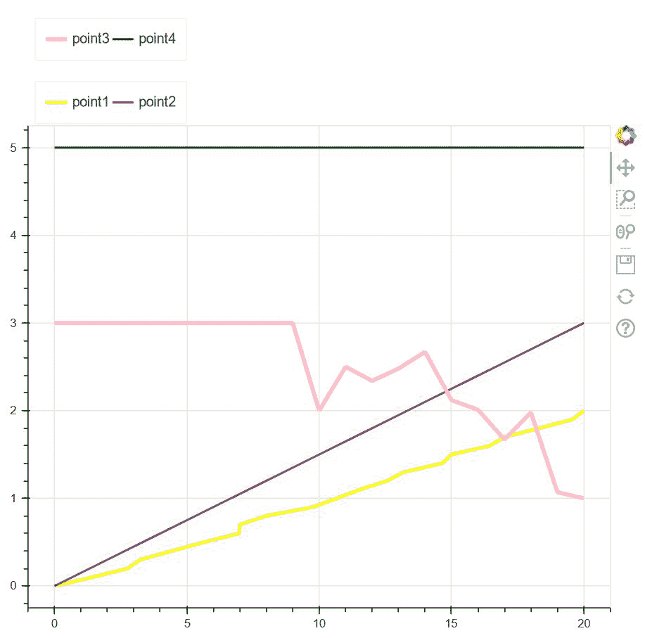
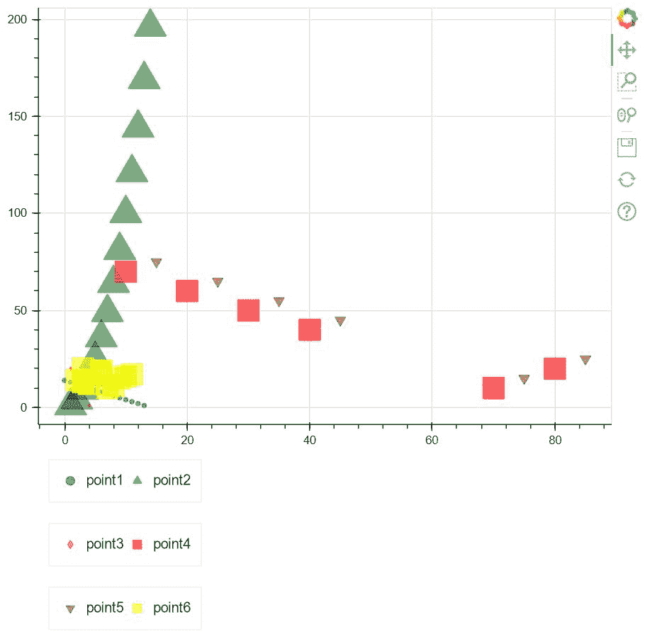

# 在博克图中创建双线图例

> 原文:[https://www . geesforgeks . org/create-a-双线-bokeh-plot 中的图例/](https://www.geeksforgeeks.org/create-a-two-line-legend-in-a-bokeh-plot/)

在本文中，我们将学习如何在 bokeh 剧情中**创建双线传奇**。传说是博克剧情中最重要的部分之一。它们帮助我们区分在一个情节中使用的不同字形。除此之外，如果我们需要在同一个图中绘制不同颜色的不同线条，我们可以使用图例来区分它们。还有，我们可以改变传说中提到的东西的各种属性。

但是在我们深入探讨这个话题之前，我们要么应该使用谷歌 colab，要么应该使用本地设备代码编辑器。如果我们在谷歌 colab 工作，那么我们可以直接进入下面的实现。但是如果我们使用本地设备，那么我们应该确保我们的设备中已经预装了 bokeh，否则我们也可以安装它。打开命令提示符并写入

```
pip install bokeh
```

现在，一切都准备好了。安装在我们的本地设备中是必不可少的，否则功能将无法工作。让我们转到上面的实现。

**例 1:**

在第一个例子中，我们看到了一些线，这些线是在一个空白的画布上用大量的点绘制的。使用 bokeh 中的图例，我们可以区分线条。这里要注意的主要事情是，我们有一个双线传奇。所以不用再等了，让我们看看代码是如何工作的。

**代码:**

## 蟒蛇 3

```
# importing show from
# bokeh.io to show the plot
from bokeh.io import show

# importing legend from bokeh.models
from bokeh.models import Legend

# importing figure from bokeh.plotting
from bokeh.plotting import figure

# importing numpy package from python
import numpy as np

# Creating an empty figure of plot height=600
# and plot width=600
fig = figure(plot_height=600, plot_width=600)

# Creating point1 which is a yellow color line with
# line width as 3 for a set of points
point1 = fig.line(x=[0, 1.43, 2.76, 3.24, 4.45, 5.65,
                     6.98, 7, 8, 9.76, 10.67, 11.54, 12.567,
                     13.21, 14.65, 15, 16.45, 17, 18.32, 19.57, 20],
                  y=np.linspace(0, 2, 21),
                  line_width=3, color="yellow")

# Creating point2 which is a purple color line with
# line width as 2 for a set of points
point2 = fig.line(x=np.linspace(0, 20, 20), y=np.linspace(0, 3, 20),
                  line_width=2, color="purple")

# Creating point3 which is a pink color line with
# line width as 4 for a set of points
point3 = fig.line(x=[0, 1, 2, 3, 4, 5, 6, 7, 8, 9, 10, 11,
                     12, 13, 14, 15, 16, 17, 18, 19, 20],
                  y=[3, 3, 3, 3, 3, 3, 3, 3, 3, 3, 2, 2.5, 2.34,
                     2.48, 2.67, 2.12, 2.01, 1.67, 1.98, 1.07, 1],
                  line_width=4, color="pink")

# Creating point4 which is a green color line with
# line width as 2 for a set of points
point4 = fig.line(x=[0, 20], y=5,
                  line_width=2,
                  color="green")

# Using legend we are placing two point descriptions
# beside each other horizontally
legend1 = Legend(items=[("point1", [point1]),
                        ("point2", [point2])],
                 location=(7, 2), orientation="horizontal")

# Using legend we are placing th other two point
# descriptions beside each other horizontally
legend2 = Legend(items=[("point3", [point3]),
                        ("point4", [point4])],
                 location=(7, 2), orientation="horizontal")

# placing legend1 at the top
fig.add_layout(legend1, 'above')

# placing legend2 at the top
fig.add_layout(legend2, 'above')

# showing the figure
show(fig)
```

**输出:**



**说明:**

*   在上面的例子中，我们首先从 python 提供的 bokeh 库的不同模块中导入所有必要的包，如 show、figure、Legend 和 numpy。
*   导入包后，我们将创建一个 600 的空图形。
*   之后，我们用不同的点集以及不同的线条颜色和线条宽度创建四条不同的线条。为了识别它们，使用了一个图例。
*   现在创建一个双线**图例**，我们使用两个变量 legend1 和 legend2，其中我们在每个变量中存储两个点，我们提供水平方向。因此，每行将显示两个。
*   使用“ **add_layout** ”我们如上确定图例的位置，即它将显示在图形表示的顶部。
*   最后，我们使用来自**博克依欧**的**显示**来显示剧情

**例 2:**

在下一个例子中，我们将探索 bokeh 提供的一些字形的概念。Bokeh 为我们提供了各种类型的字形，因此我们将实现前面示例中使用的相同概念。

**代码:**

## 蟒蛇 3

```
# importing show from
# bokeh.io to show the plot
from bokeh.io import show

# importing legend from bokeh.models
from bokeh.models import Legend

# importing figure from bokeh.plotting
from bokeh.plotting import figure

# importing numpy package from python
import numpy as np

x1 = [7, 8, 4, 3, 2, 9, 10, 11, 6, 6, 3]
y1 = [10, 11, 12, 13, 14, 15, 16, 17, 18, 19, 20]

# Creating an empty figure of plot height=600
# and plot width=600
fig = figure(plot_height=600, plot_width=600)

# Creating point1 in the form of circular glyphs
# with a set of points
point1 = fig.circle(x=np.arange(14),
                    y=[14, 13, 12, 11, 10, 9, 8, 7,
                       6, 5, 4, 3, 2, 1])

# Creating point2 in the form of triangular glyphs
# with a set of points
point2 = fig.triangle(x=[1, 2, 3, 4, 5, 6, 7, 8, 9, 10, 11,
                         12, 13, 14],

                      y=[1, 4, 9, 16, 25, 36, 49, 64, 81, 100,
                         121, 144, 169, 196], size=30,

                      color="green", alpha=0.5)

# Creating point3 in the form of diamond shaped glyphs
# with a set of points
point3 = fig.diamond(x=[1, 2, 4],
                     y=[20, 19, 1],
                     color="red",
                     alpha=0.4)

# Creating point4 in the form of square shaped glyphs
# with a set of points
point4 = fig.square(x=[70, 80, 40, 30, 20, 10],
                    y=[10, 20, 40, 50, 60, 70],
                    color="red", size=20,
                    alpha=0.6)

# Creating point5 in the form of inverted triangular glyphs
# with a set of points
point5 = fig.inverted_triangle(x=[75, 85, 45, 35, 25, 15],
                               y=[15, 25, 45, 55, 65, 75],
                               color="purple", size=10, alpha=0.6)

# Creating point6 in the form of square shaped glyphs
# with a set of points
point6 = fig.square(x1, y1, color="yellow",
                    size=20, alpha=0.6)

# Using legend we are placing two point descriptions
# beside each other
# horizontally
legend1 = Legend(items=[("point1", [point1]),
                        ("point2", [point2])],
                 location=(10, 10), orientation="horizontal")

# Using legend we are placing th other two point
# descriptions beside each other horizontally
legend2 = Legend(items=[("point3", [point3]), ("point4", [point4])],
                 location=(10, 10), orientation="horizontal")

# Using legend we are placing th other two point
# descriptions beside each other horizontally
legend3 = Legend(items=[("point5", [point5]), ("point6", [point6])],
                 location=(10, 10), orientation="horizontal")

# placing legend1 at the bottom
fig.add_layout(legend1, 'below')

# placing legend2 at the bottom
fig.add_layout(legend2, 'below')

# placing legend3 at the bottom
fig.add_layout(legend3, 'below')

# showing the figure
show(fig)
```

**输出:**



**说明:**

*   导入所需的包后，我们将获取两个变量 x1 和 y1 以及一组稍后绘制的点。
*   之后，我们将地块宽度和地块高度设置为 600。现在，bokeh 为我们提供了各种字形，可以用来区分图形中的不同图。所以，我们用一些字形来表示图中的 6 个这样的图形，有很多点。
*   在指向它们之后，我们使用图例来识别每个字形，并且我们保持两个点在彼此旁边，同时它们的方向为“**水平**”。
*   现在使用“ **add_layout** ”选项，我们可以确定图例框的位置。在这种情况下，我们将它放在底部。
*   最后，我们借助于“ **bokeh.io** 中的“ **show** ”来展示该图。