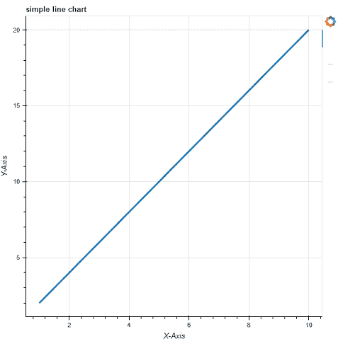
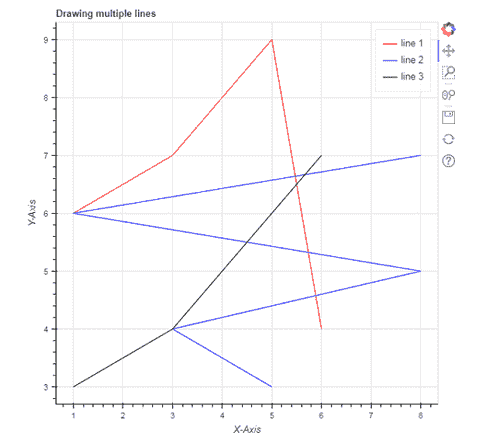
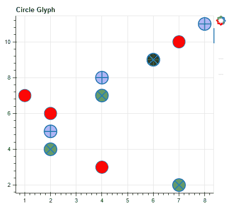
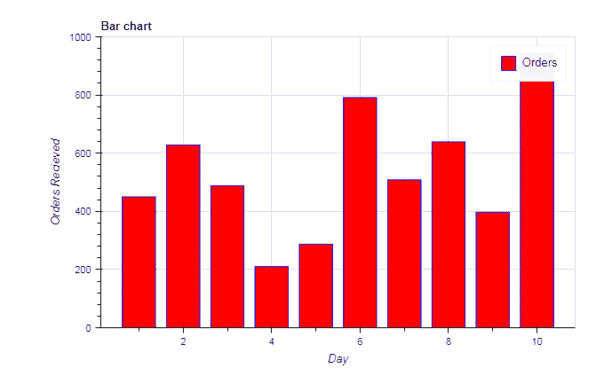
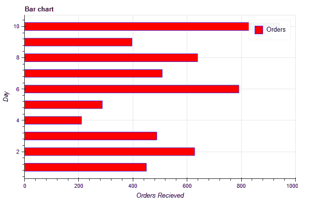
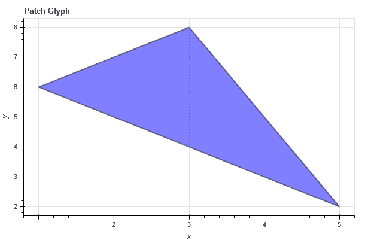
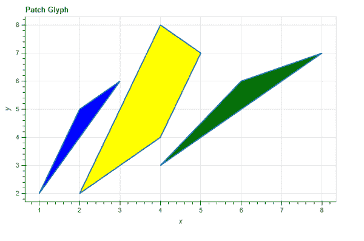

# 博克的字形

> 原文:[https://www.geeksforgeeks.org/glyphs-in-bokeh/](https://www.geeksforgeeks.org/glyphs-in-bokeh/)

Bokeh 是一个 Python 库，用于创建交互式数据可视化。在本文中，我们将讨论博克的字形。但是首先让我们看看如何在 Python 中安装 Bokeh。

## 装置

要安装此软件，请在终端中键入以下命令。

```py
conda install bokeh
Or
pip install bokeh  
```

## 用字形绘图

通常，一幅图由线、圆等几何形状组成。因此，字形只不过是用来表示数据的视觉形状，如圆形、正方形、直线、矩形等。

### 创建基本折线图:

折线图以直线的形式显示 x 轴和 y 轴点移动的可视化。要绘制图形的线条字形，我们使用图形对象的 line()方法。

**语法:**

```py
 my_plot.line(a, b, line_width)  
```

**代码:**

## 计算机编程语言

```py
# import the libraries
from bokeh.plotting import figure, show, output_file

# prepare some data
a = [1, 2, 3, 4, 5, 6, 7, 8, 9, 10]
b = [2, 4, 6, 8, 10, 12, 14, 16, 18, 20]

# create a plot using figure
my_plot = figure(title="simple line chart", x_axis_label="X-Axis",
                 y_axis_label="Y-Axis")

# adding line graph
my_plot.line(a, b, line_width=3)

# display output in file
output_file("line.html")

# show the result
show(my_plot)
```

**输出:**



### 组合多个图形

您也可以使用 bokeh .绘图界面添加多个图形。为此，您只需要通过传递不同的数据作为参数多次调用 line()函数，如示例所示。

**语法:**

```py
p.line(x1, y2, legend_label, line_color, line_width)
```

**代码:**

## 计算机编程语言

```py
from bokeh.plotting import figure, show
from bokeh.io import output_notebook

# prepare some data
x1 = [1, 3, 4, 5, 6]
x2 = [5, 3, 8, 1, 8]
y1 = [6, 7, 8, 9, 4]
y2 = [3, 4, 5, 6, 7]

# create a new plot
p = figure(title="Drawing multiple lines",
           x_axis_label="X-Axis", y_axis_label="Y-Axis")

# add multiple renderers
p.line(x1, y1, legend_label="line 1", line_color="red", line_width=1)
p.line(x2, y2, legend_label="line 2", line_color="blue", line_width=1)
p.line(x1, y2, legend_label="line 3", line_color="black", line_width=1)

output_notebook()
show(p)
```

**输出:**



## 渲染圆

为了将圆形标志符号添加到您的绘图中，我们使用了 circle()方法，而不是上面示例中使用的 line()方法。

**Circle():** 我们用这个方法给剧情增加一个圆形的字形。它以中心的 x 和 y 坐标为参数。除此之外，它还接受诸如大小、填充颜色、填充阿尔法、角度、线条颜色、线条阿尔法、半径、半径维度等参数

**语法:**

```py
p.circle(x, y, size, fill_color)
```

**Criss_cross():** 此方法通过圆心添加一个带有“+”标记的圆字形，它取圆心的 x、y 坐标。

**语法:**

> p.circle_cross(x，y，大小，填充颜色，填充 alpha，线宽)

**Circle_X()** :此方法通过圆心添加一个带有‘X’标记的圆字形，它取圆心的 X、y 坐标。

**语法:**

> p.circle_x(x，y，大小，填充颜色，填充 alpha，线宽)

**代码:**

## 计算机编程语言

```py
from bokeh.plotting import figure, show
from bokeh.io import output_file

# prepare some data
x = [1, 2, 4, 6, 7]
y = [7, 6, 3, 9, 10]

# create a new plot with figure function
p = figure(title="Circle Glyph", plot_width=450, plot_height=400)

# create circle glyph
p.circle(x=x, y=y, size=25, fill_color="red")
p.circle_cross(x=[2, 4, 6, 8], y=[5, 8, 9, 11], size=25,
               fill_color="blue", fill_alpha=0.3, line_width=2)
p.circle_x(x=[4, 7, 2, 6], y=[7, 2, 4, 9], size=25,
           fill_color="green", fill_alpha=0.6, line_width=2)

# show the results
output_file('circle.html')
show(p)
```

**输出:**



## 渲染栏

同样，我们可以使用 vbar()函数渲染垂直条，使用 hbar()函数渲染水平条。

### 创建 vbar

为了绘制 vbar，我们指定中心 x 坐标、底部和顶部端点，如下例所示:

**语法:**

```py
p.vbar(x, bottom, top,
color, width, fill_color,legend_label)
```

**代码:**

## 计算机编程语言

```py
# Bokeh libraries
from bokeh.io import output_notebook
from bokeh.plotting import figure, show

# data
day = [1, 2, 3, 4, 5, 6, 7, 8, 9, 10]
no_orders = [450, 628, 488, 210, 287,
             791, 508, 639, 397, 943]

# Output the visualization directly in the notebook
output_notebook()

# Create a figure
p = figure(title='Bar chart',
           plot_height=400, plot_width=600,
           x_axis_label='Day', y_axis_label='Orders Received',
           x_minor_ticks=2, y_range=(0, 1000),
           toolbar_location=None)

# The daily orders will be represented as vertical
# bars (columns)
p.vbar(x=day, bottom=0, top=no_orders,
       color='blue', width=0.75, fill_color='red',
       legend_label='Orders')

# Let's check it out
show(p)
```

**输出:**



### 正在创建 hbar

为了绘制 hbar，我们指定中心 y 坐标、左右端点和高度，如下例所示:

**语法:**

```py
p.hbar(y, height, left, right,
 color, width, fill_color,
legend_label)
```

#### 示例**代码:**

## 计算机编程语言

```py
# Bokeh libraries
from bokeh.plotting import figure, show, output_file

# data
day = [1, 2, 3, 4, 5, 6, 7, 8, 9, 10]
no_orders = [450, 628, 488, 210, 287, 791,
             508, 639, 397, 943]

# Create a figure
p = figure(title='Bar chart',
           plot_height=400, plot_width=600,
           x_axis_label='Orders Received', y_axis_label='Day',
           x_range=(0, 1000), toolbar_location=None)

# The daily orders will be represented as
# horizontal bars
p.hbar(y=day, height=0.5, left=0, right=no_orders,
       color='blue', width=0.75, fill_color='red',
       legend_label='Orders')

# Let's check it out
show(p)
output_file("ex.html")
```

**输出:**



## 补丁字形

面片字形以特定的颜色给空间区域着色。我们使用 patch()方法开发单个补丁，使用 patch()方法开发多个补丁。

### 单一补丁

**语法:**

```py
p.patch(x, y, fill_color, line_color, alpha, line_width)
```

**代码:**

## 计算机编程语言

```py
# Bokeh libraries
from bokeh.plotting import figure, show, output_file

# data
x = [1, 2, 3, 4, 5]
y = [6, 7, 8, 5, 2]

# Create a figure
p = figure(title='Patch Glyph',
           plot_height=400, plot_width=600,
           x_axis_label='x', y_axis_label='y',
           toolbar_location=None)

# add patch glyph
p.patch(x, y, fill_color="blue", line_color='black',
        alpha=0.5, line_width=2)

# show the results
show(p)
output_file("ex.html")
```

**输出:**



### 多个补丁

通过使用函数 patch()而不是 patch()，可以以类似的方式创建多个修补程序。我们以数组列表的形式传递数据，以便在下面显示的示例中创建三个不同颜色的补丁。

**代码:**

## 计算机编程语言

```py
# Bokeh libraries
from bokeh.plotting import figure, show, output_file

# data
x = [[1, 2, 3], [4, 6, 8], [2, 4, 5, 4]]
y = [[2, 5, 6], [3, 6, 7], [2, 4, 7, 8]]

# Create a figure
p = figure(title='Patch Glyph',
           plot_height=400, plot_width=600,
           x_axis_label='x', y_axis_label='y',
           toolbar_location=None)

# add patches glyph
p.patches(x, y, fill_color=["blue", "green", "yellow"], line_width=2)

# show the results
show(p)
output_file("ex.html")
```

**输出:**

