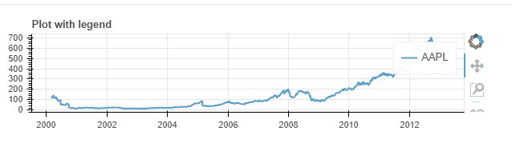
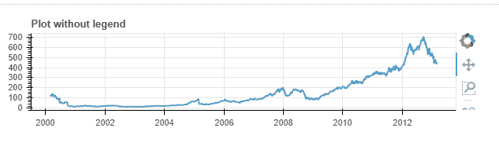

# 在博克剧情中隐藏传说

> 原文:[https://www.geeksforgeeks.org/hide-legend-in-bokeh-plot/](https://www.geeksforgeeks.org/hide-legend-in-bokeh-plot/)

Bokeh 是一个 Python 交互式数据可视化工具。它使用 HTML 和 JavaScript 来渲染它的图。它以现代网络浏览器为呈现目标，提供优雅、简洁的新颖图形结构和高性能交互性。给你的数字添加图例可以帮助你正确地描述和定义它们。因此，更清晰。Bokeh 中的传说实现起来很简单。它们可以是基本的、自动分组的、手动提及的、显式索引的以及交互式的。在这篇文章中，我们将只讨论如何让传说完全从情节中消失。

为了实现所需的功能，我们必须将 bokeh 图例的可见属性设置为 False。

**语法:**

> bokeh.legend.visible=False

**接近**

*   导入模块
*   创建图框
*   绘制所需的图表
*   将图例设置为不可见
*   显示图

首先，让我们看看一个有传说的情节是什么样子的，然后我们会为同一个情节设置可见性为 false。

**例**

## 蟒蛇 3

```
# import module
import pandas as pd
from bokeh.plotting import figure, output_file, show
from bokeh.sampledata.stocks import AAPL

# create frame
pic = figure(plot_width=600, plot_height=150, x_axis_type="datetime")
pic.title.text = 'Plot without legend'

# plot data
for data, name, color in zip([AAPL], ["AAPL"], Spectral4):
    df = pd.DataFrame(data)
    df['date'] = pd.to_datetime(df['date'])
    pic.line(df['date'], df['close'], line_width=2,
             color=color, alpha=0.8, legend_label=name)

# display plot
output_file("hide_legend.html", title="hide_legend.py example")
show(pic)
```

**输出**



**例:**无图例

## 蟒蛇 3

```
# import module
import pandas as pd
from bokeh.plotting import figure, output_file, show
from bokeh.sampledata.stocks import AAPL

# create frame
pic = figure(plot_width=600, plot_height=150, x_axis_type="datetime")
pic.title.text = 'Plot without legend'

# plot graph
for data, name, color in zip([AAPL], ["AAPL"], Spectral4):
    df = pd.DataFrame(data)
    df['date'] = pd.to_datetime(df['date'])
    pic.line(df['date'], df['close'], line_width=2,
             color=color, alpha=0.8, legend_label=name)

# set visibility
pic.legend.visible = False

# print plot
output_file("hide_legend.html", title="hide_legend.py example")
show(pic)
```

**输出**

