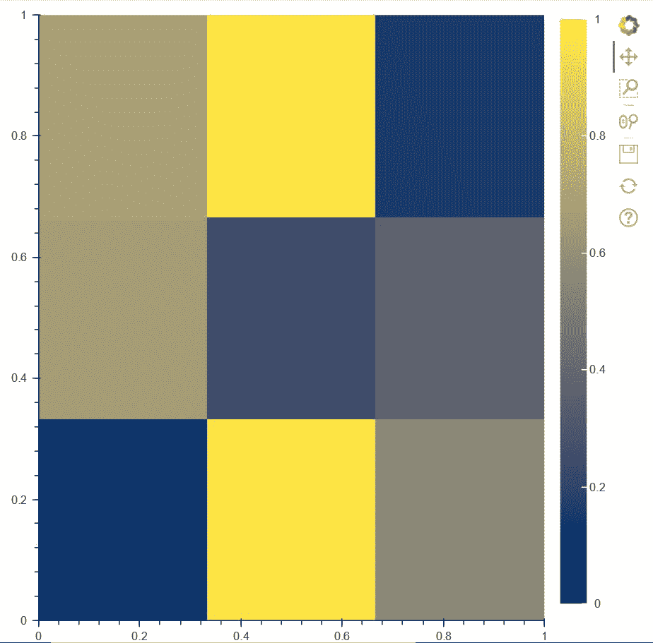
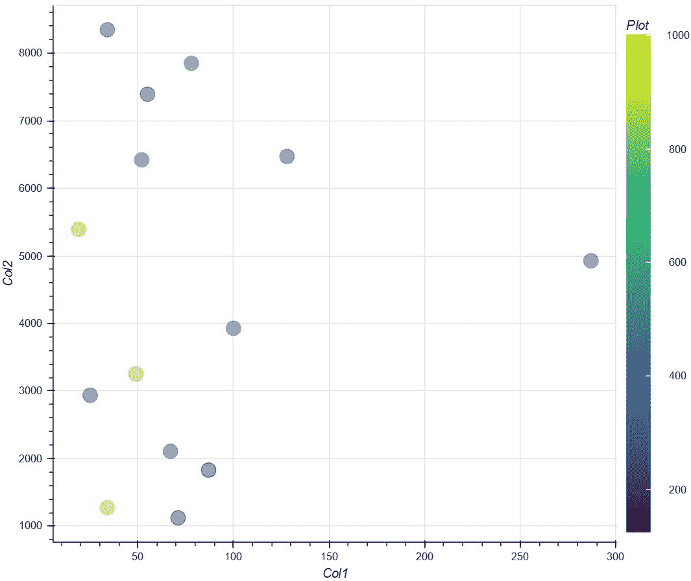
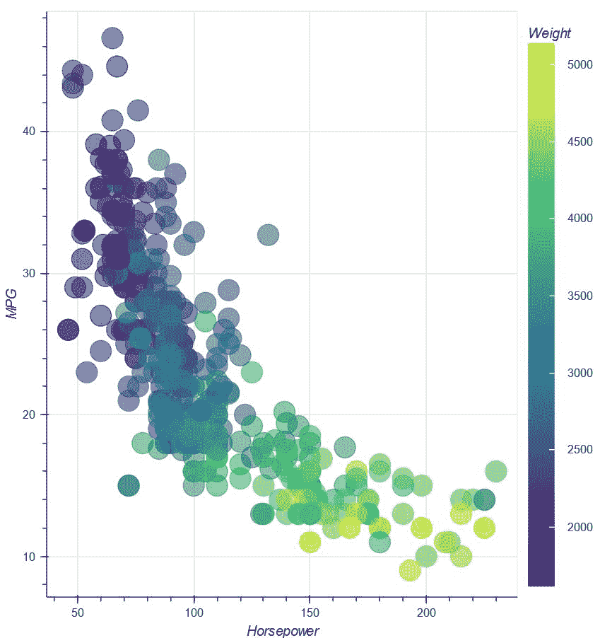

# 如何在 Bokeh 中添加彩条？

> 原文:[https://www . geesforgeks . org/how-to-add-color-bar-in-bokeh/](https://www.geeksforgeeks.org/how-to-add-color-bars-in-bokeh/)

**Bokeh** 是近期比较有前途的 Python 库之一。它在数据可视化方面提供了高性能和高效率。bokeh 的一大优势就是可以得到 HTML、笔记本等各种格式的输出文件。在本文中，我们将学习如何在 Bokeh 中添加**颜色条**。

现在，bokeh 为我们提供了各种可视化界面，如 **bokeh.models、bokeh.plotting、bokeh.transform** 等，这样我们就可以从中导入各种模块，并使用它们在图中创建和定义各种属性。**T3】**

人们可以使用谷歌 colab，它已经预装了所有的东西，但是如果我们使用本地设备，那么在我们的设备上安装 bokeh 是非常重要的，否则功能将无法工作。首先，我们需要在桌面上打开一个命令提示符，转到下面我们想要安装 bokeh 的目录。请确保您的本地设备上已经安装了 node.js，否则您可以参考[这个](https://nodejs.org/en/)网站进行下载。转到目录后，在命令提示符下编写以下代码。

```
pip install bokeh
```

现在，我们可以使用任何文本编辑器来实现上述概念。

**代码:**

## 蟒蛇 3

```
# importing numpy package
import numpy as np

# importing figure and show for creating
# and showing plots from bokeh.plotting
# interface
from bokeh.plotting import figure, show

# importing LinearColorMapper and ColorBar
# from bokeh.models to create color bars
from bokeh.models import LinearColorMapper, ColorBar

# Creating a 2D array of scalar data to plot
d = [[0.11023,0.97382,0.5634],
     [0.66382,0.2484,0.36524],
     [0.6845,0.9824,0.15498]]

# Using Linear color mapping, we are deciding
# palette color of the color bar and we are specifying
# low and high determining the range of values in color map
color = LinearColorMapper(palette = "Cividis256",
                          low = 0, high = 1)

# Creating a figure where we define
# the x-Axis limits and y-Axis limits
# of the plot
plot = figure(x_range = (0, 1),
              y_range = (0,1))

# Creating the image of the plot by
# specifying width and height of the inside plot
# along with color mapper and scalar data d
plot.image(image = [d], color_mapper = color,
           dh = [1], dw = [1], x = [0], y = [0])

# Creating the color bar and setting the
# color bar position at (5,6)
cb = ColorBar(color_mapper = color, location = (5,6))

# Adding the color bar to the right side
plot.add_layout(cb, 'right')

# Showing the above plot
show(plot)
```

**输出:**



**代码解释:**在代码中导入所有必要的包之后，我们正在创建一个**标量数据 d** ，在这里我们存储从 0 到 1 的值。之后，使用**线性颜色映射器**，我们在颜色条中定义调色板的颜色和范围。然后，我们创建一个图形，其中我们将 X 轴范围和 Y 轴范围从 0 设置为 1。之后，我们使用绘制上述图。image()，其中我们定义了绘图的宽度和高度以及绘图的起点作为参数。因此，在固定了彩色地图的位置和标签之后，我们最终将上面的图显示为一个 HTML 文件。

**例 2:**

除了创建热图，我们还可以创建一个简单的绘图并添加一个颜色条。但为此，我们需要用 python 创建一个数据框架。我们需要在我们的本地设备中安装熊猫，如果我们正在使用它，或者如果我们使用谷歌 colab，那么我们不需要安装任何东西。打开命令提示符并编写以下代码:

```
pip install pandas
```

创建**数据框**后，我们可以对数据进行处理并添加一个颜色条。下面显示了以下实现:

在第二个例子中，我们没有创建热图。取而代之的是，我们创建一个图，图中的点绘制成圆形，颜色基于颜色条中的颜色。因此，为了实现这一点，我们需要创建一组需要进行数据框化的数据，以便以表格格式获取它们。完成上述实现后，我们将使用**线性颜色映射器()**来定义颜色和颜色映射的范围。之后，我们将创建一个图形，在其中定义绘图宽度和绘图高度以及 X 轴和 Y 轴标签。然后，我们定义绘制的点的形状，即一个圆，同时我们使用**变换()**，在其中我们定义我们的颜色图和每个点(x，y)将在该位置携带的值。这意味着在每一点上，颜色将根据它所携带的值而变化，这些值是由数据帧的**‘col 0’**产生的。最后，我们展示我们的合成图。

**代码:**

## 蟒蛇 3

```
# importing linear color mapper and colorbar
# from bokeh.models
from bokeh.models import LinearColorMapper, ColorBar

# importing transform from bokeh.transform
from bokeh.transform import transform

# importing figure and show from
# bokeh.plotting
from bokeh.plotting import figure,show

# importing pandas library
import pandas as pd

# Creating a set of data in d
d={'Col0':[ 190, 320, 270, 874, 459, 124, 546,
           285, 341, 980, 1002, 453, 324, 245],
   'Col1':[ 71, 128, 34, 49, 52, 87, 78, 25, 67,
           19, 34, 100, 287, 55],
   'Col2':[ 1123, 6471, 8345, 3253, 6420, 1830,
           7849, 2937, 2108, 5392, 1273, 3928, 4927, 7392]}

# Converting the set of data into
# a dataframe

df = pd.DataFrame(d)

# Using linear color mapper, we are
# deciding the color of our color
# bar palette and also defining the
# lowest and highest values
color = LinearColorMapper(palette = 'Viridis256',
                          low = df.Col0.min(),
                          high = df.Col0.max())

# Creating a figure where we define
# its height and width along with its x-Axis
# label and Y-Axis Label
colorbar = figure(plot_width = 750, plot_height = 600,
                  x_axis_label = 'Col1', y_axis_label = 'Col2')

# Ploting the points in the graph using
# circles where color of the circles will be
# according to their values in the color bar
# along with defined size and opacity
colorbar.circle(x = 'Col1', y = 'Col2',
                source = df, color = transform('Col0', color),
                size = 15, alpha = 0.5)

# Defining various other features in the
# color bar such as its location in the
# plot along with its title
color_bar = ColorBar(color_mapper = color,
                     label_standoff = 14,
                     location = (0,0),
                     title = 'Plot')

# Defining the position of the color bar
colorbar.add_layout(color_bar, 'right')

# Showing the above implementation
show(colorbar)
```

**输出:**



**例 3:**

在本例中，我们将从**导入一个数据集“**autopg**”。**

## 蟒蛇 3

```
# importing figure and show from bokeh.plotting
# module
from bokeh.plotting import figure,show

# importing autompg from bokeh.sampledata.autompg
from bokeh.sampledata.autompg import autompg

# importing LinearColorMapper and ColorBar
# from bokeh.models
from bokeh.models import LinearColorMapper, ColorBar

# importing transform from bokeh.transform
from bokeh.transform import transform
print(autompg)

# Defining the palette color along with
# the max and min values of the color bar
color_mapper = LinearColorMapper(palette = "Viridis256",
                                 low = autompg.weight.min(),
                                 high = autompg.weight.max())

# Creating an empty figure where we define the
# X-Axis label, Y-Axis Label
p = figure(x_axis_label = 'Horsepower',
           y_axis_label = 'MPG')

# Drawing circular plots in the graph with
# color based on the value from the
# color-mapper
p.circle(x = 'hp', y = 'mpg', color = transform('weight',
                                                color_mapper),
         size = 20, alpha = 0.6, source = autompg)

# Defining properties of color mapper
color_bar = ColorBar(color_mapper = color_mapper,
                     label_standoff = 12,
                     location = (0,0),
                     title = 'Weight')

# Defining position of the color-mapper
p.add_layout(color_bar, 'right')

# Showing the plot
show(p)
```

**输出:**



在第三个例子中，我们使用 bokeh . sample data . auto pg 导入数据集，由于它已经是表格格式，我们不需要使用 dataframing。然后我们按照**例 2** 的相同步骤，显示上面的图。