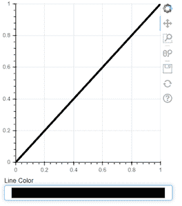
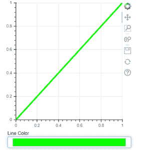

# 如何在 Bokeh 中添加拾色器？

> 原文:[https://www . geesforgeks . org/how-add-picker-in-bokeh/](https://www.geeksforgeeks.org/how-to-add-color-picker-in-bokeh/)

在本文中，我们将看到如何在 bokeh 中添加一个颜色选择器小部件。

小部件是使图表更具交互性的最佳方式。我们还可以在 Bokeh 应用程序中添加小部件，以提供最佳的前端用户可视化。使用小部件，我们可以做很多事情，比如更新图表，连接到其他编程功能。其中一个小部件是颜色选择器。

**为 bokeh 中的折线图创建颜色选择器:**

## 蟒蛇 3

```py
# displaying the chart
from bokeh.io import show
from bokeh.layouts import column

# importing colorpicker model from bokeh
from bokeh.models import ColorPicker

# plotting the figure
from bokeh.plotting import Figure

plot = Figure(x_range=(0, 1), 
              y_range=(0, 1), 
              plot_width=350, 
              plot_height=350)

line = plot.line(x=(0,1), 
                 y=(0,1),
                 color="black", 
                 line_width=4)

picker = ColorPicker(title="Line Color")

picker.js_link('color', 
               line.glyph,
               'line_color')

show(column(plot, picker))
```

**输出:**



博克的拾色器

我们用颜色选择器绘制一个折线图。这里我们已经明确指定了折线图颜色‘黑色’。线条的颜色默认为折线图的“蓝色”。我们可以从颜色选择器中选择任何颜色，并更改折线图颜色。这里我选择了绿色。



绿色折线图–带颜色选择器