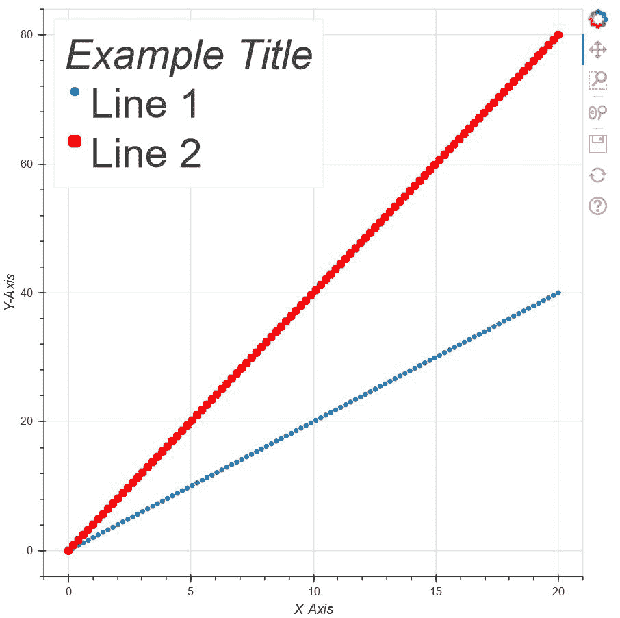
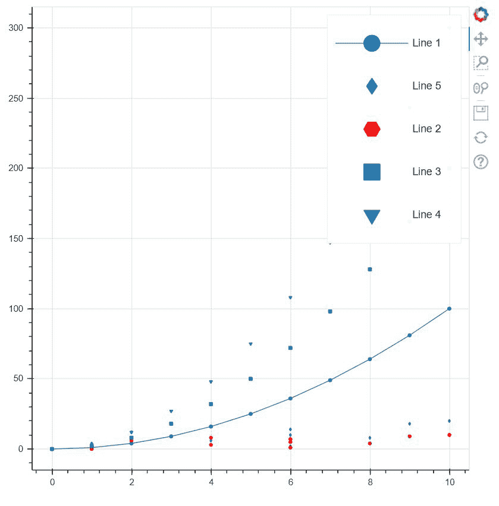

# 如何更改 Bokeh 图例中标签的大小？

> 原文:[https://www . geesforgeks . org/如何更改 bokeh-legend 中标签的大小/](https://www.geeksforgeeks.org/how-to-change-size-of-labels-in-the-bokeh-legend/)

在本文中，我们将学习如何更改 bokeh legend 中标签的大小。传说在博克扮演着非常重要的角色。借助图例，我们可以在 bokeh 提供给我们的一个图中指向各种类型的字形，并可以根据我们的选择进行自定义。除此之外，我们还可以更改图中方框中显示的字形文本的各种属性。除此之外，我们还可以使用各种属性来自定义图例。

可用于自定义字形的一些属性:图例。标签 _ 文本 _ 字体，图例。标签 _ 文本 _ 字体 _ 大小，图例。位置，图例。标题，图例。方向和，*图例。点击 _ 策略。*

现在，在继续下一步之前，我们必须确保在本地设备上安装 **bokeh** 。如果没有，则打开命令提示符并键入以下命令:

```py
pip install bokeh 
```

现在我们准备好出发了。有必要安装 bokeh，否则功能将无法工作。所以，让我们开始实施上述概念。

**例 1:**

在下面的例子中，我们将使用 bokeh legend 改变标签的字体大小，同时，我们还将学习一些其他功能。

## 蟒蛇 3

```py
# importing numpy package fro python library
import numpy as np

# import figure and show for creating
# and showing the plot from bokeh.plotting
from bokeh.plotting import figure,  show

# Initialising a variable x with
# 100 values from 0 to 20
x = np.linspace(0, 20, 100)

# initialising y with double values of
# x
y = x*2

# Creating an empty figure with plot height and
# width as 600
p1 = figure(plot_width=600, plot_height=600)

# Creating the plot with points
# in the shape of the circle
p1.circle(x, y, legend_label="Line 1")

# Creating the plot with points
# in the shape of the square
p1.square(x, 2*y, legend_label="Line 2",
          color="red", line_width=4)

# using legend we are labelling the title of the
# Glyph box
p1.legend.title = 'Example Title'

# Labelling the X-Axis
p1.xaxis.axis_label = "X Axis"

# Labelling the Y-Axis
p1.yaxis.axis_label = "Y-Axis"

# Setting up the location of the
# box that differentiates the two
# lines
p1.legend.location = "top_left"

# Increasing the title of the box
# to 30pt
p1.legend.title_text_font_size = '30pt'

# Increasing the labels of the box
# to 30pt
p1.legend.label_text_font_size = "30pt"

# Showing the above plot
show(p1)
```

**输出:**



**说明:**

在上面的代码中，在初始化了库和模块中所有必要的包之后，我们创建了两个点 x 和 y，它们是任意值的列表。现在我们将在图表中绘制这些值。因此，为此，我们创建了一个空图形/图，其图宽和图高为 600。之后，我们绘制两个图形，其中第一个图形上的点呈圆形，第二个图形上的点呈正方形。除了两个图形的不同颜色之外，为了区分它们，我们正在创建一个框，在该框中，我们使用 legend_label 为两个字形提供标签，并且我们还为该框赋予了一个标题。现在是主要的实现，即**使用 bokeh 图例**改变标签的大小。因此，通过使用**legend . label _ text _ font _ size**我们可以自定义框中标签和字形的大小，并且由于我们已经给了框一个标题，**legend . label _ text _ font _ size**可以帮助我们更改标题的大小。随着尺寸的改变，我们也在改变它的方向，即在左上角使用 **legend.location** 。

**例 2:**

现在，在第二个示例中，让我们探索如何使用图例更改大小的更多属性。在下面的例子中，除了使用 **label_text_font_size，**我们还可以使用 **glyph_height，glyph_width，label_height，label_width** ，它们负责在区分所有行的标签框中分别更改标签和字形大小。现在让我们转向主要的实现。

## 蟒蛇 3

```py
# importing numpy as np
import numpy as np

# importing figure and show from
# bokeh.plotting
from bokeh.plotting import figure, show

# creating a list of numbers from 0-10
x = np.arange(11)

# Creating square of the numbers and
# storing it in y
y = x**2

# Creating an array of random values in
# z
z = [1, 6, 1, 4, 8, 6, 2, 6, 4, 9, 10]

# Creating a plot with plot width and height
# as 600
p = figure(plot_height=600, plot_width=600)

# Plotting first line in the form of circle
p.circle(x, y, legend_label="Line 1")

# Creating first line in the form of line
p.line(x, y, legend_label="Line 1")

# Creating fifth line in the form of line
p.diamond(z, x*2, legend_label="Line 5")

# Creating second line in the form of line
p.hex(z, x, legend_label="Line 2", color="red")

# Creating third line in the form of line
p.square(x, y*2, legend_label="Line 3")

# Creating forth line in the form of line
p.inverted_triangle(x, y*3, legend_label="Line 4")

# Increasing the glyph height
p.legend.glyph_height = 50

# increasing the glyph width
p.legend.glyph_width = 90

# Increasing the glyph's label height
p.legend.label_height = 50

# Increasing the glyph's label height
p.legend.label_width = 50

# showing the above plot
show(p)
```

**输出:**



**说明:**

在上面的代码中，我们已经导入了 numpy 包以及用于绘图创建和显示的图形和显示。导入包后，我们将创建三个不同的数字列表，然后以图形格式相互绘制。它们有不同的形状。使用 bokeh 中的 legend，我们以不同的方式标记它们，并使用上面提到的以下属性，我们分别更改字形和标签的大小，这也会影响盒子的大小。