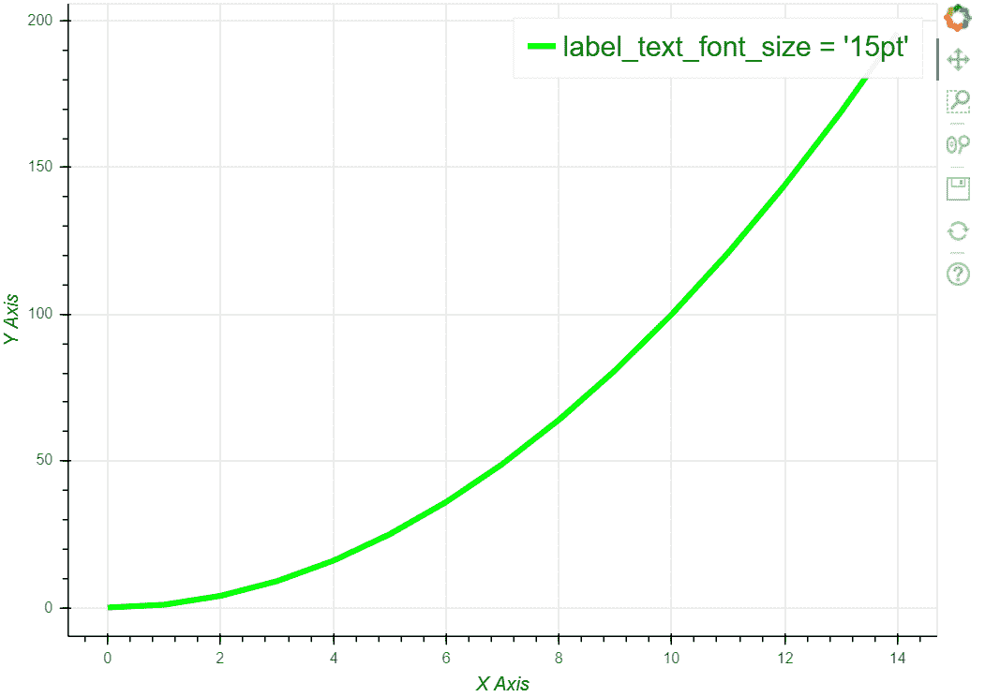
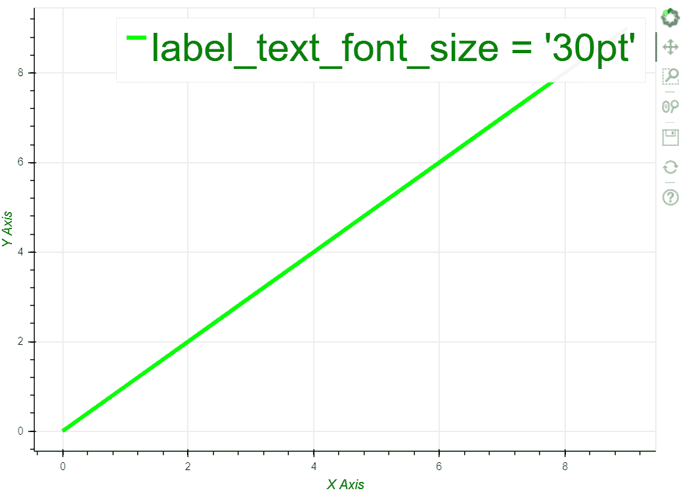

# 如何使用 Python 的 Bokeh 更改刻度标签大小？

> 原文:[https://www . geesforgeks . org/如何更改-蜱虫-标签-大小-使用-蟒蛇-bokeh/](https://www.geeksforgeeks.org/how-to-change-ticks-label-sizes-using-pythons-bokeh/)

Bokeh 是一个用于现代网络浏览器的交互式数据绘图可视化库。它提供优雅、简洁的多功能图形结构，并在大型或流式数据集上提供高性能交互性。

在本文中，我们将讨论如何使用 Python 的 Bokeh 更改刻度标签大小。

**分步方法:**

*   现在，要使用 bokeh 绘制任何数据集，最简单的方法是从绘图类导入“图形”和“显示”函数。其他是可选的导入，有助于自定义图表。
*   创建一个图形对象，将我们提供的数据集中的值绘制到图形上。
*   现在“绘图”变量将是我们的图形对象，宽度为 700 像素，高度为 500 像素。
*   Bokeh 还为我们提供了定制每个轴的能力。
*   分配或创建数据集。
*   不使用**标签 _ 文本 _ 字体 _ 大小**属性决定刻度标签的大小。
*   最后，描绘可视化。

以下是基于上述方法的一些示例:

**例 1:**

## 蟒蛇 3

```
from bokeh.plotting import figure, show
from bokeh.models import Legend

# Figure to plot
plot = figure(plot_width=700, plot_height=500)

# X axis customization
plot.xaxis.axis_label = "X Axis"
plot.xaxis.axis_label_text_color = "green"

# Y axis customization
plot.yaxis.axis_label = "Y Axis"
plot.yaxis.axis_label_text_color = "green"

# Creating the simple dataset
x = list(range(15))
y = [i**2 for i in x]

# setting the X and Y values
plot.line(x, y, line_width=4, line_color='lime',
          legend_label="label_text_font_size = '15pt'")

# Legend Customization
plot.legend.label_text_font_size = "15pt"
plot.legend.label_text_color = "green"

# Draw function
show(plot)
```

**输出:**



**例 2:**

## 蟒蛇 3

```
from bokeh.plotting import figure, show
from bokeh.models import Legend
from math import sin

# Figure to plot
plot = figure(plot_width=700, plot_height=500)

# X axis customization
plot.xaxis.axis_label = "X Axis"
plot.xaxis.axis_label_text_color = "green"

# Y axis customization
plot.yaxis.axis_label = "Y Axis"
plot.yaxis.axis_label_text_color = "green"

# Creating the simple dataset
x = y = list(range(10))

# setting the X and Y values
plot.line(x, y, line_width=4, line_color='lime',
          legend_label="label_text_font_size = '30pt'")

# Legend Customization
plot.legend.label_text_font_size = '30pt'
plot.legend.label_text_color = "green"

# Draw function
show(plot)
```

**输出:**

