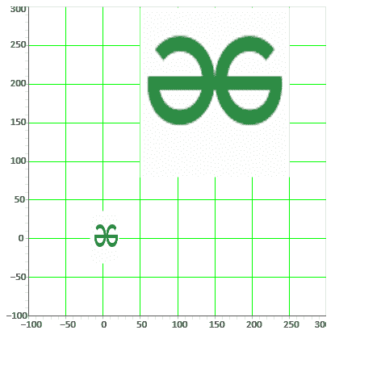
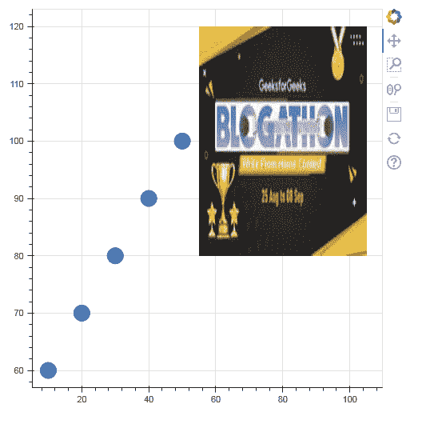

# 如何在 Bokeh 中处理图像

> 原文:[https://www . geeksforgeeks . org/如何使用 bokeh 中的图像/](https://www.geeksforgeeks.org/how-to-work-with-images-in-bokeh/)

在本文中，我们将看到如何在 Bokeh 中处理图像。

为此，我们将使用 **ImageURL 字形**。这个字形渲染从给定网址加载的图像。

> **语法:**图像 URL('url '，' x '，' y '，' w '，' h '，' angle '，' dilate ')
> 
> **论据:**
> 
> *   **网址:**需要检索图像的网址。
> *   **x** = NumberSpec(默认=字段(“x”)，定位图像锚点的 x 坐标。
> *   **y** = NumberSpec(默认=字段(“y”)，定位图像锚点的 y 坐标。
> *   **w** = NullDistanceSpec，图像将在数据空间中占据的绘图区域的宽度。默认值为“无”，在这种情况下，图像将以其实际图像大小显示。
> *   **h** = NullDistanceSpec，图像将在数据空间中占据的绘图区域的高度。默认值为“无”，在这种情况下，图像将以其实际图像大小显示(与此处指定的单位无关)。
> *   **角度** =角度规格(默认值=0)，图像旋转的角度，从水平方向测量。
> *   **全局 _alpha** =浮动(1.0)，每个图像渲染时的整体不透明度。
> *   **放大** = Bool(False)，是否总是对分数像素位置进行舍入，以使图像变大。如果像素舍入误差导致图像之间有间隙，则此设置可能很有用，此时它们应该看起来齐平。
> *   **锚** = Enum(锚)，图像的什么位置应该锚定在‘x’，‘y’坐标。
> *   **重试次数** = Int(0)，尝试从指定的网址重新加载图像的次数。默认值为零。
> *   **retry_timeout** = Int(0)，从指定 URL 加载图像的重试尝试之间的超时(毫秒)。默认值为零毫秒。

### 示例 1:从网址导入图像

在这个例子中，我们从给定的网址加载图像，然后在图上渲染图像。在这个例子中，我们从网络上加载图像，也可以在本地加载。这里，我们在图上显示了两个具有不同参数值(如 x、y、w、h 等)的图像。你可以观察输出，以便更好地理解。

## 计算机编程语言

```py
# importing numpy package and other libraries
import numpy as np
from bokeh.io import curdoc, show
from bokeh.models import ColumnDataSource, Grid, ImageURL, LinearAxis, Plot, Range1d
from bokeh.plotting import figure

# url to load image from
url = "https://media.geeksforgeeks.org/wp-content/\
uploads/20210829161730/logo.png"

N = 5

# creating columndatasource
source = ColumnDataSource(dict(
    url=[url]*N,
    x1=np.arange(N),
    y1=np.arange(N),
    w1=[35]*N,
    h1=[64]*N,
))

# creating x and y axis range
xdr = Range1d(start=-100, end=300)
ydr = Range1d(start=-100, end=300)

# creating a plot with above x and y axes range
plot = Plot(
    title=None, x_range=xdr, y_range=ydr,
  plot_width=400, plot_height=400,
    min_border=0, toolbar_location=None)

# loading the image using imageUrl
image = ImageURL(url=["https://media.geeksforgeeks.org/\
wp-content/uploads/20210829161730/logo.png"],
                 x=50, y=80, w=200, h=250, anchor="bottom_left")
image1 = ImageURL(url="url", x="x1", y="y1", w="w1",
                  h="h1", anchor="center")

# rendering the images to the plot
plot.add_glyph(source, image)
plot.add_glyph(source, image1)

xaxis = LinearAxis()
plot.add_layout(xaxis, 'below')

yaxis = LinearAxis()
plot.add_layout(yaxis, 'left')

# adding grid lines to the plot
plot.add_layout(Grid(dimension=0, ticker=xaxis.ticker,
                     grid_line_color='#00ff00'))

plot.add_layout(Grid(dimension=1, ticker=yaxis.ticker,
                     grid_line_color='#00ff00'))

# creates output file
curdoc().add_root(plot)
curdoc().theme = 'caliber'

# showing the plot on output file
show(plot)
```

**输出:**



#### 解释:

*   我们正在创建 ColumnDataSource，它为我们绘图的字形提供数据。Bokeh 有自己的数据结构，称为 ColumnDataSource，可以用作任何 Bokeh 对象的输入。我们正在用 NumPy 数组创建数据。
*   现在使用 range1d 创建 x 和 y 范围，它在标量维度中创建一个范围，然后将其分配给 xdr 和 ydr，我们将在创建图时使用它们。
*   然后我们用 xdr 和 ydr 作为 x_range 和 y_range 创建图，并将图的高度和宽度设置为 400。
*   然后，我们通过设置代码中显示的所有参数值，从之前声明的 URL 中检索图像。我们在这里使用了两幅图像，给出了不同的值。
*   现在，我们将图像渲染到图中。
*   接下来，我们使用网格功能将网格线添加到图中，并赋予它“绿色”。
*   然后，我们将该图添加到表示新文档的应用程序代码 curdoc 中，并将其发送到 bokehJs 以向用户显示。

### 示例 2:创建圆形标志符号

在本例中，我们创建了一个带有圆形字形的图形，然后使用字形 ImageURL 从给定的 URL 简单地渲染图像。

## 计算机编程语言

```py
# importing numpy package and other libraries
import numpy as np
from bokeh.io import curdoc, show
from bokeh.models import ColumnDataSource, Grid, ImageURL, LinearAxis, Plot, Range1d
from bokeh.plotting import figure

# create dict as basis for ColumnDataSource
data = {'x1': [10, 20, 30, 40, 50],
        'y1': [60, 70, 80, 90, 100]}

# create ColumnDataSource based on dict
source = ColumnDataSource(data=data)

# creating figure
p = figure(plot_height=500, plot_width=500)
p.circle(x="x1", y="y1", size=20, source=source)

# rendering the image using imageUrl
image = ImageURL(url=["https://media.geeksforgeeks.org/\
wp-content/uploads/20210902155548/imgurl2-200x112.jpg"],
                 x=80, y=100, w=50, h=40, anchor="center", 
                 retry_attempts=2)

# adding the images to the plot
p.add_glyph(source, image)

# creates output file
curdoc().add_root(p)

# showing the plot on output file
show(p)
```

**输出:**

