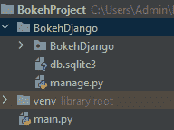
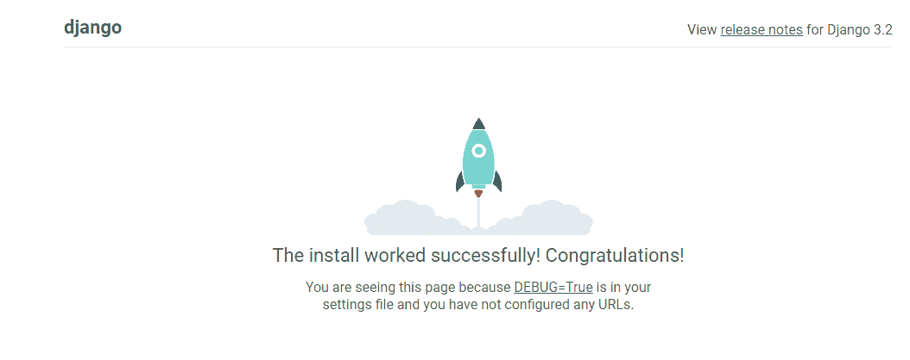
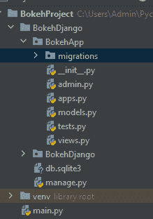
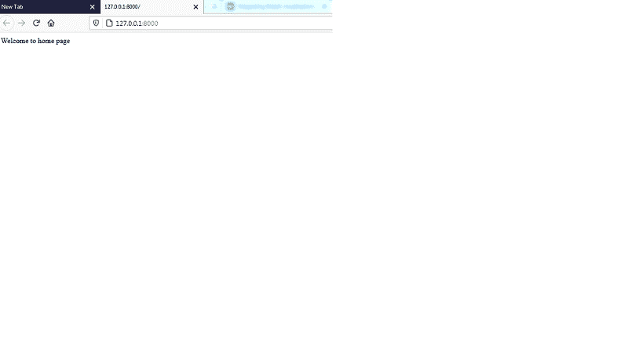
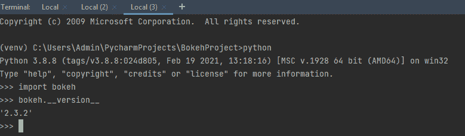
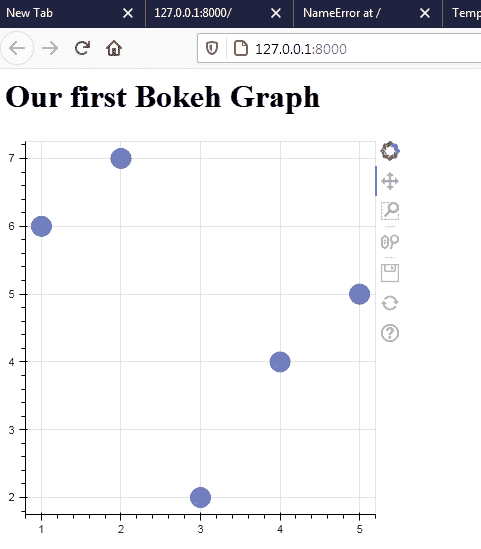
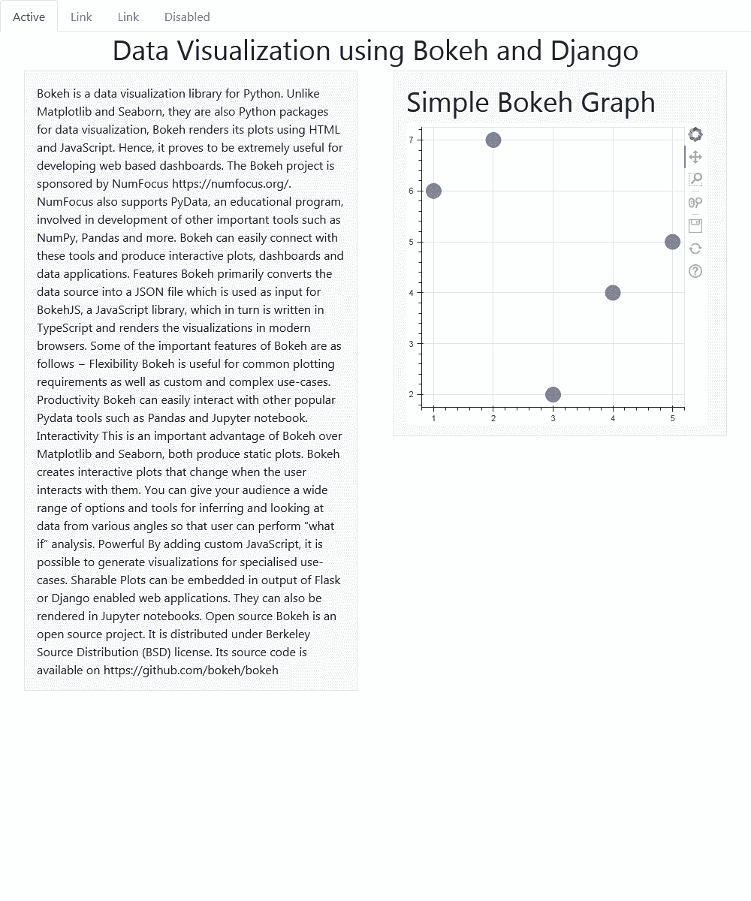

# 在 Django 应用程序中集成 Bokeh 可视化

> 原文:[https://www . geesforgeks . org/integrating-bokeh-visualizations-in-django-application/](https://www.geeksforgeeks.org/integrating-bokeh-visualizations-in-django-application/)

Bokeh 是一个交互式可视化库，帮助我们创建数据集的可视化表示并与之交互。您可以创建各种类型的可视化效果，如条形图、水平图、时间序列等。有各种方法可以将 Bokeh 应用程序和小部件包含到网络应用程序和页面中。

在本教程中，我们将创建一个基本的 bokeh 图，并将其嵌入到我们的 Django web 应用程序中。为此，我们将从返回单个组件的 *bokeh.embed* 导入组件。函数*bokeh . embedded . components()*返回一个脚本，其中包含带有 *< div >标记*的绘图数据，绘图视图将加载到该脚本中。我们将详细了解一步一步的过程。

### 步骤 1:建立一个基本的 Django 项目

对于这个项目，我们使用的是 PyCharm IDE。PyCharm 是 python 脚本语言最流行的集成开发环境之一。

*   打开 PyCharm，创建一个新项目，并将其保存为 BokehProject。
*   转到终端，使用以下命令安装 Django:

```py
pip install django
```

*   同样，我们将在项目中安装 bokeh，如下所示:

```py
pip install bokeh
```

### 步骤 2:创建姜戈项目

*   使用以下命令创建一个 Django 项目:

```py
django-admin startproject BokehDjango
```

*   使用以下命令更改项目文件夹:

```py
cd BokehDjango
```

*   运行 manage.py，通过使用下面的迁移，将数据更改初步迁移到我们的项目中

```py
python manage.py migrate
```

*   使用以下命令创建一个超级用户，以创建一个**超级用户**帐户

```py
python manage.py createsuperuser  
```

*   添加姓名、电子邮件和密码。
*   在此阶段，目录结构如下所示:



*   现在让我们运行命令下面的命令来检查 Django 是否安装成功。

```py
python manage.py runserver
```

*   导航到地址  会看到类似这样的内容。



*   现在，我们使用以下命令创建一个 Django 应用程序

```py
python manage.py startapp BokehApp
```

*   此阶段的目录结构如下所示:



*   既然我们已经创建了一个应用程序，我们需要将它添加到设置中。打开 settings.py 并在已安装的应用程序中添加以下内容:

```py
INSTALLED_APPS = [
   'django.contrib.admin',
   'django.contrib.auth',
   'django.contrib.contenttypes',
   'django.contrib.sessions',
   'django.contrib.messages',
   'django.contrib.staticfiles',
   'BokehApp',
]
```

*   更新 urls.py 文件并添加 URL 模式。从我们的项目文件夹即 BokehDjango 打开*URL . py*，在导入语句中加入 include 函数。此外，添加路径以包含我们新应用程序的 URL，如下所示:

## 计算机编程语言

```py
from django.contrib import admin
from django.urls import path, include

urlpatterns = [
    path("admin/", admin.site.urls),
    path("", include("BokehApp.urls")),
]
```

*   现在在我们的 app 文件夹中创建一个新文件，即 BokehApp，并将其保存为*URL . py .*
*   打开文件，为您的主页添加路径，如下所示，并且不要忘记导入路径和视图。

## 计算机编程语言

```py
from django.urls import path
from . import views

urlpatterns = [path("", views.home, name="home")]
```

*   接下来，我们为我们的主页创建视图，它将呈现我们的第一个博克图。打开 views.py 并创建一个名为 *home()* 的新方法，在此之前我们导入 HttpResponse..HttpResponse 最常用作 Django 视图的返回对象。
*   到目前为止，我们只显示如下欢迎消息:

## 计算机编程语言

```py
from django.shortcuts import render
from django.http import HttpResponse

# Create your views here.
def home(request):
    return HttpResponse("Welcome to home page")
```

*   让我们使用 python manage.py runserver 运行服务器，并查看结果:



太好了。所以这一切都是为了建立我们的姜戈网站。

### 步骤 3:在我们的项目中完成 Bokeh 设置:

*   转到您的 python shell 并检查 Bokeh 的版本，如下所示:

```py
bokeh.__version__  
```

*   如下图所示:



*   现在让我们在 BokehApp 目录中创建一个模板文件夹，并将其保存为模板。在模板目录中创建新文件，并将其保存为 base.html。
*   在你的*base.html*文件的头牌中添加以下 CSS 链接，并在 *bokeh <u>-x.y.z.</u> min(下划线位置 x . y . z)*处替换你的 bokeh 版本

## 超文本标记语言

```py
<link href=”http://cdn.pydata.org/bokeh/release/bokeh-2.3.2.min.css
   " rel=”stylesheet” type=”text/css”>
<link href=”http://cdn.pydata.org/bokeh/release/bokeh-widgets-2.3.2.min.css"
   rel=”stylesheet” type=”text/css”>
```

*   结束正文标签下方的 JavaScript 链接，即

## 超文本标记语言

```py
<script src="https://cdn.bokeh.org/bokeh/release/bokeh-2.3.2.min.js"></script>
<script src="https://cdn.bokeh.org/bokeh/release/bokeh-widgets-2.3.2.min.js"></script>
<script src="https://cdn.bokeh.org/bokeh/release/bokeh-tables-2.3.2.min.js"></script>
<script src="https://cdn.bokeh.org/bokeh/release/bokeh-api-2.3.2.min.js"></script>
```

*   base.html 文件看起来像

## 超文本标记语言

```py
<html>
   <head>
      <link href=”http://cdn.pydata.org/bokeh/release/bokeh-2.3.2.min.css
         " rel=”stylesheet” type=”text/css”>
      <link href=”http://cdn.pydata.org/bokeh/release/bokeh-widgets-2.3.2.min.css"
         rel=”stylesheet” type=”text/css”>
   </head>
   <body>
      <h1>Our first Bokeh Graph</h1>
      {{div| safe}}
   </body>
   <script src="https://cdn.bokeh.org/bokeh/release/bokeh-2.3.2.min.js"></script>
   <script src="https://cdn.bokeh.org/bokeh/release/bokeh-widgets-2.3.2.min.js"></script>
   <script src="https://cdn.bokeh.org/bokeh/release/bokeh-tables-2.3.2.min.js"></script>
   <script src="https://cdn.bokeh.org/bokeh/release/bokeh-api-2.3.2.min.js"></script>
   {{script| safe}}
</html>
```

*   现在让我们替换视图函数 home，以便它呈现我们的第一个图形。添加下面的代码，在我们的图中创建基本的圆形散点图:

## 计算机编程语言

```py
from django.shortcuts import render
from django.http import HttpResponse
from bokeh.plotting import figure
from bokeh.embed import components

# Create your views here.

def home(request):

   #create a plot
    plot = figure(plot_width=400, plot_height=400)

   # add a circle renderer with a size, color, and alpha

   plot.circle([1, 2, 3, 4, 5], [6, 7, 2, 4, 5], size=20, color="navy", alpha=0.5)

   script, div = components(plot)

   return render(request, 'base.html', {'script': script, 'div': div})
```

*   **组件**方法返回一个包含绘图数据的脚本，并提供一个< div >标签来显示绘图视图。这两个元素可以插入到 HTML 文本中，并且<脚本>在执行时会用剧情替换 div。
*   **圆**法是字形法，是**图**对象的一种方法。字形是博克图的基本视觉构件。这包括散点图中的直线、矩形、正方形、楔形或圆形等元素
*   **绘图**变量使我们能够创建一个保存所有各种对象(如字形、注释等)的绘图。视觉化。

因此，让我们在保存所有文件后刷新页面，输出如下所示。



为了增强页面的外观，我们将引导添加到 base.html 文件中。我们已经添加了一些组件，最终的 HTML 如下所示:

## 超文本标记语言

```py
<html>
   <head>
      <link href="https://cdn.jsdelivr.net/npm/bootstrap@5.0.1/dist/css/bootstrap.min.css"
         rel="stylesheet"
         integrity="sha384-+0n0xVW2eSR5OomGNYDnhzAbDsOXxcvSN1TPprVMTNDbiYZCxYbOOl7+AMvyTG2x"
         crossorigin="anonymous">
      <link href=”http://cdn.pydata.org/bokeh/release/bokeh-2.3.2.min.css
         " rel=”stylesheet” type=”text/css”>
      <link href=”http://cdn.pydata.org/bokeh/release/bokeh-widgets-2.3.2.min.css"
         rel=”stylesheet” type=”text/css”>
   </head>
   <body>
      <ul class="nav nav-tabs">
         <li class="nav-item">
            <a class="nav-link active" aria-current="page" href="#">Active</a>
         </li>
         <li class="nav-item">
            <a class="nav-link" href="#">Link</a>
         </li>
         <li class="nav-item">
            <a class="nav-link" href="#">Link</a>
         </li>
         <li class="nav-item">
            <a class="nav-link disabled" href="#" tabindex="-1"
               aria-disabled="true">Disabled</a>
         </li>
      </ul>
      <h1 align="center">Data Visualization using Bokeh and Django</h1>
      <div class="container overflow-hidden">
         <div class="row gx-5">
            <div class="col">
               <div class="p-3 border bg-light">Bokeh is a data
                  visualization library for Python. Unlike Matplotlib and
                  Seaborn, they are also Python packages for data visualization,
                  Bokeh renders its plots using HTML and
                  JavaScript. Hence, it proves to be extremely useful
                  for developing web based dashboards.
                  The Bokeh project is sponsored by NumFocus
                  https://numfocus.org/. NumFocus also supports PyData, an
                  educational program, involved in development of
                  important tools such as NumPy, Pandas and more.
                  Bokeh can easily connect with these tools and
                  produce interactive plots, dashboards and data applications.
                  Features
                  Bokeh primarily converts the data source into a JSON file
                  which is used as input for BokehJS, a JavaScript library,
                  which in turn is written in TypeScript and renders the
                  visualizations in modern browsers.
                  Some of the important features of Bokeh are as follows −
                  Flexibility
                  Bokeh is useful for common plotting requirements as
                  well as custom and complex use-cases.
                  Productivity
                  Bokeh can easily interact with other popular Pydata
                  tools such as Pandas and Jupyter notebook.
                  Interactivity
                  This is an important advantage of Bokeh over Matplotlib and
                  Seaborn, both produce static plots. Bokeh
                  creates interactive plots that change when the user
                  interacts with them. You can give your audience a
                  wide range of options and tools for inferring and
                  looking at data from various angles so that user can
                  perform “what if” analysis.
                  Powerful
                  By adding custom JavaScript, it is possible to generate
                  visualizations for specialised use-cases.
                  Sharable
                  Plots can be embedded in output of Flask or Django
                  enabled web applications. They can also be rendered in
                  Jupyter notebooks.
                  Open source
                  Bokeh is an open source project. It is distributed under
                  Berkeley Source Distribution (BSD) license. Its
                  source code is available on https://github.com/bokeh/bokeh
               </div>
            </div>
            <div class="col">
               <div class="p-3 border bg-light">
                  <h1>Simple Bokeh Graph</h1>
                  {{ div| safe}}
               </div>
            </div>
         </div>
      </div>
      <script src="https://cdn.jsdelivr.net/npm/bootstrap@5.0.1/dist/js/bootstrap.bundle.min.js"
         integrity="sha384-gtEjrD/SeCtmISkJkNUaaKMoLD0//ElJ19smozuHV6z3Iehds+3Ulb9Bn9Plx0x4"
         crossorigin="anonymous"></script>
   </body>
   <script src="https://cdn.bokeh.org/bokeh/release/bokeh-2.3.2.min.js"></script>
   <script src="https://cdn.bokeh.org/bokeh/release/bokeh-widgets-2.3.2.min.js"></script>
   <script src="https://cdn.bokeh.org/bokeh/release/bokeh-tables-2.3.2.min.js"></script>
   <script src="https://cdn.bokeh.org/bokeh/release/bokeh-api-2.3.2.min.js"></script>
   {{script| safe}}
</html>
```

**输出:**

