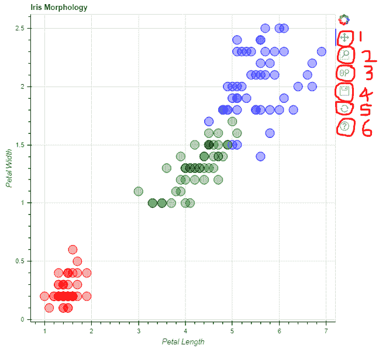
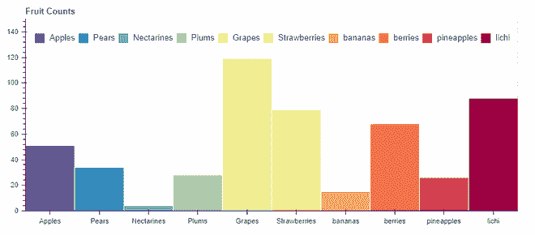

# 使用 Bokeh 进行数据交互可视化

> 原文:[https://www . geesforgeks . org/interactive-visualization-of-data-use-bokeh/](https://www.geeksforgeeks.org/interactive-visualization-of-data-using-bokeh/)

**Bokeh** 是一个 Python 库，用于在网络浏览器中创建交互式数据可视化。它以视觉上令人愉悦的方式提供了人类可读且快速的数据呈现。如果您以前在 Python 中使用过可视化，很可能您使用过 matplotlib。但是博克不同于马特普罗特利布。

要安装 Bokeh，请在终端中键入以下命令。

```
pip install bokeh

```

## **为什么要用 Bokeh？**

matplotlib 和 Bokeh 的预期用途大不相同。Matplotlib 创建静态图形，对于快速简单的可视化或创建出版物质量的图像非常有用。Bokeh 创建可视化以在网络上显示(无论是本地还是嵌入网页)，最重要的是，可视化意味着高度交互。Matplotlib 不提供这两个特性。

如果你想与你的数据进行可视化交互，或者你想将交互式可视化数据分发给网络观众，Bokeh 就是你的图书馆！如果你的主要兴趣是制作最终的可视化出版物，matplotlib 可能会更好，尽管 Bokeh 确实提供了一种创建静态图形的方法。

### **绘制简单图形**

在这个例子中，我们将使用一个内置数据集，即 flowers 数据集。我们可以使用 **circle()** 方法将每个数据点绘制成图上的圆形，我们还可以指定自定义属性如:

> *   The first two elements must be data on the X axis and Y axis respectively.
> *   **Color:** Dynamic coloring, as shown in the figure.
> *   **Fill _ alpha:** Specify the opacity for the circle.
> *   **Size:** Specify the size of each circle.

**示例:**

## 计算机编程语言

```
from bokeh.plotting import figure, output_file, show 
from bokeh.sampledata.iris import flowers  

# assign custom colors to represent each 
# class of data in a dictionary format
colormap = {'setosa': 'red', 'versicolor': 'green', 
            'virginica': 'blue'}

colors = [colormap[x] for x in flowers['species']]

# title for the graph
p = figure(title="Iris Morphology")  

# label on x-axis
p.xaxis.axis_label = 'Petal Length' 

# label on y-axis
p.yaxis.axis_label = 'Petal Width'  

# plot each datapoint as a circle
# with custom attributes.
p.circle(flowers["petal_length"],
         flowers["petal_width"],
         color=colors, 
         fill_alpha=0.3,
         size=15)

# you can save the output as an
# interactive html file
output_file("iris1.html", title="iris.py example")

# display the generated plot of graph
show(p)
```

**输出:**



在上例中， **output_file()** 函数用于将生成的输出保存为 html 文件，因为 bokeh 使用 web 格式提供交互显示。最后 show()函数用于显示生成的输出。

**注:**

*   红色=濑户，绿色=云芝，蓝色=弗吉尼亚
*   在每个可视化的右上角，都有 bokeh 提供的交互功能。它允许 1。潘穿越剧情，2。使用框选择缩放，3。使用滚轮缩放，4。保存，5。重置，6。帮助

### **绘制条形图**

对于这个例子，我们将使用自定义创建的数据集，使用代码本身的列表，即水果数据集。 **output_file()** 函数用于将生成的输出保存为 html 文件，因为 bokeh 使用 web 格式。我们可以使用 **ColumnDataSource()** 函数将彼此创建的自定义数据集(两个列表)映射为字典格式。**图形()**功能用于初始化图形图形，以便可以使用各种参数在其上绘制数据，例如:

*   **x_range** :定义 x 轴上的数据。
*   **绘图 _ 宽度，绘图 _ 高度**:定义图形的宽度和高度。
*   **工具栏 _ 位置**:定义工具栏的位置。
*   **标题**:定义图形的标题。

这里我们使用简单的竖线来表示数据，因此我们使用 vbar()方法，并为竖线分配各种属性，我们在其中传递不同的参数，例如:

*   **x**:x 轴方向数据
*   **顶部**:y 轴方向数据
*   **宽度**:定义每个条的宽度
*   **来源**:数据来源
*   **图例 _ 字段**:显示数据中存在的类别列表
*   **线条颜色**:定义图形中线条的颜色
*   **fill_color** :为数据类定义不同的颜色

这里可以传递更多的参数。可以使用的其他一些属性包括:

*   **y_range.start** :用于定义 y 轴上数据的下限。
*   **y_range.end** :用于定义 y 轴上数据的最大上限。
*   **图例.方向**:定义图例条的方向。
*   **图例位置**:定义图例条的位置。

最后 **show()** 功能用于显示生成的输出。

**示例:**

## 计算机编程语言

```
from bokeh.io import output_file, show
from bokeh.models import ColumnDataSource
from bokeh.palettes import Spectral10
from bokeh.plotting import figure
from bokeh.transform import factor_cmap

output_file("fruits_bar_chart.html") #output save file name

# creating custom data
fruits = ['Apples', 'Pears', 'Nectarines',
          'Plums', 'Grapes', 'Strawberries',
          'bananas','berries','pineapples','lichi']
counts = [51, 34, 4, 28, 119, 79, 15, 68, 26, 88]

# mapping counts with classes as a dictionary
source = ColumnDataSource(data=dict(fruits=fruits,
                                    counts=counts))

# initializing the figure 
p = figure(x_range=fruits,
           plot_width=800, 
           plot_height=350,
           toolbar_location=None,
           title="Fruit Counts")

# assigning various attributes to plot
p.vbar(x='fruits', top='counts',
       width=1, source=source,
       legend_field="fruits",
       line_color='white',
       fill_color=factor_cmap('fruits',
                              palette=Spectral10,
                              factors=fruits))

p.xgrid.grid_line_color = None
p.y_range.start = 0
p.y_range.end = 150
p.legend.orientation = "horizontal"
p.legend.location = "top_center"

# display output
show(p)
```

**输出:**



**注:**这是静态图，也是 bokeh 提供的，类似 matplotlib。