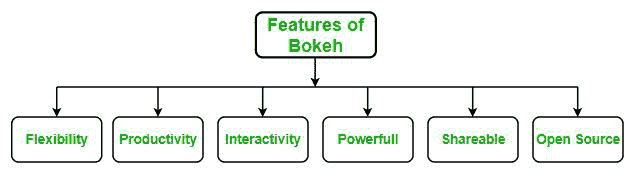
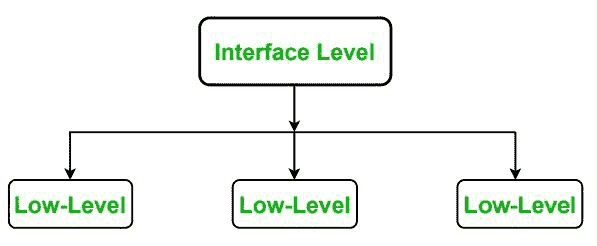

# Python 中的 Bokeh 介绍

> 原文:[https://www . geesforgeks . org/introduction-to-bokeh-in-python/](https://www.geeksforgeeks.org/introduction-to-bokeh-in-python/)

**Bokeh** 是一款 [**Python**](https://www.geeksforgeeks.org/python-programming-language/) 交互数据可视化。与 [**Matplotlib**](https://www.geeksforgeeks.org/python-introduction-matplotlib/) 和 [**Seaborn**](https://www.geeksforgeeks.org/introduction-to-seaborn-python/) 不同，Bokeh 使用 HTML 和 JavaScript 渲染其地块。它以现代网络浏览器为呈现目标，提供优雅、简洁的新颖图形结构和高性能交互性。

**博克的特征:**博克的一些重要特征如下:

*   **灵活性:** Bokeh 可以用于常见的绘图需求以及自定义和复杂的用例。
*   **生产力:**它与其他流行的 Pydata 工具(如 Pandas 和 Jupyter 笔记本)的交互非常容易。
*   **交互性:**它创建随用户交互而变化的交互图。
*   **功能强大:**通过添加 JavaScript，可以为专门的用例生成可视化。
*   **可共享:**可视化数据是可共享的。它们也可以在 Jupyter 笔记本中渲染。
*   **开源:** Bokeh 是一个开源项目。

**接口级别:** Bokeh 支持不同的接口级别，用户可以使用:

*   **低级:** bokeh.models 接口为应用程序开发人员提供了最大的灵活性。
*   **一个中级:** bokeh .标绘界面是由所有可视字形组成的。
*   **高级:** bokeh.charts 界面，轻松搭建复杂地块。