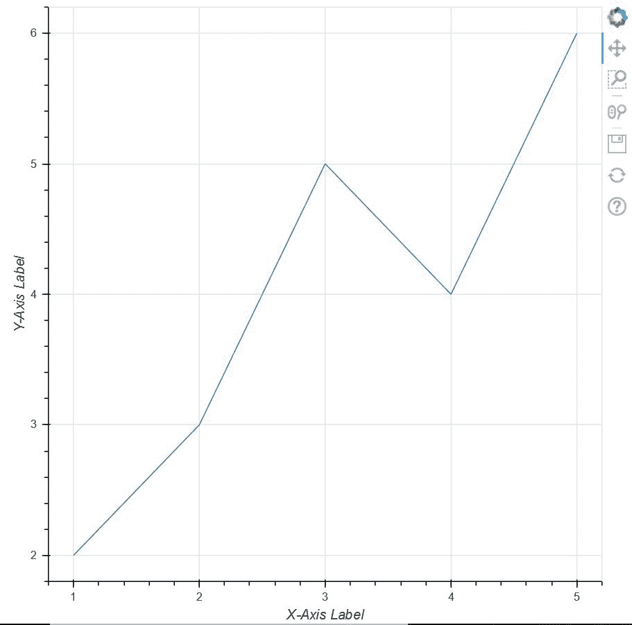
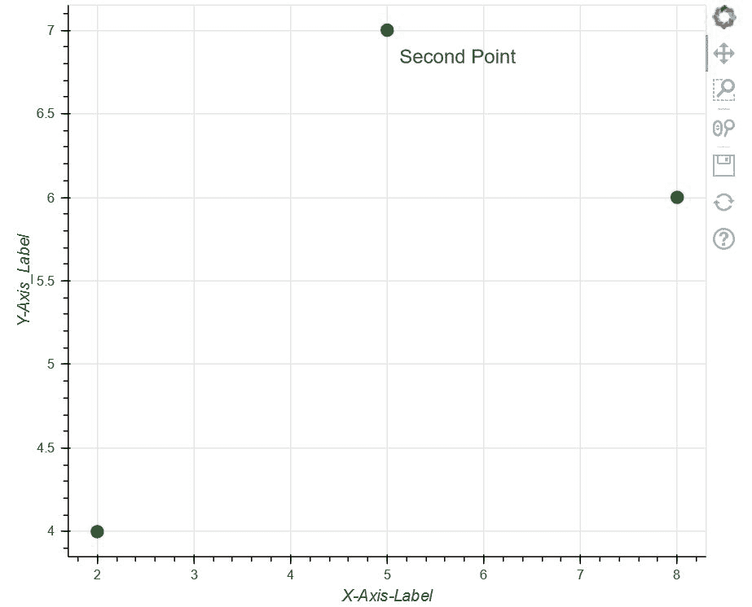
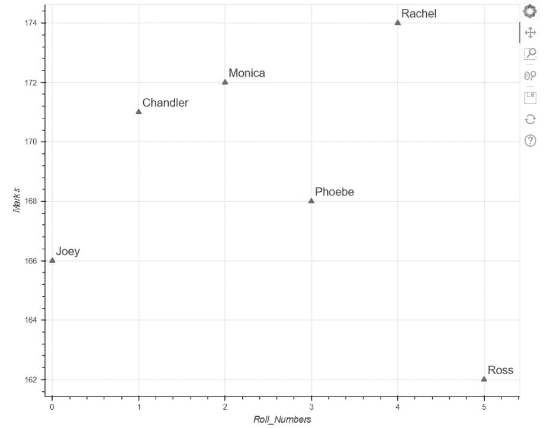
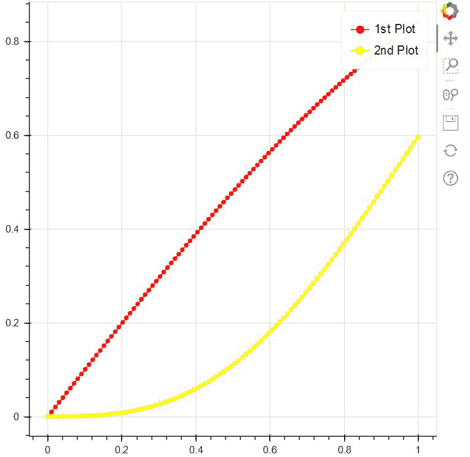

# 博克的标签

> 原文:[https://www.geeksforgeeks.org/labels-in-bokeh/](https://www.geeksforgeeks.org/labels-in-bokeh/)

在本文中，我们将学习**博克**中的**标签**。标签是用来在情节中定义某些东西的短词或短语。

让我们举一个例子，我们在图中画出一组点。现在，如果我们处理的是现实生活中的统计数据，那么为了绘制图中的点，我们需要用适当的信息来标记 X 轴和 Y 轴，以便定义我们相互绘制的内容。这就是这个术语的由来。它们帮助我们确定我们在 X 轴和 Y 轴上到底在画什么。除此之外，标签还有其他各种功能。

所以，让我们来看一个简单的实现，用一组简单的点在 X 轴和 Y 轴上放置标签。**可以使用 Google Colab** 或任何其他文本编辑器来实现上述概念。但是如果我们使用的是本地设备，请确保之前已经安装了 python。之后，我们需要安装 **bokeh** 。打开命令提示符并编写以下代码进行安装:

```py
pip install bokeh 
```

现在，让我们举一个简单的例子来了解一下 bokeh 中的标签。在这里，我们取一组点，用带有 bokeh 编码标签的 X 轴和 Y 轴来绘制它们。

**样本代码:**

## 蟒蛇 3

```py
# importing show from bokeh.io
# module to show the plot
from bokeh.io import show

# importing figure from
# bokeh.plotting to create an
# empty plot
from bokeh.plotting import figure

# Creating a set of points using
# two arrays x and y
x = [1, 2, 3, 4, 5]
y = [2, 3, 5, 4, 6]

# Creating an empty figure with plot width
# and height as 600
p = figure(plot_width=600, plot_height=600)

# defining that the points should be joined
# with a line
p.line(x, y)

# Defining the X-Axis Label
p.xaxis.axis_label = "X-Axis Label"

# defining the Y-Axis Label
p.yaxis.axis_label = "Y-Axis Label"

# showing the above plot
show(p)
```

**输出:**



现在，让我们深入探讨一下这个话题。除了在上述方法中仅在轴上添加标签外， **bokeh.models.annotations** 还为我们提供了一个名为**标签**的包。标签带有各种功能，我们将在下面探讨这些功能:

在下面的代码中，我们使用 bokeh.models.annotations 模块中的标签，并在图上绘制一组点。标记 X 轴和 Y 轴后，我们标记图中的第二个点。与此同时，我们还定义了标签的位置，并最终显示了上面的图。

**示例:**

## 蟒蛇 3

```py
# importing show from bokeh.io
# module to show the plot
# importing show from bokeh.io
from bokeh.io import show

# importing label from
# bokeh.models.annotations module
from bokeh.models.annotations import Label

# importing figure from bokeh.plotting
# module
from bokeh.plotting import figure

# Creating an empty figure with plot
# width and size to be 600 and 500
# respectively
p = figure(plot_width=600, plot_height=500)

# Plotting the points in the shape of
# a circle with color green and size 10
p.circle([2, 5, 8], [4, 7, 6], color="green", size=10)

# Labelling the X-Axis
p.xaxis.axis_label = "X-Axis-Label"

# Labelling the Y-Axis
p.yaxis.axis_label = "Y-Axis_Label"

# Creating a label for the point (5,7)
# where the text for the point will be
# "Second Point" alng with defining
# the position of the text
label = Label(x=5, y=7, x_offset=10, y_offset=-30, text="Second Point")

# Implementing label in our plot
p.add_layout(label)

# Showing the above plot
show(p)
```

**输出:**



**我们来看下一个例子:**

在这个例子中，我们将讨论标签的另一个属性，即**标签集。**但是在进入代码之前，我们应该对什么是 LabelSet 有一个简单的了解。现在，从前面的例子中，我们可以清楚地看到，在标签的帮助下，我们只能标记图形中的一个点，即“第二点”。但是如果我们想标记所有的点，那么每次重复代码就没有意义了。因此，在这种情况下，bokeh 提出了一个名为 LabelSet 的包，它帮助我们在不重复的情况下标记图中的多个点。在这个例子中，我们将使用另一个包，即**列数据源**。ColumnDataSource 为我们提供了列名与一系列值的映射。

现在，让我们转到代码来看看实现:

**代码:**

## 蟒蛇 3

```py
# importing figure from
# Bokeh.plotting
from bokeh.plotting import figure

# importing ColumnDataSource and LabelSet
# from bokeh.models
from bokeh.models import ColumnDataSource, LabelSet

# import show from broken.io module
from bokeh.io import show

# Using ColumnDataSource we are providing
# Column names to a sequence of values
source = ColumnDataSource(data=dict(
    marks=[166, 171, 172, 168, 174, 162],
    roll_no=[0, 1, 2, 3, 4, 5],
    names=['Joey', 'Chandler', 'Monica',
           'Phoebe', 'Rachel', 'Ross']))

# Creating an empty figure
p = figure(plot_width=750, plot_height=600)

# Plotting the data in the form of triangle
p.triangle(x='roll_no', y='marks', size=8, source=source)

# Labelling the X-Axis
p.xaxis.axis_label = 'Roll_Numbers'

# Labelling the Y-Axis
p.yaxis.axis_label = 'Marks'

# Using LabelSet, we are labelling each of the
# points with names created in source
labels = LabelSet(x='roll_no', y='marks', text='names',
                  x_offset=5, y_offset=5, source=source)

Adding that label to our figure
p.add_layout(labels)

# Showing the above plot
show(p)
```

**输出:**



最后但同样重要的是，我们将学习另一个注释，即 legend_label，它可以帮助我们区分图形中的多个图。通过使用标签**“legend _ label”**，我们实际上定义了将显示在图表右上角的图的名称。

**代码:**

## 蟒蛇 3

```py
# import numpy package
import numpy as np

# importing figure and show from
# bokeh.plotting
from bokeh.plotting import figure, show

# Creating an array of 100 numbers
# between 0 to 1 using linespace
x = np.linspace(0, 1, 100)

# Creating an array of sin
# values of x in y
y = np.sin(x)

# Creating an empty figure
p = figure(plot_width=500, plot_height=500)

# Creating the first plot with color as red and label as
# sin(x)
p.circle(x, y, legend_label="1st Plot", color="red")

# Drawing a line through all the points with the
# same color
p.line(x, y, legend_label="1st Plot", line_color="red")

# Drawing the second plot as yellow and labelling as
# the 2nd plot
p.circle(x, y**3, legend_label="2nd Plot", color="yellow")

# Drawing a line through all the points of the
# second plot
p.line(x, y**3, legend_label="2nd Plot", line_color="yellow", line_width=2)

# showing the above plot
show(p)
```

**输出:**

