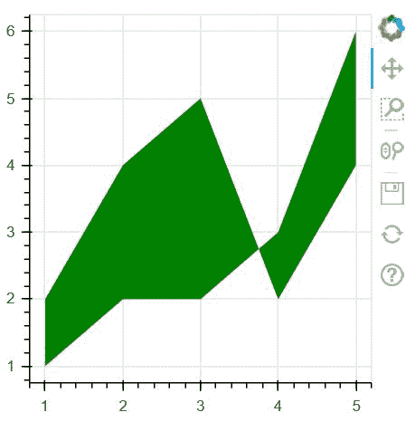
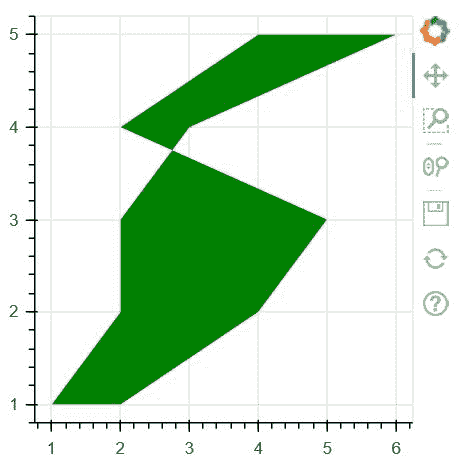

# 使用 Bokeh

在 Python 中制作面积图

> 原文:[https://www . geeksforgeeks . org/make-a-area-plot-in-python-using-bokeh/](https://www.geeksforgeeks.org/make-an-area-plot-in-python-using-bokeh/)

**Bokeh** 是一款 [**Python**](https://www.geeksforgeeks.org/python-programming-language/) 交互数据可视化。与 [**Matplotlib**](https://www.geeksforgeeks.org/python-introduction-matplotlib/) 和 **Seaborn** 不同，Bokeh 使用 HTML 和 JavaScript 渲染其地块。它以现代网络浏览器为呈现目标，提供优雅、简洁的新颖图形结构和高性能交互性。

## **绘制区域图**

面积图定义为两个系列之间共享一个公共面积的填充区域。Bokeh 图类有两种方法，如下所示:

*   **varea（）**
*   **【harea()**

**1。varea()方法:** varea()方法是一个垂直有向区域，它有一个 x 坐标数组和两个 y 坐标数组，y1 和 y2，这两个数组之间将被填充。

> **语法:** varea(x，y1，y2，**kwargs)
> 
> **参数:**该方法接受以下描述的参数:
> 
> *   **x:** 该参数是该区域点的 x 坐标。
> *   **y1:** 此参数是区域一侧点的 y 坐标。
> *   **y2:** 此参数为区域另一侧点的 y 坐标。

**示例:**

## 蟒蛇 3

```py
# Implementation of bokeh function

import numpy as np 
from bokeh.plotting import figure, output_file, show

x = [1, 2, 3, 4, 5]
y1 = [2, 4, 5, 2, 4]
y2 = [1, 2, 2, 3, 6]

output_file("geeksforgeeks.html")

p = figure(plot_width=300, plot_height=300)

# area plot
p.varea(x=x, y1=y1, y2=y2,fill_color="green")

show(p)
```

**输出:**



**2。harea()方法:** harea()方法是一个水平有向区域，它有一个 x 坐标数组和两个 y 坐标数组，y1 和 y2，这两个数组之间将被填充。

> **语法:** harea(x1，x2，y，**kwargs)
> 
> **参数:**该方法接受以下描述的参数:
> 
> *   **x1:** 该参数是区域一侧点的 x 坐标。
> *   **x2:** 此参数为区域另一侧点的 x 坐标。
> *   **y:** 该参数是该区域点的 y 坐标。

**示例:**

## 蟒蛇 3

```py
# Implementation of bokeh function

import numpy as np 
from bokeh.plotting import figure, output_file, show

y = [1, 2, 3, 4, 5]
x1 = [2, 4, 5, 2, 4]
x2 = [1, 2, 2, 3, 6]

output_file("geeksforgeeks.html")

p = figure(plot_width=300, plot_height=300)

# area plot
p.harea(x1=x1, x2=x2, y=y,fill_color="green")

show(p)
```

**输出:**

