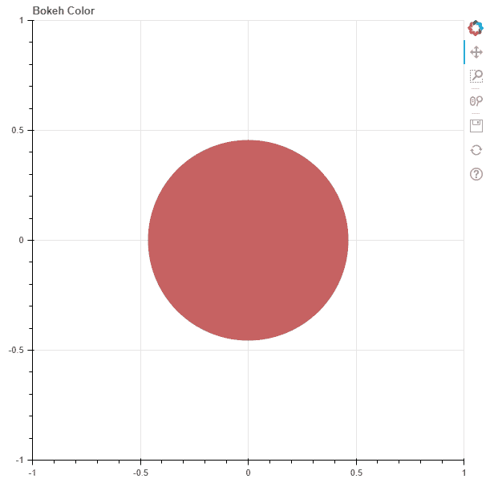
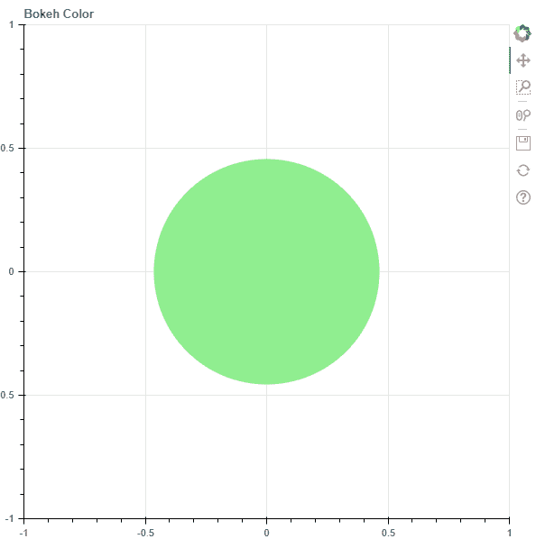

# Python Bokeh–颜色类

> 原文:[https://www.geeksforgeeks.org/python-bokeh-colors-class/](https://www.geeksforgeeks.org/python-bokeh-colors-class/)

Bokeh 是一款 Python 交互数据可视化。它使用 HTML 和 JavaScript 来渲染它的图。它以现代网络浏览器为呈现目标，提供优雅、简洁的新颖图形结构和高性能交互性。

在本文、中，我们将了解博凯的**颜色**。Bokeh 中有 5 种不同的颜色类别:

1.  颜色，颜色
2.  bokeh.colors.HSL
3.  boeck . colors . RGB 档
4.  bokeh . colors . group
5.  bokeh . colors . name

## 颜色，颜色

这是代表颜色对象的**基类**。该类中的方法有:

*   夹钳()
*   复制()
*   变暗()
*   from_hsl()
*   from_rgb()
*   减轻()
*   to_css()
*   to_hsl()
*   to_rgb()

## bokeh.colors.HSL

这提供了一个用 **HSL** 格式表示颜色的类，即色相、值和明度。

**示例:**我们将绘制一个字形，并使用 HSL 格式对其进行着色。

## 蟒蛇 3

```py
# importing the modules 
from bokeh.plotting import figure, output_file, show 
from bokeh.colors import HSL

# file to save the model 
output_file("gfg.html") 

# instantiating the figure object 
graph = figure(title = "Bokeh Color") 

# the point to be plotted 
x = 0
y = 0

# HSL color
hue = 0
saturation = 0.47
lightness = 0.58
color = HSL(h = hue,
            s = saturation,
            l = lightness)

# plotting the graph 
graph.dot(x, y, size = 1000,
          color = color.to_rgb()) 

# displaying the model 
show(graph)
```

**输出:**



## boeck . colors . RGB 档

该通过指定红色、绿色和蓝色通道来表示颜色。

**示例:**我们将绘制一个字形，并使用 RGB 格式将其染成浅绿色。

## 蟒蛇 3

```py
# importing the modules 
from bokeh.plotting import figure, output_file, show 
from bokeh.colors import RGB

# file to save the model 
output_file("gfg.html") 

# instantiating the figure object 
graph = figure(title = "Bokeh Color") 

# the point to be plotted 
x = 0
y = 0

# RGB color
red = 144
green = 238
blue = 144
color = RGB(r = red,
            g = green,
            b = blue)

# plotting the graph 
graph.dot(x, y, size = 1000,
          color = color) 

# displaying the model 
show(graph)
```

**输出:**



## bokeh . colors . group

这表示根据一般色调将 CSS 命名的颜色分成有用的组。每种颜色都有自己的类别，有多种不同色调的。本课程中的颜色列表为:

1.  **黑色:**增益 sboro，lightgray，silver，darkgray，dimgray，lightslategray，slaughter gray，dark slaughter，black
2.  **蓝色:**轻钢蓝、粉末蓝、轻钢、天蓝色、光剑蓝、深天空蓝、十二月蓝、康沃尔蓝、钢蓝、皇家蓝、蓝、中阴、暗蓝色、海军、午夜蓝
3.  **棕色:**玉米须、白蜡、浓汤、纳瓦霍白、小麦、burlywood、tan、rosybrown、sandybrown、黄花、暗黄花、秘鲁、巧克力、鞍形棕、锡耶纳、棕色、褐红色
4.  **青色:T1】水母、水生、青色、淡青色、古生物、水生、土耳其、中世生物、暗生物、暗生物、亮绿色、短链氯化石蜡、深青色、teal**
5.  绿色:暗橄榄树、橄榄、橄榄树、黄绿色、莱姆绿色、莱姆、草坪会议大楼、图表产生器、绿色黄色、春树绿色、中环绿色、lightgreen、palegreen、darkseagreen、mediumseagreen、seagreen、forestforestreen、green、darkgreen
6.  **橙色:**橙色、番茄色、珊瑚色、深橙色、橙色
7.  **粉红色:**粉色，淡粉色，火红，深粉色，古色古香，中世纪紫色
8.  **紫色:**薰衣草、伦理道德、羽毛、紫色、兰花、紫红色、紫红色、中墨角、月牙形、紫蓝色、暗紫色、暗紫色、紫红色、indigo、暗石板蓝色、蓝中世蓝
9.  **红色:**亮鲑鱼、鲑鱼、暗鲑鱼、光珊瑚、印度红、深红色、耐火砖、暗红色、红色
10.  白色，白雪，蜜环素，薄荷，蓝色，天蓝色，鬼影，白色烟雾，海亮，米色，oldlace，floralwhite，ivory，antiquewhite，linen，lavenderblush，mysterious
11.  **黄色:**黄色，淡黄色，lemonchiffon，lightgoldenrodyellow，papayawhip，moccasin，peachpuff，palegoldenrod，khaki，darkkhaki，gold

**示例:**我们将绘制多个字形，并使用颜色组对它们进行着色。

## 蟒蛇 3

```py
# importing the modules 
from bokeh.plotting import figure, output_file, show 
from bokeh.colors.groups import purple, yellow, blue

# file to save the model 
output_file("gfg.html") 

# instantiating the figure object 
graph = figure(title = "Bokeh Color") 

# the point to be plotted 
x = [-2, 0, 2]
y = 0

# color groups
color = [purple()._colors[purple()._colors.index("Fuchsia")],
         yellow()._colors[yellow()._colors.index("Khaki")],
         blue()._colors[blue()._colors.index("RoyalBlue")]]

# plotting the graph 
graph.dot(x, y, size = 1000,
          color = color) 

# displaying the model 
show(graph)
```