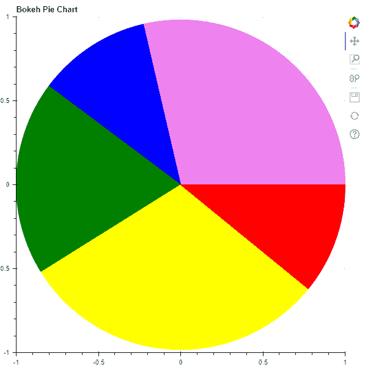
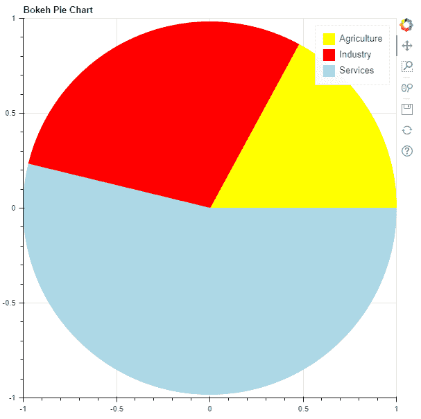

# Python Bokeh–制作饼图

> 原文:[https://www . geesforgeks . org/python-bokeh-making-a-pie-chart/](https://www.geeksforgeeks.org/python-bokeh-making-a-pie-chart/)

Bokeh 是一个 Python 交互式数据可视化工具。它使用 HTML 和 JavaScript 来渲染它的图。它以现代网络浏览器为呈现目标，提供优雅、简洁的新颖图形结构和高性能交互性。

让我们看看如何在 Bokeh 中绘制饼图。没有为我们提供直接绘制饼图的模块，但是我们可以使用楔形符号来制作饼图。可以使用 [`bokeh.plotting.figure.wedge()`](https://www.geeksforgeeks.org/python-bokeh-plotting-wedges-on-a-graph/) 功能绘制楔形。

在`wedge()`功能中，主要参数是楔块的`x`和`y` 坐标、`radius`、`start_angle` 和`end_angle`坐标。为了将楔形绘制成饼图，所有楔形的`x`、`y`和`radius` 参数都是相同的。我们只调整`start_angle`和`end_angle`。

**例 1 :**

```py
# importing the modules
from bokeh.plotting import figure, output_file, show

# file to save the model 
output_file("gfg.html") 

# instantiating the figure object 
graph = figure(title = "Bokeh Pie Chart") 

# center of the pie chart
x = 0
y = 0

# radius of the glyphs
radius = 1

# starting angle values
start_angle = [0, 1.8, 2.5,
               3.7, 5.6]

# ending angle values
end_angle = [1.8, 2.5, 3.7,
             5.6, 0]

# color of the wedges
color = ["violet", "blue", "green",
          "yellow", "red"]

# plotting the graph
graph.wedge(x, y, radius,
            start_angle,
            end_angle,
            color = color)

# displaying the graph
show(graph)
```

**输出:**


**示例 2 :** 在他的示例中，我们将可视化一些数据。在数据中，我们提供了 2017-2018 年 GVA 在印度的行业份额。这些股份是:

```py
Agriculture - 17.1%
Industry - 29.1%
Services - 53.8%

```

要找到`start_angle` 和`end_angle` ，我们需要使用以下公式将百分比转换为弧度:

```py
math.radians((percent / 100) * 360)
```

```py
# importing the modules
from bokeh.plotting import figure, output_file, show
import math

# file to save the model 
output_file("gfg.html") 

# instantiating the figure object 
graph = figure(title = "Bokeh Pie Chart") 

# name of the sectors
sectors = ["Agriculture", "Industry", "Services"]

# % tage weightage of the sectors
percentages = [17.1, 29.1, 53.8]

# converting into radians
radians = [math.radians((percent / 100) * 360) for percent in percentages]

# starting angle values
start_angle = [math.radians(0)]
prev = start_angle[0]
for i in radians[:-1]:
    start_angle.append(i + prev)
    prev = i + prev

# ending angle values
end_angle = start_angle[1:] + [math.radians(0)]

# center of the pie chart
x = 0
y = 0

# radius of the glyphs
radius = 1

# color of the wedges
color = ["yellow", "red", "lightblue"]

# plotting the graph
for i in range(len(sectors)):
    graph.wedge(x, y, radius,
                start_angle = start_angle[i],
                end_angle = end_angle[i],
                color = color[i],
                legend_label = sectors[i])

# displaying the graph
show(graph)
```

**输出:**
