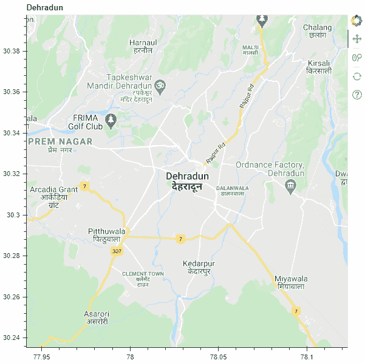
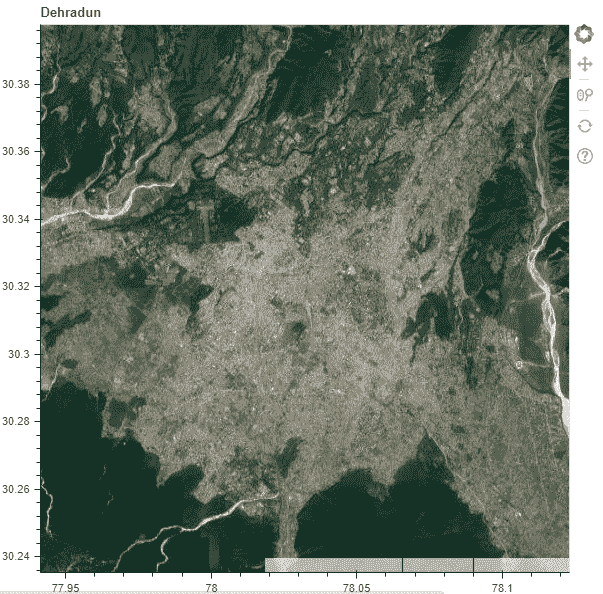
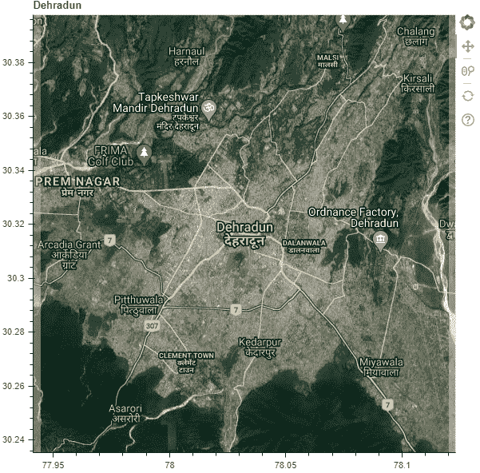
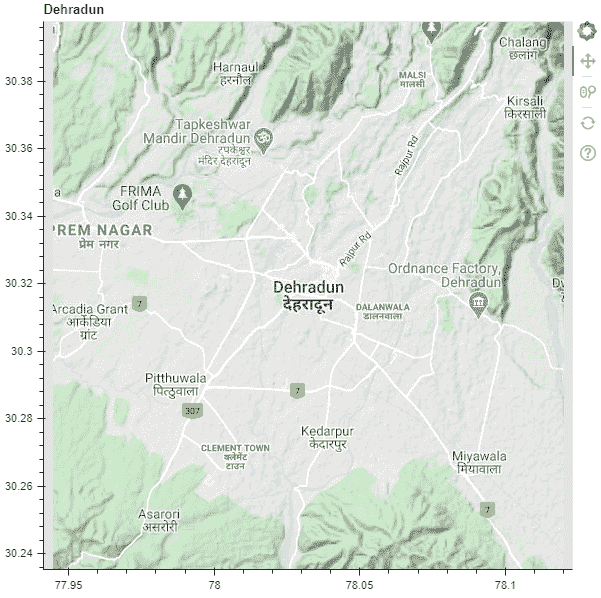

# Python Bokeh–绘制所有类型的谷歌地图(路线图、卫星、混合、地形)

> 原文:[https://www . geesforgeks . org/python-bokeh-所有类型的谷歌地图绘图-路线图-卫星-混合地形/](https://www.geeksforgeeks.org/python-bokeh-plot-for-all-types-of-google-maps-roadmap-satellite-hybrid-terrain/)

Bokeh 是一个 Python 交互式数据可视化工具。它使用 HTML 和 JavaScript 来渲染它的图。它以现代网络浏览器为呈现目标，提供优雅、简洁的新颖图形结构和高性能交互性。Bokeh 可以用来显示谷歌地图。要在 Bokeh 中使用谷歌地图，我们将使用`plotting`类的`gmap()`功能。

谷歌地图有 4 种基本类型–**路线图、卫星、混合、地形**
我们需要使用`GMapOptions()`功能配置谷歌地图。`GMapOptions()`功能包含参数`map_type`。使用这个参数，我们可以确定谷歌地图的地图类型。将上述 4 个值中的一个分配给该参数。

**为了使用这些地图，我们必须:**

1.  导入所需的库和模块:
    *   bokeh .标绘的 gmap
    *   来自 bokeh.models 的 GMapOptions
    *   从 bokeh.io 输出文件和显示
2.  使用`output_file()`创建一个文件来存储我们的模型。
3.  使用`GMapOptions()`配置谷歌地图。在配置过程中，为`map_type`参数指定所需的值。
4.  使用`gmap()`生成一个谷歌地图对象。
5.  使用`show()`显示谷歌地图。

## 路线图:

这将显示默认的路线图视图。在这种类型的地图中，地形被平滑，道路被高亮显示。它适用于在车辆中导航某个区域。这是默认的地图类型。

```
# importing the required modules
from bokeh.plotting import gmap
from bokeh.models import GMapOptions
from bokeh.io import output_file, show

# file to save the model
output_file("gfg.html")

# configuring the Google map
lat = 30.3165
lng = 78.0322
map_type = "roadmap"
zoom = 12
google_map_options = GMapOptions(lat = lat,
                                 lng = lng,
                                 map_type = map_type,
                                 zoom = zoom)

# generating the Google map
google_api_key = ""
title = "Dehradun"
google_map = gmap(google_api_key,
                  google_map_options,
                  title = title)

# displaying the model
show(google_map)
```

**输出:**


## 卫星:

这显示了谷歌地球卫星视图。这是没有任何图形的鸟瞰图。

```
# importing the required modules
from bokeh.plotting import gmap
from bokeh.models import GMapOptions
from bokeh.io import output_file, show

# file to save the model
output_file("gfg.html")

# configuring the Google map
lat = 30.3165
lng = 78.0322
map_type = "satellite"
zoom = 12
google_map_options = GMapOptions(lat = lat,
                                 lng = lng,
                                 map_type = map_type,
                                 zoom = zoom)

# generating the Google map
google_api_key = ""
title = "Dehradun"
google_map = gmap(google_api_key,
                  google_map_options,
                  title = title)

# displaying the model
show(google_map)
```

**输出:**


## 混合动力:

顾名思义，这显示了路线图和卫星地图的组合。卫星地图上覆盖着道路图形。

```
# importing the required modules
from bokeh.plotting import gmap
from bokeh.models import GMapOptions
from bokeh.io import output_file, show

# file to save the model
output_file("gfg.html")

# configuring the Google map
lat = 30.3165
lng = 78.0322
map_type = "hybrid"
zoom = 12
google_map_options = GMapOptions(lat = lat,
                                 lng = lng,
                                 map_type = map_type,
                                 zoom = zoom)

# generating the Google map
google_api_key = ""
title = "Dehradun"
google_map = gmap(google_api_key,
                  google_map_options,
                  title = title)

# displaying the model
show(google_map)
```

**输出:**


## 地形:

这将显示基于地形信息的物理地图。

```
# importing the required modules
from bokeh.plotting import gmap
from bokeh.models import GMapOptions
from bokeh.io import output_file, show

# file to save the model
output_file("gfg.html")

# configuring the Google map
lat = 30.3165
lng = 78.0322
map_type = "terrain"
zoom = 12
google_map_options = GMapOptions(lat = lat,
                                 lng = lng,
                                 map_type = map_type,
                                 zoom = zoom)

# generating the Google map
google_api_key = ""
title = "Dehradun"
google_map = gmap(google_api_key,
                  google_map_options,
                  title = title)

# displaying the model
show(google_map)
```

**输出:**
