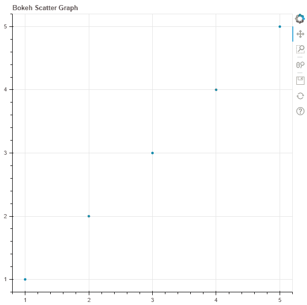
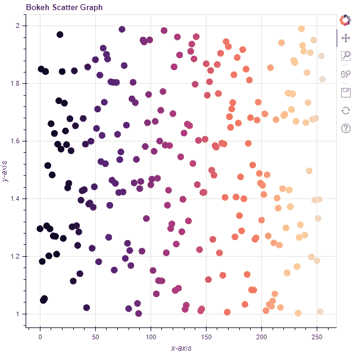

# Python Bokeh–在图形上绘制散点图

> 原文:[https://www . geesforgeks . org/python-bokeh-绘图-散点图/](https://www.geeksforgeeks.org/python-bokeh-plotting-a-scatter-plot-on-a-graph/)

Bokeh 是一个 Python 交互式数据可视化工具。它使用 HTML 和 JavaScript 来渲染它的图。它以现代网络浏览器为呈现目标，提供优雅、简洁的新颖图形结构和高性能交互性。

Bokeh 可用于在图表上绘制散点图。可以使用`plotting`模块的`scatter()`方法在图形上绘制正方形。

## 标绘.图形.散布()

> **语法:**散布(参数)
> 
> **参数:**
> 
> *   **x :** 字形中心的 x 坐标
> *   **y :** 字形中心的 y 坐标
> *   **标记:**表示字形的类型
> 
> **返回:**类的一个对象`GlyphRenderer`

**示例 1 :** 在本例中，我们将使用默认值绘制图表。

```
# importing the modules
from bokeh.plotting import figure, output_file, show

# file to save the model
output_file("gfg.html")

# instantiating the figure object
graph = figure(title = "Bokeh Scatter Graph")

# the points to be plotted
x = [1, 2, 3, 4, 5]
y = [1, 2, 3, 4, 5]

# plotting the graph
graph.scatter(x, y)

# displaying the model
show(graph)
```

**输出:**


**示例 2 :** 在此示例中，我们将使用各种其他参数绘制多个散射点

```
# importing the modules 
from bokeh.plotting import figure, output_file, show 
from bokeh.palettes import magma
import random

# file to save the model 
output_file("gfg.html") 

# instantiating the figure object 
graph = figure(title = "Bokeh Scatter Graph") 

# name of the x-axis 
graph.xaxis.axis_label = "x-axis"

# name of the y-axis 
graph.yaxis.axis_label = "y-axis"

# points to be plotted
x = [n for n in range(256)]
y = [random.random() + 1 for n in range(256)]
size = 10

# color value of the scatter points
color = magma(256)

# plotting the graph 
graph.scatter(x, y,
              size = size,
              color = color) 

# displaying the model 
show(graph)
```

**输出:**
