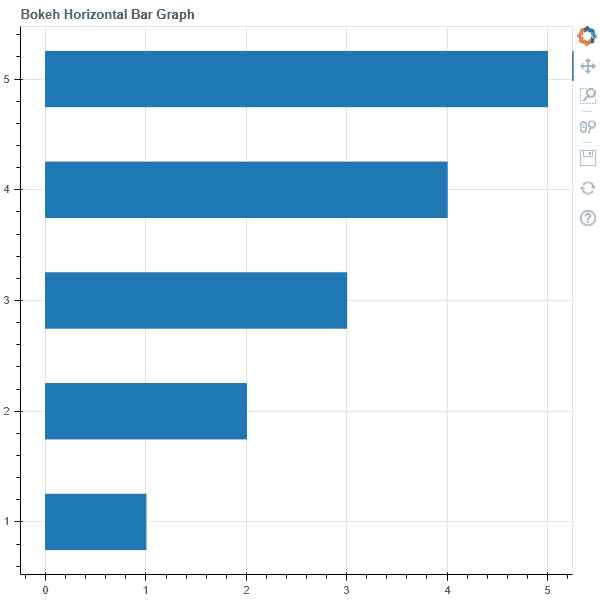
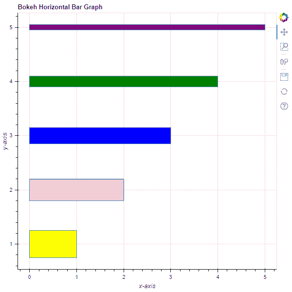

# Python Bokeh–绘制水平条形图

> 原文:[https://www . geesforgeks . org/python-bokeh-绘图-水平条形图/](https://www.geeksforgeeks.org/python-bokeh-plotting-horizontal-bar-graphs/)

Bokeh 是一个 Python 交互式数据可视化工具。它使用 HTML 和 JavaScript 来渲染它的图。它以现代网络浏览器为呈现目标，提供优雅、简洁的新颖图形结构和高性能交互性。

Bokeh 可用于绘制水平条形图。可以使用`plotting`模块的`hbar()`方法绘制横条图。

## 标绘. figure.hbar()

> **语法:** hbar(参数)
> 
> **参数:**
> 
> *   **y :** 横条中心的 y 坐标
> *   **高度:**水平杆的厚度
> *   **右侧:**右边缘的 x 坐标
> *   **左侧:**左边缘的 x 坐标，默认为 0
> *   **填充α:**填充水平条的α值
> *   **填充颜色:**水平条的填充颜色值
> *   **阴影阿尔法:**水平条的阴影阿尔法值，默认为 1
> *   **阴影 _ 颜色:**横条的阴影颜色值，默认为黑色
> *   **阴影 _ 额外:**水平条的阴影额外值
> *   **阴影 _ 图案:**横条的阴影图案值
> *   **阴影 _ 比例:**横条的阴影比例值，默认为 12
> *   **阴影 _ 重量:**横条的阴影重量值，默认为 1
> *   **line _ alpha:**line alpha 的百分比值，默认为 1
> *   **线帽:**线的线帽值，默认为对接
> *   **线条 _ 颜色:**线条的颜色，默认为黑色
> *   **line_dash :** value of line dash such as :
>     *   固体
>     *   虚线
>     *   有点的
>     *   dotdash！dotdash！dotdash
>     *   达什特
>     
>     默认为实心
>     
>     
> *   **线划偏移量:**线划偏移量的值，默认为 0
> *   **线连接:**线连接的值，默认为斜角
> *   **线宽:**线宽值，默认为 1
> *   **名称:**用户提供的型号名称
> *   **标签:**用户为模型提供的值
> 
> **其他参数:**
> 
> *   **alpha :** 一次性设置所有 alpha 关键字参数
> *   **颜色:**一次性设置所有颜色关键字参数
> *   **legend_field :** 数据源中应使用的列的名称
> *   **legend_group :** 数据源中应使用的列的名称
> *   **图例 _ 标签:**标记图例条目
> *   **静音:**确定字形是否应该渲染为静音，默认为假
> *   **名称:**附加到渲染器的可选用户提供的名称
> *   **来源:**用户提供的数据源
> *   **视图:**用于过滤数据源的视图
> *   **可见:**决定是否渲染字形，默认为真
> *   **x_range_name :** 用于映射 x 坐标的额外范围的名称
> *   **y_range_name :** 用于映射 y 坐标的额外范围的名称
> *   **等级:**指定此字形的渲染等级顺序
> 
> **返回:**类的一个对象`GlyphRenderer`

**示例 1 :** 在本例中，我们将使用默认值绘制图表。

```
# importing the modules
from bokeh.plotting import figure, output_file, show

# file to save the model
output_file("gfg.html")

# instantiating the figure object
graph = figure(title = "Bokeh Horizontal Bar Graph")

# y-coordinates to be plotted
y = [1, 2, 3, 4, 5]

# x-coordinates of the right edges
right = [1, 2, 3, 4, 5]

# height / thickness of the bars 
height = 0.5

# plotting the graph
graph.hbar(y,
           right = right,
           height = height)

# displaying the model
show(graph)
```

**输出:**


**示例 2 :** 在本例中，我们将绘制具有不同参数的水平条。

```
# importing the modules
from bokeh.plotting import figure, output_file, show

# file to save the model
output_file("gfg.html")

# instantiating the figure object
graph = figure(title = "Bokeh Horizontal Bar Graph")

# name of the x-axis
graph.xaxis.axis_label = "x-axis"

# name of the y-axis
graph.yaxis.axis_label = "y-axis"

# y-coordinates to be plotted
y = [1, 2, 3, 4, 5]

# x-coordinates of the right edges
right = [1, 2, 3, 4, 5]

# height / thickness of the bars 
height = [0.5, 0.4, 0.3, 0.2, 0.1]

# color values of the bars
fill_color = ["yellow", "pink", "blue", "green", "purple"]

# plotting the graph
graph.hbar(y,
           right = right,
           height = height,
           fill_color = fill_color)

# displaying the model
show(graph)
```

**输出:**
