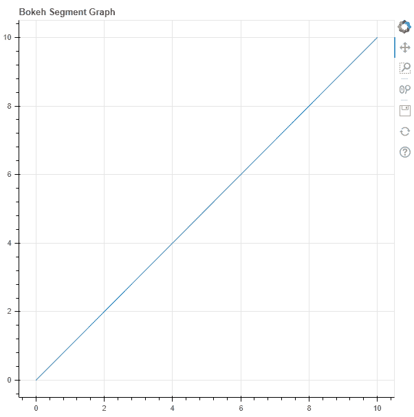
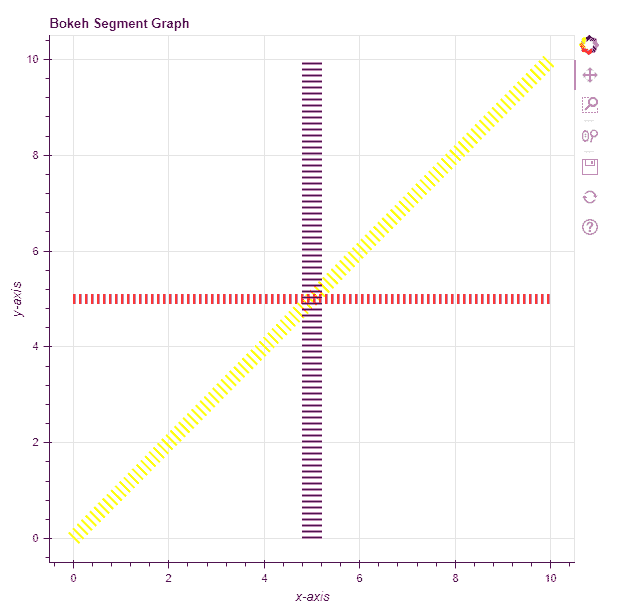

# Python Bokeh–在图形上绘制线段

> 原文:[https://www . geesforgeks . org/python-bokeh-绘图-线段-在图形上/](https://www.geeksforgeeks.org/python-bokeh-plotting-line-segments-on-a-graph/)

Bokeh 是一个 Python 交互式数据可视化工具。它使用 HTML 和 JavaScript 来渲染它的图。它以现代网络浏览器为呈现目标，提供优雅、简洁的新颖图形结构和高性能交互性。

Bokeh 可用于在图形上绘制线段。可以使用`plotting`模块的`segment()`方法在图形上绘制线段。

## 绘图.图.段()

> **语法:**段(参数)
> 
> **参数:**
> 
> *   **x0 :** 线段起点的 x 坐标
> *   **y0 :** 线段起点的 y 坐标
> *   **x1 :** 线段端点的 x 坐标
> *   **y1 :** 线段终点的 y 坐标
> 
> **返回:**类的一个对象`GlyphRenderer`

**示例 1 :** 在本例中，我们将使用默认值绘制图表。

```
# importing the modules
from bokeh.plotting import figure, output_file, show

# file to save the model
output_file("gfg.html")

# instantiating the figure object
graph = figure(title = "Bokeh Segment Graph")

# the points to be plotted
x0 = 0
y0 = 0
x1 = 10
y1 = 10

# plotting the graph
graph.segment(x0, y0,
              x1, y1)

# displaying the model
show(graph)
```

**输出:**


**示例 2 :** 在此示例中，我们将使用各种其他参数绘制多条线段

```
# importing the modules 
from bokeh.plotting import figure, output_file, show 

# file to save the model 
output_file("gfg.html") 

# instantiating the figure object 
graph = figure(title = "Bokeh Segment Graph") 

# name of the x-axis 
graph.xaxis.axis_label = "x-axis"

# name of the y-axis 
graph.yaxis.axis_label = "y-axis"

# points to be plotted
x0 = [0, 0, 5]
y0 = [0, 5, 0]
x1 = [10, 10, 5]
y1 = [10, 5, 10]

# color of the lines
line_color = ["yellow", "red", "purple"]

# value of line dash
line_dash = "dotted"

# thickness of the lines
line_width = [15, 10, 20]

# plotting the graph 
graph.segment(x0, y0,
              x1, y1,
              line_color = line_color,
              line_dash = line_dash,
              line_width = line_width) 

# displaying the model 
show(graph)
```

**输出:**
