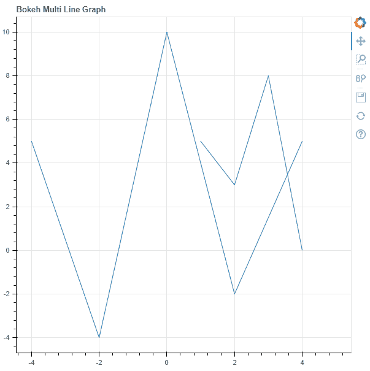
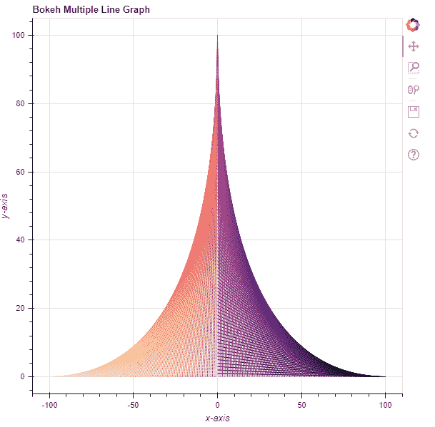

# Python Bokeh–在图形上绘制多条线

> 原文:[https://www . geeksforgeeks . org/python-bokeh-绘图-多行在图形上/](https://www.geeksforgeeks.org/python-bokeh-plotting-multiple-lines-on-a-graph/)

Bokeh 是一个 Python 交互式数据可视化工具。它使用 HTML 和 JavaScript 来渲染它的图。它以现代网络浏览器为呈现目标，提供优雅、简洁的新颖图形结构和高性能交互性。

Bokeh 可用于在图形上绘制多条线。可以使用`plotting`模块的`multi_line()`方法在图形上绘制多条线。

## ploting . figure . multi _ line()

> **语法:**多行(参数)
> 
> **参数:**
> 
> *   **xs :** 线的 x 坐标
> *   **ys :** 直线的 y 坐标
> *   **line _ alpha:**line alpha 的百分比值，默认为 1
> *   **线帽:**线的线帽值，默认为对接
> *   **线条 _ 颜色:**线条的颜色，默认为黑色
> *   **线划:**线划的值，如:实线、虚线、虚线、点划线、点划线[默认为实线]
> *   **线划偏移量:**线划偏移量的值，默认为 0
> *   **线连接:**线连接的值，默认为斜角
> *   **线宽:**线宽值，默认为 1
> *   **名称:**用户提供的型号名称
> *   **标签:**用户为模型提供的值
> 
> **其他参数:**
> 
> *   **alpha :** 一次性设置所有 alpha 关键字参数
> *   **颜色:**一次性设置所有颜色关键字参数
> *   **legend_field :** 数据源中应使用的列的名称
> *   **legend_group :** 数据源中应使用的列的名称
> *   **图例 _ 标签:**标记图例条目
> *   **静音:**确定字形是否应该渲染为静音，默认为假
> *   **名称:**附加到渲染器的可选用户提供的名称
> *   **来源:**用户提供的数据源
> *   **视图:**用于过滤数据源的视图
> *   **可见:**决定是否渲染字形，默认为真
> *   **x_range_name :** 用于映射 x 坐标的额外范围的名称
> *   **y_range_name :** 用于映射 y 坐标的额外范围的名称
> *   **等级:**指定此字形的渲染等级顺序
> 
> **返回:**类的一个对象`GlyphRenderer`

**示例 1 :** 在本例中，我们将使用默认值绘制图表。

```py
# importing the modules 
from bokeh.plotting import figure, output_file, show 

# file to save the model 
output_file("gfg.html") 

# instantiating the figure object 
graph = figure(title = "Bokeh Multi Line Graph") 

# the points to be plotted 
xs = [[1, 2, 3, 4, 5], [-4, -2, 0, 2, 4]] 
ys = [[5, 3, 8, 0], [5, -4, 10, -2, 5]] 

# plotting the graph 
graph.multi_line(xs, ys) 

# displaying the model 
show(graph)
```

**输出:**


**示例 2 :** 在本例中，我们将使用各种其他参数绘制多条线

```py
# importing the modules 
from bokeh.plotting import figure, output_file, show 
from bokeh.palettes import magma

# file to save the model 
output_file("gfg.html") 

# instantiating the figure object 
graph = figure(title = "Bokeh Multiple Line Graph") 

# name of the x-axis 
graph.xaxis.axis_label = "x-axis"

# name of the y-axis 
graph.yaxis.axis_label = "y-axis"

# the points to be plotted
x = [n for n in range(-100, 101)]
x.reverse()
xs = [[n, 0] for n in x]
y1 = [n for n in range(1, 101)]
y1.reverse()
y = [n for n in range(1, 101)] + [0] + y1
ys = [[0, n] for n in y] 

# color of the lines
line_color = magma(201)

# plotting the graph 
graph.multi_line(xs, ys,
                 line_color = line_color) 

# displaying the model 
show(graph)
```

**输出:**
