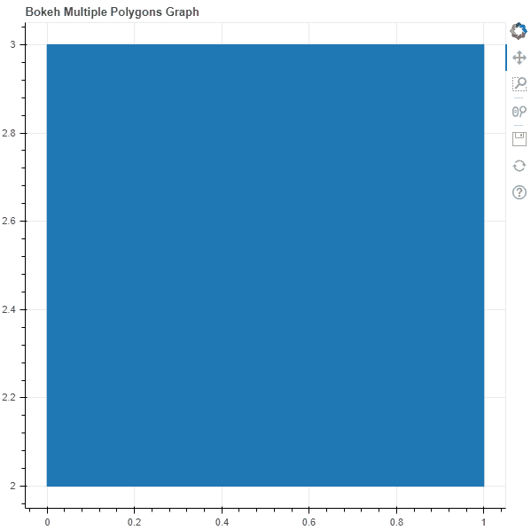
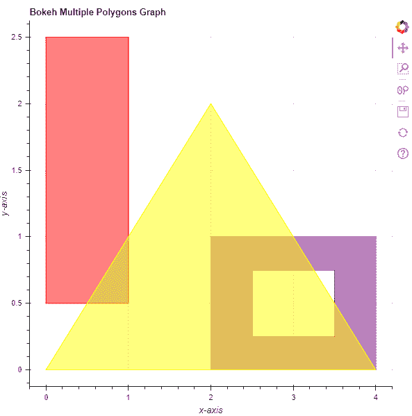

# Python Bokeh–在图形上绘制多个多边形

> 原文:[https://www . geesforgeks . org/python-bokeh-绘图-图形上的多个多边形/](https://www.geeksforgeeks.org/python-bokeh-plotting-multiple-polygons-on-a-graph/)

Bokeh 是一个 Python 交互式数据可视化工具。它使用 HTML 和 JavaScript 来渲染它的图。它以现代网络浏览器为呈现目标，提供优雅、简洁的新颖图形结构和高性能交互性。

Bokeh 可用于在图形上绘制多个多边形。可以使用`plotting`模块的`multi_polygons()`方法在图形上绘制多个多边形。

## ploting . figure . multi _ 多边形()

> **语法:**多多边形(参数)
> 
> **参数:**
> 
> *   **xs :** 多边形的 x 坐标
> *   **ys :** 多边形的 y 坐标
> *   **填充阿尔法:**填充多边形的阿尔法值
> *   **填充颜色:**多边形的填充颜色值
> *   **阴影阿尔法:**多边形的阴影阿尔法值，默认值为 1
> *   **阴影颜色:**多边形的阴影颜色值，默认为黑色
> *   **填充 _ 额外:**填充多边形的额外值
> *   **填充图案:**多边形的填充图案值
> *   **阴影比例:**多边形的阴影比例值，默认值为 12
> *   **阴影权重:**多边形的阴影权重值，默认值为 1
> *   **line _ alpha:**line alpha 的百分比值，默认为 1
> *   **线帽:**线的线帽值，默认为对接
> *   **线条 _ 颜色:**线条的颜色，默认为黑色
> *   **线划:**线划的值，如:实线、虚线、虚线、点划线、点划线[默认为实线]
> *   **线划偏移量:**线划偏移量的值，默认为 0
> *   **线连接:**线连接的值，默认为斜角
> *   **线宽:**线宽值，默认为 1
> *   **名称:**用户提供的型号名称
> *   **标签:**用户为模型提供的值
> 
> **其他参数:**
> 
> *   **alpha :** 一次性设置所有 alpha 关键字参数
> *   **颜色:**一次性设置所有颜色关键字参数
> *   **legend_field :** 数据源中应使用的列的名称
> *   **legend_group :** 数据源中应使用的列的名称
> *   **图例 _ 标签:**标记图例条目
> *   **静音:**确定字形是否应该渲染为静音，默认为假
> *   **名称:**附加到渲染器的可选用户提供的名称
> *   **来源:**用户提供的数据源
> *   **视图:**用于过滤数据源的视图
> *   **可见:**决定是否渲染字形，默认为真
> *   **x_range_name :** 用于映射 x 坐标的额外范围的名称
> *   **y_range_name :** 用于映射 y 坐标的额外范围的名称
> *   **等级:**指定此字形的渲染等级顺序
> 
> **返回:**类的一个对象`GlyphRenderer`

**示例 1 :** 在本例中，我们将使用默认值绘制图表。

```py
# importing the modules 
from bokeh.plotting import figure, output_file, show 

# file to save the model 
output_file("gfg.html") 

# instantiating the figure object 
graph = figure(title = "Bokeh Multiple Polygons Graph") 

# the points to be plotted
xs = [[[[0, 0, 1, 1]]]]
ys = [[[[3, 2, 2, 3]]]]

# plotting the graph 
graph.multi_polygons(xs, ys) 

# displaying the model 
show(graph)
```

**输出:**


**示例 2 :** 在此示例中，我们将使用各种其他参数绘制多个多边形

```py
# importing the modules 
from bokeh.plotting import figure, output_file, show 

# file to save the model 
output_file("gfg.html") 

# instantiating the figure object 
graph = figure(title = "Bokeh Multiple Polygons Graph") 

# name of the x-axis 
graph.xaxis.axis_label = "x-axis"

# name of the y-axis 
graph.yaxis.axis_label = "y-axis"

# the points to be plotted
xs = [[[[0, 0, 1, 1]]],
      [[[2, 2, 4, 4], [2.5, 2.5, 3.5, 3.5]]],
      [[[2, 0, 4]]]]
ys = [[[[2.5, 0.5, 0.5, 2.5]]],
      [[[1, 0, 0, 1], [0.75, 0.25, 0.25, 0.75]]],
      [[[2, 0, 0]]]]

# color values of the poloygons
color = ["red", "purple", "yellow"]

# fill alpha values of the polygons
fill_alpha = 0.5

# plotting the graph 
graph.multi_polygons(xs, ys,
                     color = color,
                     fill_alpha = fill_alpha) 

# displaying the model 
show(graph)
```

**输出:**
