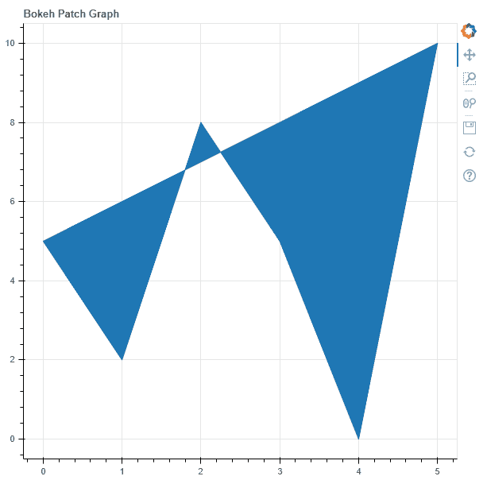
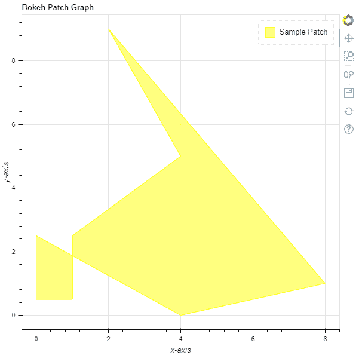

# Python Bokeh–在图形上绘制补丁

> 原文:[https://www . geesforgeks . org/python-bokeh-绘图-图形上的补丁/](https://www.geeksforgeeks.org/python-bokeh-plotting-patches-on-a-graph/)

Bokeh 是一个 Python 交互式数据可视化工具。它使用 HTML 和 JavaScript 来渲染它的图。它以现代网络浏览器为呈现目标，提供优雅、简洁的新颖图形结构和高性能交互性。

Bokeh 可用于在图形上绘制面片。可以使用`plotting`模块的`patch()`方法在图形上绘制面片。

## 标绘.图.补丁()

> **语法:**补丁(参数)
> 
> **参数:**
> 
> *   **x :** 面片的 x 坐标
> *   **y :** 面片的 y 坐标
> 
> **返回:**类的一个对象`GlyphRenderer`

**示例 1 :** 在本例中，我们将使用默认值绘制图表。

```py
# importing the modules 
from bokeh.plotting import figure, output_file, show 

# file to save the model 
output_file("gfg.html") 

# instantiating the figure object 
graph = figure(title = "Bokeh Patch Graph") 

# the points to be plotted
x = [0, 1, 2, 3, 4, 5]
y = [5, 2, 8, 5, 0, 10]

# plotting the graph 
graph.patch(x, y) 

# displaying the model 
show(graph)
```

**输出:**


**示例 2 :** 在本例中，我们将使用各种其他参数绘制面片

```py
# importing the modules 
from bokeh.plotting import figure, output_file, show 

# file to save the model 
output_file("gfg.html") 

# instantiating the figure object 
graph = figure(title = "Bokeh Patch Graph") 

# name of the x-axis 
graph.xaxis.axis_label = "x-axis"

# name of the y-axis 
graph.yaxis.axis_label = "y-axis"

# points to be plotted
x = [0, 0, 1, 1, 4, 2, 8, 4]
y = [2.5, 0.5, 0.5, 2.5, 5, 9, 1, 0]

# color value of the patch
color = "yellow"

# fill alpha value of the patch
fill_alpha = 0.5

# name of the legend
legend_label = "Sample Patch"

# plotting the graph 
graph.patch(x, y,
            color = color,
            fill_alpha = fill_alpha,
            legend_label = legend_label) 

# displaying the model 
show(graph)
```

**输出:**
