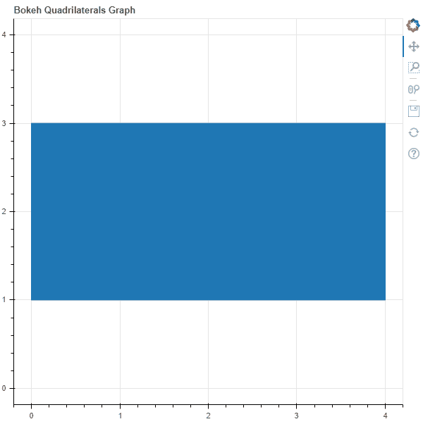
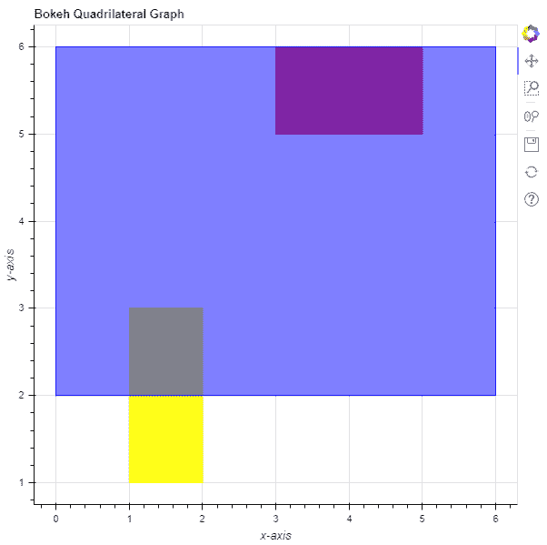

# Python Bokeh–在图形上绘制四边形

> 原文:[https://www . geesforgeks . org/python-bokeh-标绘-四边形-在图形上/](https://www.geeksforgeeks.org/python-bokeh-plotting-quadrilaterals-on-a-graph/)

Bokeh 是一个 Python 交互式数据可视化工具。它使用 HTML 和 JavaScript 来渲染它的图。它以现代网络浏览器为呈现目标，提供优雅、简洁的新颖图形结构和高性能交互性。

Bokeh 可用于在图形上绘制四边形。可以使用`plotting`模块的`quad()`方法在图形上绘制四边形。

## 标绘. figure.quad()

> **语法:**四边形(参数)
> 
> **参数:**
> 
> *   **左侧:**四边形左边缘的 x 坐标
> *   **右侧:**四边形右边缘的 x 坐标
> *   **顶部:**四边形顶部边缘的 y 坐标
> *   **底部:**四边形边缘底部的 y 坐标
> 
> **返回:**类的一个对象`GlyphRenderer`

**示例 1 :** 在本例中，我们将使用默认值绘制图表。

```py
# importing the modules
from bokeh.plotting import figure, output_file, show

# file to save the model
output_file("gfg.html")

# instantiating the figure object
graph = figure(title = "Bokeh Quadrilateral Graph",
               match_aspect = True)

# the points to be plotted
top = 3
bottom = 1
left = 0
right = 4

# plotting the graph
graph.quad(left,
           right,
           top,
           bottom)

# displaying the model
show(graph)
```

**输出:**


**示例 2 :** 在此示例中，我们将绘制具有各种其他参数的多个四边形

```py
# importing the modules 
from bokeh.plotting import figure, output_file, show 

# file to save the model 
output_file("gfg.html") 

# instantiating the figure object 
graph = figure(title = "Bokeh Quadrilateral Graph") 

# name of the x-axis 
graph.xaxis.axis_label = "x-axis"

# name of the y-axis 
graph.yaxis.axis_label = "y-axis"

# points to be plotted
left = [2, 3, 6]
right = [1, 5, 0]
top = [3, 6, 6]
bottom = [1, 5, 2] 

# color value of the patch
color = ["yellow", "red", "blue"]

# fill alpha value of the patch
fill_alpha = [0.9, 0.7, 0.5]

# plotting the graph 
graph.quad(left,
           right,
           top,
           bottom,
           color = color,
           fill_alpha = fill_alpha) 

# displaying the model 
show(graph)
```

**输出:**
