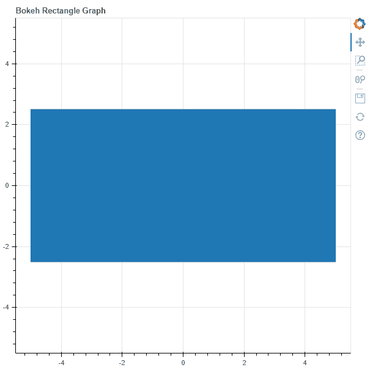
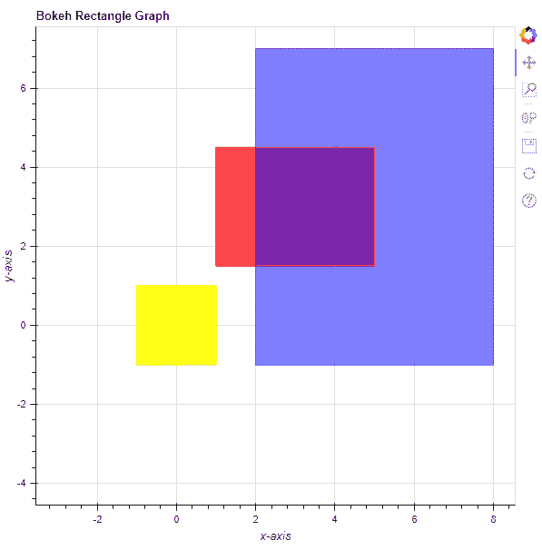

# Python Bokeh–在图形上绘制矩形

> 原文:[https://www . geesforgeks . org/python-bokeh-绘图-图形上的矩形/](https://www.geeksforgeeks.org/python-bokeh-plotting-rectangles-on-a-graph/)

Bokeh 是一个 Python 交互式数据可视化工具。它使用 HTML 和 JavaScript 来渲染它的图。它以现代网络浏览器为呈现目标，提供优雅、简洁的新颖图形结构和高性能交互性。

Bokeh 可用于在图形上绘制矩形。可以使用`plotting`模块的`rect()`方法在图形上绘制矩形。

## 绘图. figure.rect()

> **语法:** rect(参数)
> 
> **参数:**
> 
> *   **x :** 矩形中心的 x 坐标
> *   **y :** 矩形中心的 y 坐标
> *   **宽度:**矩形的宽度
> *   **宽度 _ 单位:**矩形宽度的单位
> *   **高度:**矩形的高度
> *   **高度 _ 单位:**矩形高度的单位
> 
> **返回:**类的一个对象`GlyphRenderer`

**示例 1 :** 在本例中，我们将使用默认值绘制图表。

```
# importing the modules
from bokeh.plotting import figure, output_file, show

# file to save the model
output_file("gfg.html")

# instantiating the figure object
graph = figure(title = "Bokeh Rectangle Graph",
               match_aspect = True)

# the points to be plotted
x = 0
y = 0
width = 10
height = 5

# plotting the graph
graph.rect(x,
           y,
           width,
           height)

# displaying the model
show(graph)
```

**输出:**


**示例 2 :** 在本例中，我们将使用各种其他参数绘制多个矩形

```
# importing the modules 
from bokeh.plotting import figure, output_file, show 

# file to save the model 
output_file("gfg.html") 

# instantiating the figure object 
graph = figure(title = "Bokeh Rectangle Graph") 

# name of the x-axis 
graph.xaxis.axis_label = "x-axis"

# name of the y-axis 
graph.yaxis.axis_label = "y-axis"

# points to be plotted
x = [0, 3, 5]
y = [0, 3, 3]
width = [2, 4, 6]
height = [2, 3, 8]

# color value of the rectangle
color = ["yellow", "red", "blue"]

# fill alpha value of the rectangle
fill_alpha = [0.9, 0.7, 0.5]

# plotting the graph 
graph.rect(x,
           y,
           width,
           height,
           color = color,
           fill_alpha = fill_alpha) 

# displaying the model 
show(graph)
```

**输出:**
