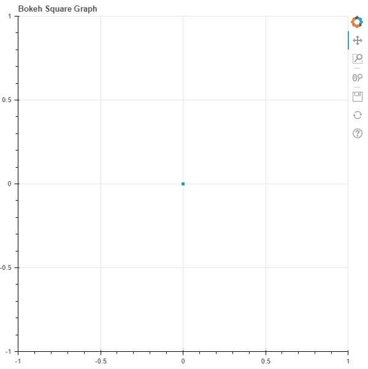
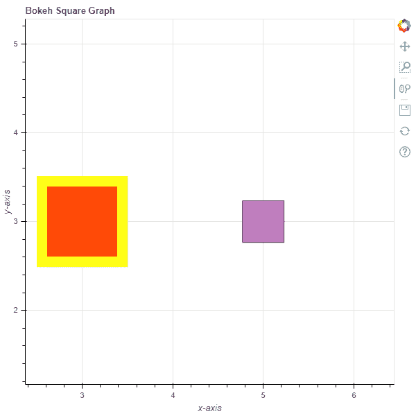

# Python Bokeh–在图形上绘制正方形

> 原文:[https://www . geesforgeks . org/python-bokeh-绘图-图形上的方块/](https://www.geeksforgeeks.org/python-bokeh-plotting-squares-on-a-graph/)

Bokeh 是一个 Python 交互式数据可视化工具。它使用 HTML 和 JavaScript 来渲染它的图。它以现代网络浏览器为呈现目标，提供优雅、简洁的新颖图形结构和高性能交互性。

Bokeh 可用于在图形上绘制正方形。可以使用`plotting`模块的`square()`方法在图形上绘制正方形。

## 绘图.图形.正方形()

> **语法:**平方(参数)
> 
> **参数:**
> 
> *   **x :** 正方形中心的 x 坐标
> *   **y :** 正方形中心的 y 坐标
> 
> **返回:**类的一个对象`GlyphRenderer`

**示例 1 :** 在本例中，我们将使用默认值绘制图表。

```py
# importing the modules
from bokeh.plotting import figure, output_file, show

# file to save the model
output_file("gfg.html")

# instantiating the figure object
graph = figure(title = "Bokeh Square Graph")

# the points to be plotted
x = 0
y = 0

# plotting the graph
graph.square(x, y)

# displaying the model
show(graph)
```

**输出:**


**示例 2 :** 在本例中，我们将使用各种其他参数绘制多个正方形

```py
# importing the modules 
from bokeh.plotting import figure, output_file, show 

# file to save the model 
output_file("gfg.html") 

# instantiating the figure object 
graph = figure(title = "Bokeh Square Graph",
               match_aspect = True) 

# name of the x-axis 
graph.xaxis.axis_label = "x-axis"

# name of the y-axis 
graph.yaxis.axis_label = "y-axis"

# points to be plotted
x = [3, 3, 5]
y = [3, 3, 3]
size = [130, 100, 60]

# color value of the square
color = ["yellow", "red", "purple"]

# fill alpha value of the square
fill_alpha = [0.9, 0.7, 0.5]

# plotting the graph 
graph.square(x, y,
             size = size,
             color = color,
             fill_alpha = fill_alpha) 

# displaying the model 
show(graph)
```

**输出:**
