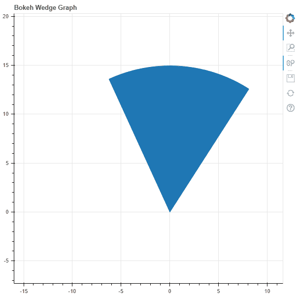
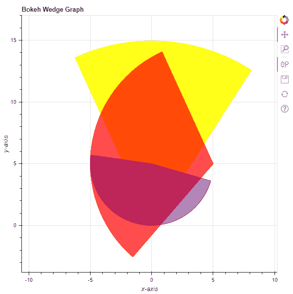

# Python Bokeh–在图形上绘制楔形区

> 原文:[https://www . geesforgeks . org/python-bokeh-绘图-图形上的楔形区/](https://www.geeksforgeeks.org/python-bokeh-plotting-wedges-on-a-graph/)

Bokeh 是一个 Python 交互式数据可视化工具。它使用 HTML 和 JavaScript 来渲染它的图。它以现代网络浏览器为呈现目标，提供优雅、简洁的新颖图形结构和高性能交互性。

Bokeh 可用于在图表上绘制楔形区。可以使用`plotting`模块的`wedge()`方法在图形上绘制楔形。

## 标绘.图形.楔形()

> **语法:**楔形(参数)
> 
> **参数:**
> 
> *   **x :** 楔形标记的 x 坐标
> *   **y :** 楔形标记的 y 坐标
> *   **半径:**楔形标记的半径
> *   **半径 _ 单位:**楔形标记的半径单位，默认为弧度
> *   **开始角度:**开始楔形标记的角度
> *   **start_angle_units :** 楔形标记开始的角度单位，默认为弧度
> *   **结束角度:**结束楔形标记的角度
> *   **结束角度单位:**结束楔形标记的角度单位
> *   **方向:**笔画方向，默认为反锁
> 
> **返回:**类的一个对象`GlyphRenderer`

**示例 1 :** 在本例中，我们将使用默认值绘制图表。

```py
# importing the modules
from bokeh.plotting import figure, output_file, show

# file to save the model
output_file("gfg.html")

# instantiating the figure object
graph = figure(title = "Bokeh Wedge Graph")

# the points to be plotted
x = 0
y = 0

# radius of the wedge
radius = 15

# start angle of the wedge
start_angle = 1

# end angle of the wedge
end_angle = 2

# plotting the graph
graph.wedge(x, y,
            radius = radius,
            start_angle = start_angle,
            end_angle = end_angle)

# displaying the model
show(graph)
```

**输出:**


**示例 2 :** 在本例中，我们将使用各种其他参数绘制多个楔形。

```py
# importing the modules
from bokeh.plotting import figure, output_file, show

# file to save the model
output_file("gfg.html")

# instantiating the figure object
graph = figure(title = "Bokeh Wedge Graph")

# name of the x-axis 
graph.xaxis.axis_label = "x-axis"

# name of the y-axis 
graph.yaxis.axis_label = "y-axis"

# the points to be plotted
x = [0, 5, 0]
y = [0, 5, 5]

# radius of the wedges
radius = [15, 10, 5]

# start angle of the wedges
start_angle = [1, 2, 3]

# end angle of the wedges
end_angle = [2, 4, 6]

# color value of the wedges
color = ["yellow", "red", "purple"]

# fill alpha value of the wedges
fill_alpha = [0.9, 0.7, 0.5]

# plotting the graph
graph.wedge(x, y,
            radius = radius,
            start_angle = start_angle,
            end_angle = end_angle,
            color = color,
            fill_alpha = fill_alpha)

# displaying the model
show(graph)
```

**输出:**
