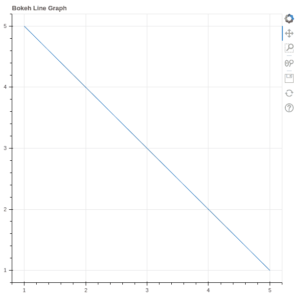
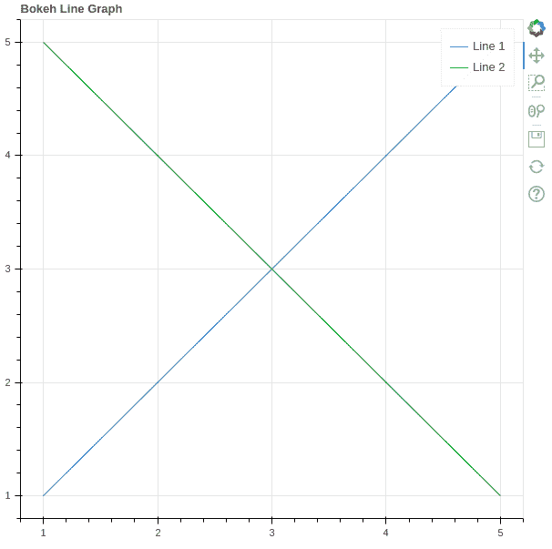
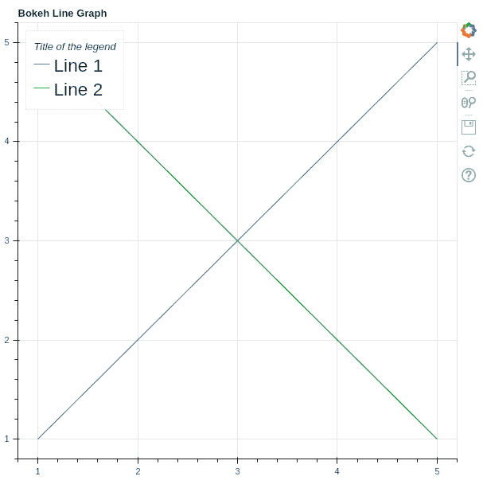
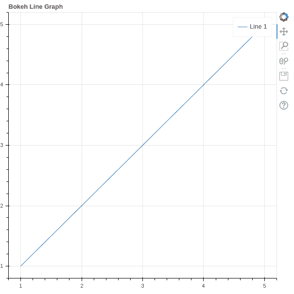
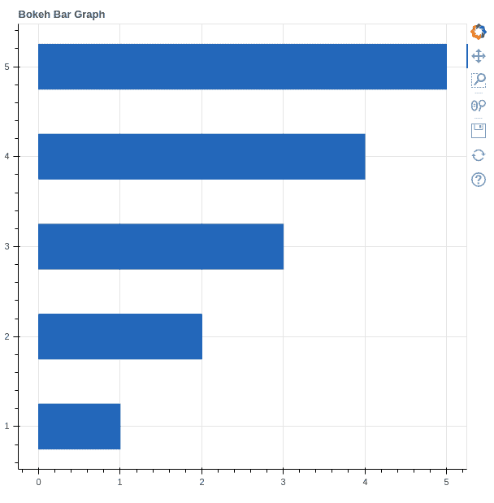
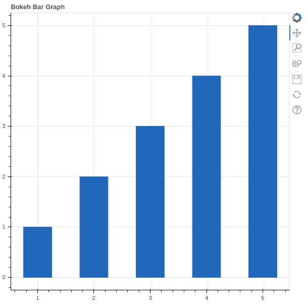
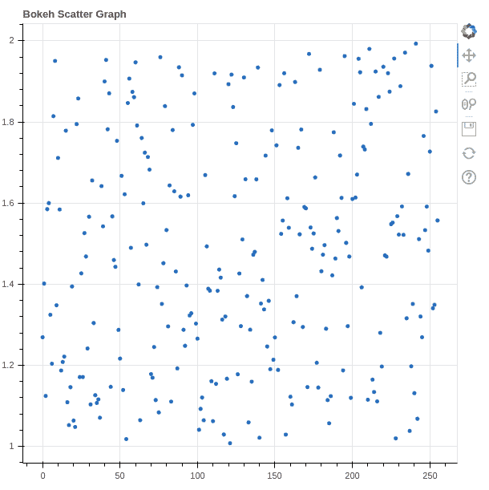
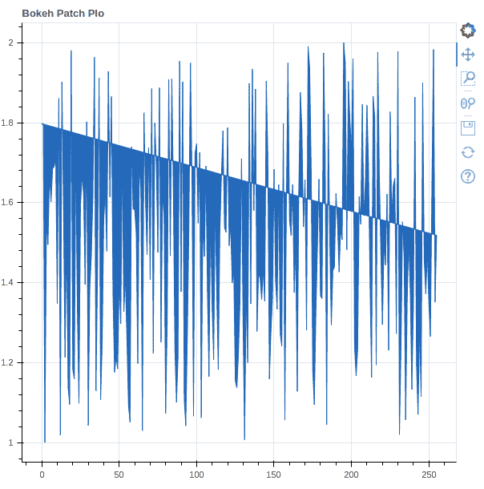

# Python Bokeh 教程-与 Bokeh 的交互数据可视化

> 原文:[https://www . geesforgeks . org/python-bokeh-tutorial-interactive-data-visualization-with-bokeh/](https://www.geeksforgeeks.org/python-bokeh-tutorial-interactive-data-visualization-with-bokeh/)

[**Python Bokeh**](https://www.geeksforgeeks.org/introduction-to-bokeh-in-python/) 是一个提供交互式图表和绘图的数据可视化库。Bokeh 使用 HTML 和 JavaScript 渲染其情节，使用现代网络浏览器呈现优雅、简洁的新颖图形结构，具有高级交互性。

**博克的特征:**

*   **灵活性:** Bokeh 可以用于常见的绘图需求以及自定义和复杂的用例。
*   **生产力:**它与其他流行的 Pydata 工具(如 Pandas 和 Jupyter 笔记本)的交互非常容易。
*   **交互性:**它创建随用户交互而变化的交互图。
*   **功能强大:**通过添加 JavaScript，可以为专门的用例生成可视化。
*   **可共享:**可视化数据是可共享的。它们也可以在 Jupyter 笔记本中渲染。
*   **开源:** Bokeh 是一个开源项目。


本教程旨在借助一个巨大的数据集，使用解释良好的概念和示例为 Bokeh 提供洞察力。因此，让我们深入 Bokeh，从基础到高级学习所有知识。

**目录**

> *   [Installation](#Installation)
> *   [Bokeh interface–basic concept of Bokeh](#Interfaces)
> *   [Introduction](#Getting)
> *   [Notes and legend](#Annotations)
>     *   [Custom legend](#Legends)
>         
> [绘制不同类型的地块](#Plotting)
> 
> *   [Strip plot](#Bar)
> [](#Scatter)
> [创建不同的形状](#Creating)
> 
> *   [Circular](#Circle)
> *   [Ellipse](#Oval)
> *   [triangle](#Triangle)
> *   [Rectangular](#Rectangle)
> *   [polygon](#Polygon)
> 
> *   Draw multiple plots
>     [向绘图中添加小部件](#Widgets)
> 
> *   [Create different types of glyphs](#Glyphs)
> *   [Visualize different types of data](#Data)
> *   [More topics about Bokeh](#More)

## 装置

Bokeh 由 **CPython 3.6 和更老的**支持，包括标准分布和蟒蛇分布。Bokeh 包具有以下依赖项。

**1。必需的依赖关系**

*   皮尤三点十分
*   python-dateutil>=2.1
*   Jinja2>=2.7
*   数值> =1.11.3
*   枕头> =4.0
*   包装> =16.8
*   龙卷风> =5
*   键入扩展名> =3.7.4

**2。可选依赖关系**

*   朱皮特
*   NodeJS(节点名称)
*   网络 x
*   熊猫
*   psutil
*   硒，壁虎河，火狐
*   狮身人面像

Bokeh 可以使用 conda 包管理器和 pip 来安装。要使用 conda 安装它，请在终端中键入以下命令。

```py
conda install bokeh
```

这将安装所有依赖项。如果安装了所有的依赖项，那么您可以使用 pip 从 PyPI 安装 bokeh。在终端中键入以下命令。

```py
pip install bokeh
```

请参考下面的文章，以获得关于 Bokeh 安装的详细信息。

*   [Python–设置博克环境](https://www.geeksforgeeks.org/python-setting-up-the-bokeh-environment/)

## 博克接口——博克的基本概念

Bokeh 易于使用，因为它为数据科学家提供了一个简单的界面，他们不想被它的实现分散注意力，也为开发人员和软件工程师提供了一个详细的界面，他们可能想要更多地控制 Bokeh 来创建更复杂的功能。为此，博克遵循分层方法。

### Bokeh.models

这个类是 Bokeh 的 Python 库，它包含处理由 Bokeh 的 JavaScript 库(BokehJS)创建的 JSON 数据的模型类。大多数模型都是非常基本的，只有很少的属性或者没有方法。

### bokeh .绘图

这是提供 [**Matplotlib**](https://www.geeksforgeeks.org/matplotlib-tutorial/) 或 **MATLAB** 类特征进行绘图的中级界面。它处理要绘制的数据，并创建有效的轴、网格和工具。这个界面的主类是**图**类。

## 入门指南

在安装和学习了 Bokeh 的基本概念之后，让我们创建一个简单的情节。

**示例:**

## 蟒蛇 3

```py
# importing the modules
from bokeh.plotting import figure, output_file, show

# instantiating the figure object
graph = figure(title = "Bokeh Line Graph")

# the points to be plotted
x = [1, 2, 3, 4, 5]
y = [5, 4, 3, 2, 1]

# plotting the line graph
graph.line(x, y)

# displaying the model
show(graph)
```

**输出:**



在上面的例子中，我们创建了一个标题为**博克线图的简单图。**如果您正在使用 Jupyter，那么输出将在浏览器的新选项卡中创建。

## 注释和图例

**标注**是可以添加到图形中的补充信息，如**标题、图例、箭头**等。在上面的例子中，我们已经看到了如何向图中添加标题。在这一节，我们将看到关于传说。

给你的数字添加图例可以帮助你正确地描述和定义它们。因此，更清晰。Bokeh 中的传说实现起来很简单。它们可以是基本的、自动分组的、手动提及的、显式索引的，也可以是交互式的。

**示例:**

## 蟒蛇 3

```py
# importing the modules
from bokeh.plotting import figure, output_file, show

# instantiating the figure object
graph = figure(title="Bokeh Line Graph")

# the points to be plotted
x = [1, 2, 3, 4, 5]
y = [5, 4, 3, 2, 1]

# plotting the 1st line graph
graph.line(x, x, legend_label="Line 1")

# plotting the 2nd line graph with a
# different color
graph.line(y, x, legend_label="Line 2",
           line_color="green")

# displaying the model
show(graph)
```

**输出:**



在上面的例子中，我们用图例绘制了两条不同的线，图例简单地说明了哪一条是线 1，哪一条是线 2。传说中的颜色也是通过颜色来区分的。

请参考下面的文章，以获取有关注释和图例的详细信息

*   [博克-注释和图例](https://www.geeksforgeeks.org/bokeh-annotations-and-legends/)

### 自定义图例

Bokeh 中的图例可以使用以下属性进行自定义。

<figure class="table">

| 财产 | 描述 |
| --- | --- |
| 图例.标签 _ 文本 _ 字体 | 将默认标签字体更改为指定的字体名称 |
| legend.label_text_font_size | 字体大小，以磅为单位 |
| 图例.位置 | 在指定位置设置标签。 |
| 图例.标题 | 设置图例标签的标题 |
| 图例.方向 | 设置为水平(默认)或垂直 |
| 图例. clicking_policy | 指定单击图例时应该发生的情况 |

</figure>

**示例:**

## 蟒蛇 3

```py
# importing the modules
from bokeh.plotting import figure, output_file, show

# instantiating the figure object
graph = figure(title="Bokeh Line Graph")

# the points to be plotted
x = [1, 2, 3, 4, 5]
y = [5, 4, 3, 2, 1]

# plotting the 1st line graph
graph.line(x, x, legend_label="Line 1")

# plotting the 2nd line graph with a
# different color
graph.line(y, x, legend_label="Line 2",
           line_color="green")

graph.legend.title = "Title of the legend"
graph.legend.location ="top_left"
graph.legend.label_text_font_size = "17pt"

# displaying the model
show(graph)
```

**输出:**



## 绘制不同类型的图

**Bokeh 术语中的字形**是指 Bokeh 地块的基本构建块，如直线、矩形、正方形等。Bokeh 绘图是使用 **bokeh .绘图**界面创建的，该界面使用一组默认工具和样式。

### 线图

[**折线图**](https://www.geeksforgeeks.org/python-bokeh-plotting-a-line-graph/) 用于表示不同轴上两个数据 X 和 Y 之间的关系。可以使用绘图模块的 line()方法创建线图。

**语法:**

> 线(参数)

**示例:**

## 蟒蛇 3

```py
# importing the modules
from bokeh.plotting import figure, output_file, show

# instantiating the figure object
graph = figure(title = "Bokeh Line Graph")

# the points to be plotted
x = [1, 2, 3, 4, 5]
y = [5, 4, 3, 2, 1]

# plotting the line graph
graph.line(x, y)

# displaying the model
show(graph)
```

**输出:**



参考下面的文章来获得关于线图的详细信息。

*   [Python Bokeh–绘制线图](https://www.geeksforgeeks.org/python-bokeh-plotting-a-line-graph/)
*   [Python Bokeh–在图形上绘制多条线](https://www.geeksforgeeks.org/python-bokeh-plotting-multiple-lines-on-a-graph/)

### 条形图

**柱状图或条形图**是一种用矩形条表示数据类别的图表，矩形条的长度和高度与它们所代表的值成比例。它可以是两种类型的横条和竖条。分别使用绘图界面的 **hbar()** 和 **vbar()** 功能创建。

**语法:**

> hbar(参数)
> 
> vbar(参数)

**示例 1:** 创建水平条。

## 蟒蛇 3

```py
# importing the modules
from bokeh.plotting import figure, output_file, show

# instantiating the figure object
graph = figure(title = "Bokeh Bar Graph")

# the points to be plotted
x = [1, 2, 3, 4, 5]
y = [1, 2, 3, 4, 5] 

# height / thickness of the plot
height = 0.5

# plotting the bar graph
graph.hbar(x, right = y, height = height)

# displaying the model
show(graph)
```

**输出:**



**示例 2:** 创建竖线

## 蟒蛇 3

```py
# importing the modules
from bokeh.plotting import figure, output_file, show

# instantiating the figure object
graph = figure(title = "Bokeh Bar Graph")

# the points to be plotted
x = [1, 2, 3, 4, 5]
y = [1, 2, 3, 4, 5] 

# height / thickness of the plot
width = 0.5

# plotting the bar graph
graph.vbar(x, top = y, width = width)

# displaying the model
show(graph)
```

**输出:**



请参考下面的文章，获取有关条形图的详细信息。

*   [Python Bokeh–绘制水平条形图](https://www.geeksforgeeks.org/python-bokeh-plotting-horizontal-bar-graphs/)
*   [Python Bokeh–绘制竖条图](https://www.geeksforgeeks.org/python-bokeh-plotting-vertical-bar-graphs/)

### 散点图

一个**散点图**是一组在水平和垂直轴上代表单个数据的点。一种图表，其中两个变量的值沿 X 轴和 Y 轴绘制，结果点的模式揭示了它们之间的相关性。可以使用绘图模块的**散射()**方法绘制。

**语法:**

```py
scatter(parameters)
```

**示例:**

## 蟒蛇 3

```py
# importing the modules
from bokeh.plotting import figure, output_file, show
from bokeh.palettes import magma
import random

# instantiating the figure object
graph = figure(title = "Bokeh Scatter Graph")

# points to be plotted
x = [n for n in range(256)]
y = [random.random() + 1 for n in range(256)]

# plotting the graph
graph.scatter(x, y)

# displaying the model
show(graph)
```

**输出:**



请参考下面的文章，获取散点图的详细信息。

*   [Python Bokeh–在图形上绘制散点图](https://www.geeksforgeeks.org/python-bokeh-plotting-a-scatter-plot-on-a-graph/)

### 补丁图

**面片图**对一个区域进行着色，以显示具有相同属性的组。它可以使用绘图模块的**补丁()**方法创建。

**语法:**

> 补丁(参数)

**示例:**

## 蟒蛇 3

```py
# importing the modules
from bokeh.plotting import figure, output_file, show
from bokeh.palettes import magma
import random

# instantiating the figure object
graph = figure(title = "Bokeh Patch Plo")

# points to be plotted
x = [n for n in range(256)]
y = [random.random() + 1 for n in range(256)]

# plotting the graph
graph.patch(x, y)

# displaying the model
show(graph)
```

**输出:**



请参考以下文章，以获取有关补丁程序图的详细信息。

*   [Python Bokeh–在图形上绘制补丁](https://www.geeksforgeeks.org/python-bokeh-plotting-patches-on-a-graph/)

### 面积图

**面积图**定义为两个系列之间共享一个公共区域的填充区域。Bokeh Figure 类有两种方法–**varea()，harea()**

**语法:**

> varea(x，y1，y2，**kwargs)
> 
> harea(x1、x2、y、**kwargs)

**示例 1:** 创建垂直面积图

## 计算机编程语言

```py
# Implementation of bokeh function
import numpy as np
from bokeh.plotting import figure, output_file, show

x = [1, 2, 3, 4, 5]
y1 = [2, 4, 5, 2, 4]
y2 = [1, 2, 2, 3, 6]

p = figure(plot_width=300, plot_height=300)

# area plot
p.varea(x=x, y1=y1, y2=y2,fill_color="green")

show(p)
```

**输出:**


**示例 2:** 创建水平面积图

## 蟒蛇 3

```py
# Implementation of bokeh function

import numpy as np
from bokeh.plotting import figure, output_file, show

y = [1, 2, 3, 4, 5]
x1 = [2, 4, 5, 2, 4]
x2 = [1, 2, 2, 3, 6]

p = figure(plot_width=300, plot_height=300)

# area plot
p.harea(x1=x1, x2=x2, y=y,fill_color="green")

show(p)
```