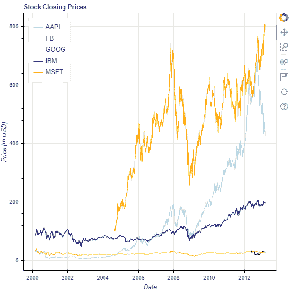

# Python Bokeh–可视化股票数据

> 原文:[https://www . geesforgeks . org/python-bokeh-visualizing-stock-data/](https://www.geeksforgeeks.org/python-bokeh-visualizing-stock-data/)

Bokeh 是一个 Python 交互式数据可视化工具。它使用 HTML 和 JavaScript 来渲染它的图。它以现代网络浏览器为呈现目标，提供优雅、简洁的新颖图形结构和高性能交互性。
Bokeh 可以用来可视化股市数据。使用`plotting`模块进行可视化。这里我们将使用博克给我们的样本股票数据集。

## 正在下载数据集:

要下载示例数据集，请在命令行上运行以下命令:

```
bokeh sampledata
```

或者，我们也可以执行以下 Python 代码:

```
import bokeh
bokeh.sampledata.download()

```

## 分析数据集:

在博凯提供的样本数据中，有以下公司股票的数据集:

*   苹果是哪个 AAPL
*   脸书是哪一个
*   谷歌是哪个谷歌
*   国际商用机器公司
*   MSFT 是微软公司

所有这些数据集都可以作为 CSV 文件使用。下面是对 IBM.csv 文件的一瞥:

```
Date        Open    High    Low    Close    Volume        Adj Close
01-03-2000    102    105.5    100.06    100.25    10807800    84.48
02-03-2000    100.5    105.44    99.5    103.12    11192900    86.9
03-03-2000    107.25    110    106.06    108    10162800    91.01
06-03-2000    109.94    111    101    103.06    10747400    86.85
07-03-2000    106    107    101.69    103    10035100    86.8

```

该文件包含 2000 年至 2013 年间的股票数据，有 3000 多个条目。

## 可视化股票:

我们将绘制一个线图，跟踪所有 5 家公司 2000 年至 2013 年间的股票收盘价。

1.  导入所需的模块:
    *   numpy
    *   图，输出文件和显示来自 bokeh .标绘
    *   来自 bokeh.sampledata.stocks 的 AAPL、FB、GOOG、IBM 和 MSFT
2.  用标题和轴类型实例化图形对象。
3.  给 x 轴和 y 轴命名。
4.  绘制所有 5 家公司的折线图。
5.  显示模型。

```
# importing the modules
import numpy as np
from bokeh.plotting import figure, output_file, show
from bokeh.sampledata.stocks import AAPL, FB, GOOG, IBM, MSFT

# the file to save the model
output_file("gfg.html")

# instantiating the figure object
graph = figure(x_axis_type = "datetime", title = "Stock Closing Prices")

# name of the x-axis
graph.xaxis.axis_label = 'Date'

# name of the y-axis
graph.yaxis.axis_label = 'Price (in USD)'

# plotting the line graph for AAPL
x_axis_coordinates = np.array(AAPL['date'], dtype = np.datetime64)
y_axis_coordinates = AAPL['adj_close']
color = "lightblue"
legend_label = 'AAPL'
graph.line(x_axis_coordinates,
        y_axis_coordinates,
        color = color,
        legend_label = legend_label)

# plotting the line graph for FB
x_axis_coordinates = np.array(FB['date'], dtype = np.datetime64)
y_axis_coordinates = FB['adj_close']
color = "black"
legend_label = 'FB'
graph.line(x_axis_coordinates,
        y_axis_coordinates,
        color = color,
        legend_label = legend_label)

# plotting the line graph for GOOG
x_axis_coordinates = np.array(GOOG['date'], dtype = np.datetime64)
y_axis_coordinates = GOOG['adj_close']
color = "orange"
legend_label = 'GOOG'
graph.line(x_axis_coordinates,
        y_axis_coordinates,
        color = color,
        legend_label = legend_label)

# plotting the line graph for IBM
x_axis_coordinates = np.array(IBM['date'], dtype = np.datetime64)
y_axis_coordinates = IBM['adj_close']
color = "darkblue"
legend_label = 'IBM'
graph.line(x_axis_coordinates,
        y_axis_coordinates,
        color = color,
        legend_label = legend_label)

# plotting the line graph for MSFT
x_axis_coordinates = np.array(MSFT['date'], dtype = np.datetime64)
y_axis_coordinates = MSFT['adj_close']
color = "yellow"
legend_label = 'MSFT'
graph.line(x_axis_coordinates,
        y_axis_coordinates,
        color = color,
        legend_label = legend_label)

# relocating the legend table to 
# avoid abstruction of the graph
graph.legend.location = "top_left"

# displaying the model
show(graph)
```

**输出:**
