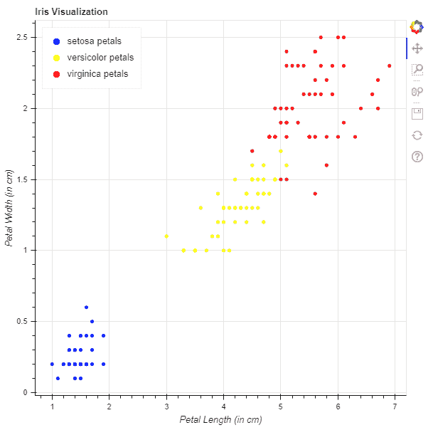
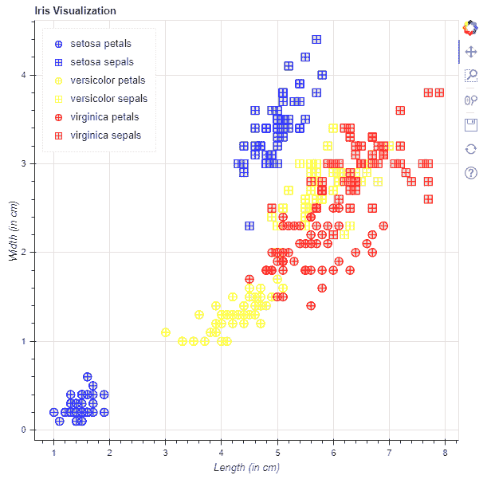

# Python Bokeh–可视化虹膜数据集

> 原文:[https://www . geesforgeks . org/python-bokeh-visiting-the-iris-dataset/](https://www.geeksforgeeks.org/python-bokeh-visualizing-the-iris-dataset/)

Bokeh 是一个 Python 交互式数据可视化工具。它使用 HTML 和 JavaScript 来渲染它的图。它以现代网络浏览器为呈现目标，提供优雅、简洁的新颖图形结构和高性能交互性。

Bokeh 可用于可视化鸢尾花数据集。使用`plotting`模块进行可视化。这里我们将使用博克给我们的虹膜数据集。

## 正在下载数据集:

要下载 Iris 数据集，请在命令行上运行以下命令:

```
bokeh sampledata
```

或者，我们也可以执行以下 Python 代码:

```
import bokeh
bokeh.sampledata.download()

```

## 分析数据集:

在 Bokeh 提供的样本数据中，有一个文件 iris.csv，这就是 iris 数据集。下面是 iris.csv 文件的一瞥:

```
sepal_length    sepal_width    petal_length    petal_width    species
5.1        3.5        1.4        0.2        setosa
4.9        3        1.4        0.2        setosa
4.7        3.2        1.3        0.2        setosa
4.6        3.1        1.5        0.2        setosa
5        3.6        1.4        0.2        setosa

```

数据集包含 5 个属性，它们是:

*   萼片长厘米
*   萼片 _ 宽度(厘米)
*   花瓣长度(厘米)
*   花瓣宽度(厘米)
*   种有 3 种类型的花种:
    *   感觉很好
    *   杂色的
    *   处女座

每个物种有 50 个记录，条目总数为 150 个。

## 可视化数据集:

我们将绘制图表来可视化所有 3 个物种的数据聚类。

**示例 1 :** 这里将绘制以花瓣长度为 x 轴、花瓣宽度为 y 轴的图形。

1.  导入所需的模块:
    *   图，输出文件和显示来自 bokeh .标绘
    *   来自 bokeh.sampledata.iris 的花
2.  用标题实例化一个图形对象。
3.  给 x 轴和 y 轴命名。
4.  绘制所有 3 个物种的图表。
5.  显示模型。

```
# importing the modules
from bokeh.sampledata.iris import flowers
from bokeh.plotting import figure, show, output_file

# file to save the model
output_file("gfg.html")

# instantiating the figure object
graph = figure(title = "Iris Visualization")

# labeling the x-axis and the y-axis
graph.xaxis.axis_label = "Petal Length (in cm)"
graph.yaxis.axis_label = "Petal Width (in cm)"

# plotting for setosa petals
x = flowers[flowers["species"] == "setosa"]["petal_length"]
y = flowers[flowers["species"] == "setosa"]["petal_width"]
color = "blue"
legend_label = "setosa petals"
graph.circle(x, y,
             color = color,
             legend_label = legend_label)

# plotting for versicolor petals
x = flowers[flowers["species"] == "versicolor"]["petal_length"]
y = flowers[flowers["species"] == "versicolor"]["petal_width"]
color = "yellow"
legend_label = "versicolor petals"
graph.circle(x, y,
             color = color,
             legend_label = legend_label)

# plotting for virginica petals
x = flowers[flowers["species"] == "virginica"]["petal_length"]
y = flowers[flowers["species"] == "virginica"]["petal_width"]
color = "red"
legend_label = "virginica petals"
graph.circle(x, y,
             color = color,
             legend_label = legend_label)

# relocating the legend table to 
# avoid abstruction of the graph
graph.legend.location = "top_left"

# displaying the model
show(graph)
```

**输出:**


**示例 2 :** 这里将绘制一个散点图，萼片和花瓣都以长度为 x 轴，宽度为 y 轴。

1.  导入所需的模块:
    *   图，输出文件和显示来自 bokeh .标绘
    *   来自 bokeh.sampledata.iris 的花
2.  用标题实例化一个图形对象。
3.  给 x 轴和 y 轴命名。
4.  绘制所有 3 个物种的图表。
5.  显示模型。

```
# importing the modules
from bokeh.sampledata.iris import flowers
from bokeh.plotting import figure, show, output_file

# file to save the model
output_file("gfg.html")

# instantiating the figure object
graph = figure(title = "Iris Visualization")

# labeling the x-axis and the y-axis
graph.xaxis.axis_label = "Length (in cm)"
graph.yaxis.axis_label = "Width (in cm)"

# plotting for setosa petals
x = flowers[flowers["species"] == "setosa"]["petal_length"]
y = flowers[flowers["species"] == "setosa"]["petal_width"]
marker = "circle_cross"
line_color = "blue"
fill_color = "lightblue"
fill_alpha = 0.4
size = 10
legend_label = "setosa petals"
graph.scatter(x, y,
              marker = marker,
              line_color = line_color,
              fill_color = fill_color,
              fill_alpha = fill_alpha,
              size = size,
              legend_label = legend_label)

# plotting for setosa sepals
x = flowers[flowers["species"] == "setosa"]["sepal_length"]
y = flowers[flowers["species"] == "setosa"]["sepal_width"]
marker = "square_cross"
line_color = "blue"
fill_color = "lightblue"
fill_alpha = 0.4
size = 10
legend_label = "setosa sepals"
graph.scatter(x, y,
              marker = marker,
              line_color = line_color,
              fill_color = fill_color,
              fill_alpha = fill_alpha,
              size = size,
              legend_label = legend_label)

# plotting for versicolor petals
x = flowers[flowers["species"] == "versicolor"]["petal_length"]
y = flowers[flowers["species"] == "versicolor"]["petal_width"]
marker = "circle_cross"
line_color = "yellow"
fill_color = "lightyellow"
fill_alpha = 0.4
size = 10
legend_label = "versicolor petals"
graph.scatter(x, y,
              marker = marker,
              line_color = line_color,
              fill_color = fill_color,
              fill_alpha = fill_alpha,
              size = size,
              legend_label = legend_label)

# plotting for versicolor sepals
x = flowers[flowers["species"] == "versicolor"]["sepal_length"]
y = flowers[flowers["species"] == "versicolor"]["sepal_width"]
marker = "square_cross"
line_color = "yellow"
fill_color = "lightyellow"
fill_alpha = 0.4
size = 10
legend_label = "versicolor sepals"
graph.scatter(x, y,
              marker = marker,
              line_color = line_color,
              fill_color = fill_color,
              fill_alpha = fill_alpha,
              size = size,
              legend_label = legend_label)

# plotting for virginica petals
x = flowers[flowers["species"] == "virginica"]["petal_length"]
y = flowers[flowers["species"] == "virginica"]["petal_width"]
marker = "circle_cross"
line_color = "red"
fill_color = "lightcoral"
fill_alpha = 0.4
size = 10
legend_label = "virginica petals"
graph.scatter(x, y,
              marker = marker,
              line_color = line_color,
              fill_color = fill_color,
              fill_alpha = fill_alpha,
              size = size,
              legend_label = legend_label)

# plotting for virginica sepals
x = flowers[flowers["species"] == "virginica"]["sepal_length"]
y = flowers[flowers["species"] == "virginica"]["sepal_width"]
marker = "square_cross"
line_color = "red"
fill_color = "lightcoral"
fill_alpha = 0.4
size = 10
legend_label = "virginica sepals"
graph.scatter(x, y,
              marker = marker,
              line_color = line_color,
              fill_color = fill_color,
              fill_alpha = fill_alpha,
              size = size,
              legend_label = legend_label)

# relocating the legend table to 
# avoid abstruction of the graph
graph.legend.location = "top_left"

# displaying the model
show(graph)
```

**输出:**
