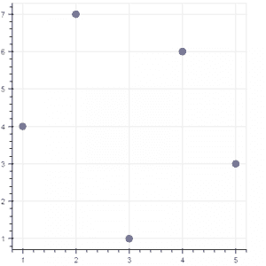
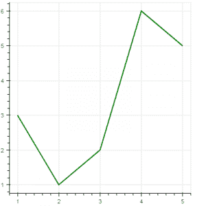
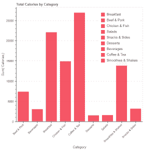
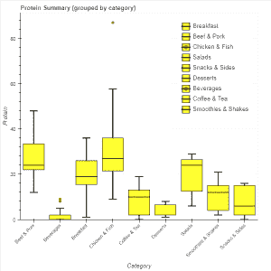
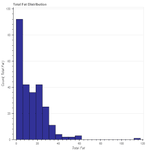
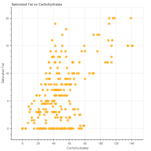

# Python–使用 Bokeh 的数据可视化

> 原文:[https://www . geesforgeks . org/python-数据-可视化-使用-bokeh/](https://www.geeksforgeeks.org/python-data-visualization-using-bokeh/)

***Bokeh*** 是 Python 中的数据可视化库，提供高性能的交互式图表和绘图。Bokeh 输出可以通过笔记本、html、服务器等多种媒介获得。可以在 Django 和 flask 应用程序中嵌入 bokeh 地块。

博凯为用户提供了两个可视化界面:

> **bokeh.models** :为应用开发者提供高度灵活性的低级接口。
> **bokeh .标绘**:创建可视化字形的高级界面。

要安装 bokeh 包，请在终端中运行以下命令:

```
pip install bokeh
```

用于生成 bokeh 图的数据集是从 [Kaggle](https://www.kaggle.com/mcdonalds/nutrition-facts) 收集的。

**代码#1:** 散点标记
要创建散点圆形标记，请使用圆形()方法。

```
# import modules
from bokeh.plotting import figure, output_notebook, show

# output to notebook
output_notebook()

# create figure
p = figure(plot_width = 400, plot_height = 400)

# add a circle renderer with
# size, color and alpha
p.circle([1, 2, 3, 4, 5], [4, 7, 1, 6, 3], 
         size = 10, color = "navy", alpha = 0.5)

# show the results
show(p) 
```

**输出:**



**代码#2:** 单行
要创建单行，使用 line()方法。

```
# import modules
from bokeh.plotting import figure, output_notebook, show

# output to notebook
output_notebook()

# create figure
p = figure(plot_width = 400, plot_height = 400)

# add a line renderer
p.line([1, 2, 3, 4, 5], [3, 1, 2, 6, 5], 
        line_width = 2, color = "green")

# show the results
show(p)
```

**输出:**


**代码#3:** 条形图
条形图用矩形条表示分类数据。条形的长度与所表示的值成比例。

```
# import necessary modules
import pandas as pd
from bokeh.charts import Bar, output_notebook, show

# output to notebook
output_notebook()

# read data in dataframe
df = pd.read_csv(r"D:/kaggle/mcdonald/menu.csv")

# create bar
p = Bar(df, "Category", values = "Calories",
        title = "Total Calories by Category", 
                        legend = "top_right")

# show the results
show(p)
```

**输出:**


**代码#4:** 箱线图
箱线图用于表示图中的统计数据。它有助于总结数据中存在的各种数据组的统计属性。

```
# import necessary modules
from bokeh.charts import BoxPlot, output_notebook, show
import pandas as pd

# output to notebook
output_notebook()

# read data in dataframe
df = pd.read_csv(r"D:/kaggle / mcdonald / menu.csv")

# create bar
p = BoxPlot(df, values = "Protein", label = "Category", 
            color = "yellow", title = "Protein Summary (grouped by category)",
             legend = "top_right")

# show the results
show(p)
```

**输出:**


**代码#5:** 直方图
直方图用于表示数值数据的分布。直方图中矩形的高度与类间隔中值的出现频率成正比。

```
# import necessary modules
from bokeh.charts import Histogram, output_notebook, show
import pandas as pd

# output to notebook
output_notebook()

# read data in dataframe
df = pd.read_csv(r"D:/kaggle / mcdonald / menu.csv")

# create histogram
p = Histogram(df, values = "Total Fat",
               title = "Total Fat Distribution", 
               color = "navy")

# show the results
show(p) 
```

**输出:**


**代码#6:** 散点图
散点图用于绘制数据集中两个变量的值。它有助于找到所选的两个变量之间的相关性。

```
# import necessary modules
from bokeh.charts import Scatter, output_notebook, show
import pandas as pd

# output to notebook
output_notebook()

# read data in dataframe
df = pd.read_csv(r"D:/kaggle / mcdonald / menu.csv")

# create scatter plot
p = Scatter(df, x = "Carbohydrates", y = "Saturated Fat",
            title = "Saturated Fat vs Carbohydrates",
            xlabel = "Carbohydrates", ylabel = "Saturated Fat",
            color = "orange")

# show the results
show(p) 
```

**输出:**


**参考文献:**[https://bokeh.pydata.org/en/latest/](https://bokeh.pydata.org/en/latest/)