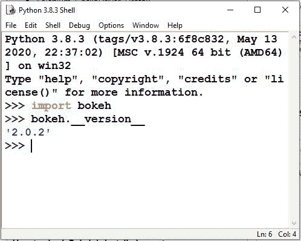

# Python–设置博克环境

> 原文:[https://www . geesforgeks . org/python-setting-the-bokeh-environment/](https://www.geeksforgeeks.org/python-setting-up-the-bokeh-environment/)

**Bokeh** 在 **CPython** 版本 **3.6+** 上仅支持标准发行版和蟒蛇发行版。其他 Python 版本或实现可能起作用，也可能不起作用。 **Bokeh 当前版本为 2.0.2** 。Bokeh 包具有以下依赖项:

**1。必需的依赖关系**

*   皮尤三点十分
*   python-dateutil>=2.1
*   Jinja2>=2.7
*   数值> =1.11.3
*   枕头> =4.0
*   包装> =16.8
*   龙卷风> =5
*   键入扩展名> =3.7.4

**2。可选依赖关系**

*   朱皮特
*   NodeJS(节点名称)
*   网络 x
*   熊猫
*   psutil
*   硒，壁虎河，火狐
*   狮身人面像

## **如何安装 bokeh 包？**

安装 Bokeh 有几种不同的方法。如果您使用的是 Anaconda 发行版，请使用 conda 包管理器，如下所示？

```
conda install bokeh

```

这将安装所有需要运行 Bokeh 的依赖项。如果安装了上述所有依赖项，如 NumPy、Pandas 和 Redis，那么您可以在命令行使用 pip 从 PyPI 安装 bokeh 包:

```
pip install bokeh

```

## **如何检查 Bokeh 是否安装？**

要检查 Bokeh 是否安装成功，请执行以下操作:

*   在 Python 终端中导入 bokeh 包
*   检查 bokeh 版本

