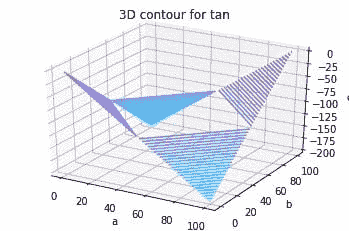

# 使用 Matplotlib 在 Python 中绘制三维轮廓

> 原文:[https://www . geesforgeks . org/3d-python 中的等高线绘制-使用-matplotlib/](https://www.geeksforgeeks.org/3d-contour-plotting-in-python-using-matplotlib/)

**引入 Matplotlib** 时谨记，只有二维标绘。但是在 1.0 发布的时候，3d 实用程序是在 2d 的基础上开发的，因此，我们今天有了 3d 的数据实现！通过导入 **mplot3d** 工具包启用 3d 绘图。让我们看一个 3d 余弦函数的 3d 轮廓图。代码附后供参考。

| 函数参数 | 描述 |
| --- | --- |
| 网栅 | numpy 函数，用于从两个给定的一维数组中创建一个矩形网格，表示笛卡尔索引或矩阵索引 |
| plt.axes() | 创建轴的对象 |
| ax 轮廓 | 形成轮廓 |
| ax.set_xlabel 系列 | 标记 X 轴 |
| ax.set_title | 给这个情节命名 |

**例 1:**

```py
from mpl_toolkits import mplot3d
import numpy as np
import matplotlib.pyplot as plt
from matplotlib import cm
import math

x = [i for i in range(0, 200, 100)]
y = [i for i in range(0, 200, 100)]

X, Y = np.meshgrid(x, y)
Z = []
for i in x:
    t = []
    for j in y:
        t.append(math.cos(math.sqrt(i*2+j*2)))
    Z.append(t)

fig = plt.figure()
ax = plt.axes(projection='3d')
ax.contour3D(X, Y, Z, 50, cmap=cm.cool)
ax.set_xlabel('a')
ax.set_ylabel('b')
ax.set_zlabel('c')
ax.set_title('3D contour for cosine')
plt.show()
```

**输出:**


**例 2:** 为了更好地理解概念，我们再来看另一个 3d 图。这一次，3d tan 功能。

```py
from mpl_toolkits import mplot3d
import numpy as np
import matplotlib.pyplot as plt
from matplotlib import cm
import math

x = [i for i in range(0, 200, 100)]
y = [i for i in range(0, 200, 100)]

X, Y = np.meshgrid(x, y)
Z = []
for i in x:
    t = []
    for j in y:
        t.append(math.tan(math.sqrt(i*2+j*2)))
    Z.append(t)

fig = plt.figure()
ax = plt.axes(projection='3d')
ax.contour3D(X, Y, Z, 50, cmap=cm.cool)
ax.set_xlabel('a')
ax.set_ylabel('b')
ax.set_zlabel('c')
ax.set_title('3D contour for tan')
plt.show()
```

**输出:**
