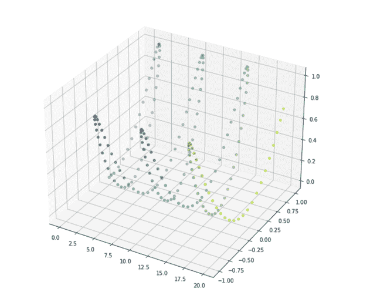
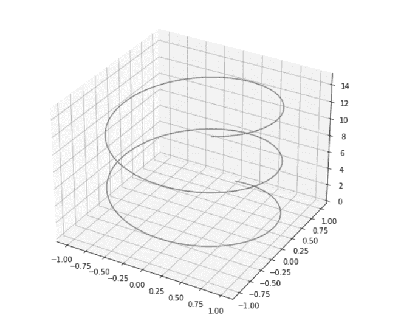

# 使用 Matplotlib–Python 的三维正弦波

> 原文:[https://www . geesforgeks . org/3d-正弦波-使用-matplotlib-python/](https://www.geeksforgeeks.org/3d-sine-wave-using-matplotlib-python/)

**前提条件:**[【mathplotlib】](https://www.geeksforgeeks.org/python-introduction-matplotlib/)、[【num py】](https://www.geeksforgeeks.org/numpy-in-python-set-1-introduction/)

在笛卡尔坐标系中，三角正弦函数 sin(x) sin (x)生成一条规则的起伏曲线，该曲线穿过原点。在本文中，我们将使用三维散射绘制正弦波图。用 matplotlib 在 python 中绘制正弦波的一种简单方法。

**进场:**

*   导入所需的库。
*   创建点的数组。
*   绘制三维图形。
*   制造一个罪恶的浪潮。
*   显示图表。

**示例 1:** 在此示例中，我们使用散射方法绘制了正弦波信号的三维图。

## 蟒蛇 3

```
import numpy as np
import matplotlib.pyplot as plt
from mpl_toolkits.mplot3d import Axes3D

# Creating array points using numpy
x = np.arange(0, 20, 0.1)
y = np.sin(x)
z = y*np.sin(x)
c = x + y

#Change the Size of Graph using Figsize
fig = plt.figure(figsize = (10, 10))

#Generating a 3D sine wave
ax = plt.axes(projection = '3d')

# To create a scatter graph
ax.scatter(x, y, z, c = c)

# show the graph 
plt.show()
```

**输出:**



**示例 2:** 在本例中，我们绘制了正弦波信号的简单三维线图。

## 蟒蛇 3

```
from mpl_toolkits import mplot3d
import numpy as np
import matplotlib.pyplot as plt

fig = plt.figure(figsize=(8, 8))
ax = plt.axes(projection = '3d')

# Creating array points using numpy
z = np.linspace(0, 15, 1000)
x = np.sin(zline)
y = np.cos(zline)
ax.plot3D(x, y, z, 'gray')

plt.show()
```

**输出:**

