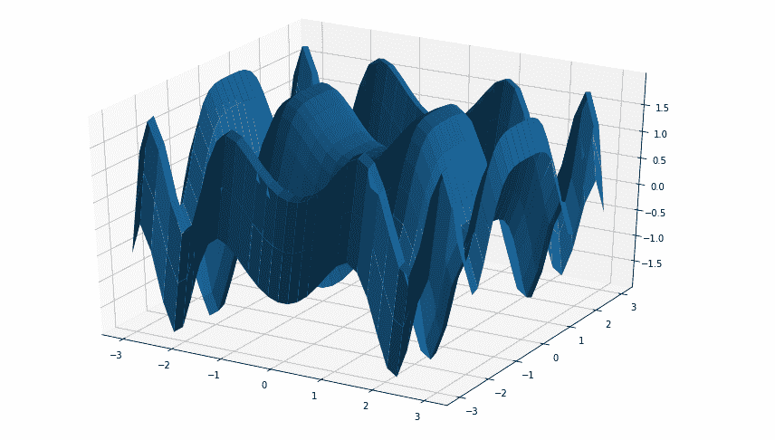
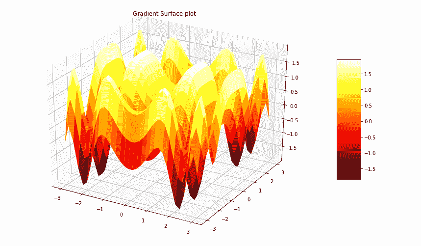
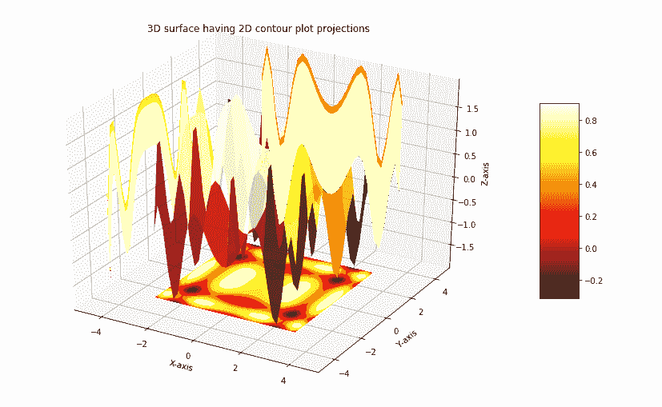

# 使用 Matplotlib 在 Python 中绘制三维曲面

> 原文:[https://www . geesforgeks . org/3d-surface-python 绘图-使用-matplotlib/](https://www.geeksforgeeks.org/3d-surface-plotting-in-python-using-matplotlib/)

一个**曲面图**是一个三维数据集的表示。它描述了两个自变量 X 和 Z 与一个指定因变量 Y 之间的函数关系，而不是显示单个数据点。这是等高线图的配套图。它类似于线框图，但线框的每个面都是一个填充的多边形。这有助于创建正在可视化的曲面拓扑。

## 创建三维曲面图

Matplotlib 的 mpl_toolkits.mplot3d toolkit 中的 axes3d 提供了用于创建 3d 曲面图的必要功能。使用 ax.plot_surface()函数创建曲面图。
**语法:**

```py
ax.plot_surface(X, Y, Z)
```

其中 X 和 Y 是 X 和 Y 点的 2D 阵列，而 Z 是高度的 2D 阵列。ax.plot_surface()函数的更多属性如下:

<figure class="table">

| 属性 | 描述 |
| --- | --- |
| x，Y，Z | 数据值的 2D 数组 |
| cstrike | 列间距数组(步长) |
| 进展 | 行步幅数组(步长) |
| 数数 | 要使用的列数，默认值为 50 |
| rcount 系统 | 要使用的行数，默认值为 50 |
| 颜色 | 表面颜色 |
| cmap | 表面的颜色图 |
| 标准 | 实例来规范化颜色映射的值 |
| 虚拟机(VMM) | 地图最小值 |
| vmax | 地图的最大值 |
| facecolors(面颜色) | 单个表面的表面颜色 |
| 阴影 | 使脸部颜色变深 |

</figure>

**示例:**让我们使用上面的函数创建一个 3D 表面

## 蟒蛇 3

```py
# Import libraries
from mpl_toolkits import mplot3d
import numpy as np
import matplotlib.pyplot as plt

# Creating dataset
x = np.outer(np.linspace(-3, 3, 32), np.ones(32))
y = x.copy().T # transpose
z = (np.sin(x **2) + np.cos(y **2) )

# Creating figure
fig = plt.figure(figsize =(14, 9))
ax = plt.axes(projection ='3d')

# Creating plot
ax.plot_surface(x, y, z)

# show plot
plt.show()
```

**输出:**



## 梯度表面图

渐变曲面图是三维曲面图与 2D 等高线图的组合。在此图中，三维表面像 2D 等高线图一样着色。表面高的部分与表面低的部分包含不同的颜色。
**语法:**

> surf = ax.plot_surface(X，Y，Z，cmap=，线宽=0，抗锯齿=False)

属性 cmap=表示表面的颜色。也可以通过调用 fig.colorbar 来添加颜色条，下面的代码创建一个渐变表面图:
**示例:**

## 蟒蛇 3

```py
# Import libraries
from mpl_toolkits import mplot3d
import numpy as np
import matplotlib.pyplot as plt

# Creating dataset
x = np.outer(np.linspace(-3, 3, 32), np.ones(32))
y = x.copy().T # transpose
z = (np.sin(x **2) + np.cos(y **2) )

# Creating figure
fig = plt.figure(figsize =(14, 9))
ax = plt.axes(projection ='3d')

# Creating color map
my_cmap = plt.get_cmap('hot')

# Creating plot
surf = ax.plot_surface(x, y, z,
                       cmap = my_cmap,
                       edgecolor ='none')

fig.colorbar(surf, ax = ax,
             shrink = 0.5, aspect = 5)

ax.set_title('Surface plot')

# show plot
plt.show()
```

**输出:**



## 具有 2D 等高线图投影的三维表面图

使用 Matplotlib 绘制的三维曲面图可以投影到 2D 曲面上。下面的代码创建了一个三维图，并将其在 2D 等高线图上的投影可视化:
**示例:**

## 蟒蛇 3

```py
# Import libraries
from mpl_toolkits import mplot3d
import numpy as np
import matplotlib.pyplot as plt

# Creating dataset
x = np.outer(np.linspace(-3, 3, 32), np.ones(32))
y = x.copy().T # transpose
z = (np.sin(x **2) + np.cos(y **2) )

# Creating figure
fig = plt.figure(figsize =(14, 9))
ax = plt.axes(projection ='3d')

# Creating color map
my_cmap = plt.get_cmap('hot')

# Creating plot
surf = ax.plot_surface(x, y, z,
                       rstride = 8,
                       cstride = 8,
                       alpha = 0.8,
                       cmap = my_cmap)
cset = ax.contourf(x, y, z,
                   zdir ='z',
                   offset = np.min(z),
                   cmap = my_cmap)
cset = ax.contourf(x, y, z,
                   zdir ='x',
                   offset =-5,
                   cmap = my_cmap)
cset = ax.contourf(x, y, z,
                   zdir ='y',
                   offset = 5,
                   cmap = my_cmap)
fig.colorbar(surf, ax = ax,
             shrink = 0.5,
             aspect = 5)

# Adding labels
ax.set_xlabel('X-axis')
ax.set_xlim(-5, 5)
ax.set_ylabel('Y-axis')
ax.set_ylim(-5, 5)
ax.set_zlabel('Z-axis')
ax.set_zlim(np.min(z), np.max(z))
ax.set_title('3D surface having 2D contour plot projections')

# show plot
plt.show()
```

**输出:**

