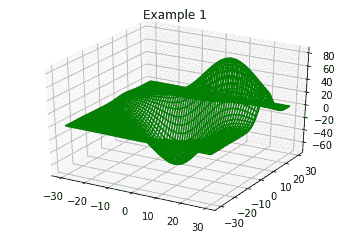
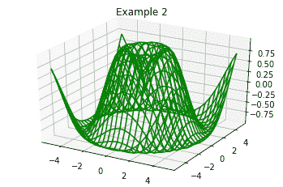

# 使用 Matplotlib 在 Python 中绘制三维线框

> 原文:[https://www . geesforgeks . org/3d-线框-python 绘图-使用-matplotlib/](https://www.geeksforgeeks.org/3d-wireframe-plotting-in-python-using-matplotlib/)

为了创建静态、动态和交互式的数据可视化，我们使用 Python 中的 Matplotlib 模块。以下程序将描绘三维线框。Python 中数据的可视化。为了使用三维线框可视化数据，我们需要来自 matplotlib、mpl _ toolkits 和 numpy 库的一些模块。
**例 1:**

## 蟒蛇 3

```py
# importing modules
from mpl_toolkits.mplot3d import axes3d
from matplotlib import pyplot

# creating the visualization
fig = pyplot.figure()
wf = fig.add_subplot(111, projection='3d')
x, y, z = axes3d.get_test_data(0.05)
wf.plot_wireframe(x,y,z, rstride=2,
                  cstride=2,color='green')

# displaying the visualization
wf.set_title('Example 1')
pyplot.show()
```

**输出:**



在上面的程序中，使用坐标的测试值绘制了一个三维线框。
**例 2:**

## 蟒蛇 3

```py
# importing modules
from mpl_toolkits import mplot3d
import numpy
from matplotlib import pyplot

# assigning coordinates   
a = numpy.linspace(-5, 5, 25)
b = numpy.linspace(-5, 5, 25)
x, y = numpy.meshgrid(a, b)
z = numpy.sin(numpy.sqrt(x**2 + y**2))

# creating the visualization
fig = pyplot.figure()
wf = pyplot.axes(projection ='3d')
wf.plot_wireframe(x, y, z, color ='green')

# displaying the visuliztion
wf.set_title('Example 2')
pyplot.show()
```

**输出:**

