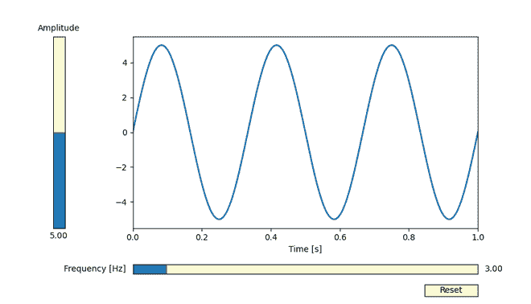
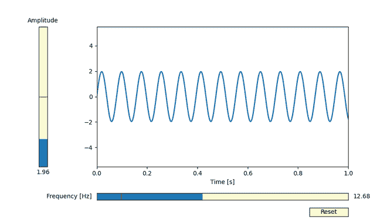
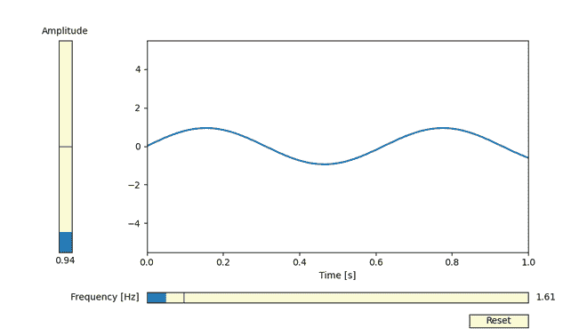

# 用 matplotlib 添加一个垂直滑块

> 原文:[https://www . geesforgeks . org/add-a-垂直滑块带-matplotlib/](https://www.geeksforgeeks.org/add-a-vertical-slider-with-matplotlib/)

[Matplotlib](https://www.geeksforgeeks.org/python-introduction-matplotlib/) 不仅允许静态图形，我们还可以准备可以交互修改的图。为此，我们可以使用微件子模块中的滑块微件来控制绘图的视觉属性。

水平和垂直滑块之间的唯一区别是存在一个默认设置为“水平”的附加参数“方向”。

> amp_slider = Slider(
> 
> ax=axamp，
> 
> 标签=“振幅”，
> 
> 缬氨酸=0，
> 
> valmax=10，
> 
> valinit=init_amplitude，
> 
> 方向=“垂直”#如果需要水平图形，请将其更新为“水平”
> 
> )

**示例:**

在这里，我们将使用滑块小部件创建一个带有滚动条的函数图，该滚动条可用于修改该图。在本例中，两个滑块(一个垂直，一个水平)用于选择正弦波的振幅和频率。我们可以通过这种方式控制我们的地块的许多连续变化的属性。

## 计算机编程语言

```
import numpy as np
import matplotlib.pyplot as plt
from matplotlib.widgets import Slider, Button

# The parameterized function to be plotted
def f(t, amplitude, frequency):
    return amplitude * np.sin(2 * np.pi * frequency * t)

t = np.linspace(0, 1, 1000)

# Defining the initial parameters
init_amplitude = 5
init_frequency = 3

# Creating the figure and the graph line that we will update
fig, ax = plt.subplots()
line, = plt.plot(t, f(t, init_amplitude, init_frequency), lw=2)
ax.set_xlabel('Time [s]')

axcolor = 'lightgoldenrodyellow'
ax.margins(x=0)

# adjusting the main plot to make space for our sliders
plt.subplots_adjust(left=0.25, bottom=0.25)

# Making a horizontally oriented slider to
# control the frequency.
axfreq = plt.axes([0.25, 0.1, 0.65, 0.03], facecolor=axcolor)
freq_slider = Slider(
    ax=axfreq,
    label='Frequency [Hz]',
    valmin=0.1,
    valmax=30,
    valinit=init_frequency,
    # orientation="horizontal" is Default
)

# Making a vertically oriented slider to control the amplitude
axamp = plt.axes([0.1, 0.25, 0.0225, 0.63], facecolor=axcolor)
amp_slider = Slider(
    ax=axamp,
    label="Amplitude",
    valmin=0,
    valmax=10,
    valinit=init_amplitude,
    orientation="vertical"
)

# Function to be rendered anytime a slider's value changes
def update(val):
    line.set_ydata(f(t, amp_slider.val, freq_slider.val))
    fig.canvas.draw_idle()

# Registering the update function with each slider Update
freq_slider.on_changed(update)
amp_slider.on_changed(update)

# Create a `matplotlib.widgets.Button` to reset
# the sliders to initial parameters.
resetax = plt.axes([0.8, 0.025, 0.1, 0.04])
button = Button(resetax, 'Reset', color=axcolor, hovercolor='0.975')

def reset(event):
    freq_slider.reset()
    amp_slider.reset()

button.on_clicked(reset)

plt.show()
```

**输出:**



使用滑块可以有效地控制正弦波形的振幅和频率等连续变化的特性:



从示例图像中我们可以看到，通过使用 Matplotlib 中的滑块子模块，可以在运行时修改绘图。



因此，水平和垂直滑块之间的唯一区别是存在一个附加参数“方向”，该参数默认设置为“水平”，并且在实现您想要的方向时没有区别。