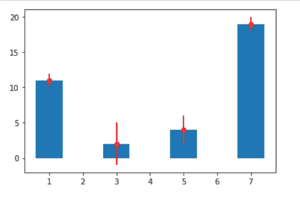
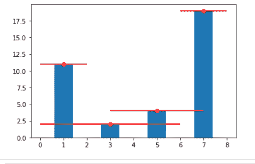
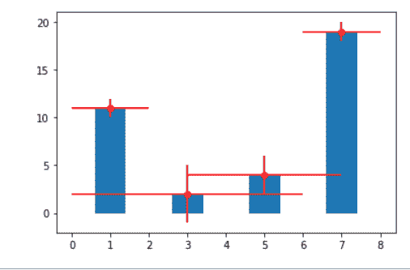
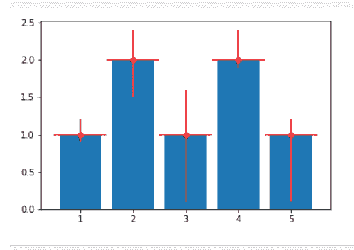

# 向 Matplotlib 条形图添加误差线

> 原文:[https://www . geesforgeks . org/add-error-bar-to-a-matplotlib-bar-plot/](https://www.geeksforgeeks.org/add-error-bars-to-a-matplotlib-bar-plot/)

**先决条件:**T2【马特洛特利

在本文中，我们将使用 Matplotlib 创建一个带有误差线的条形图。误差条形图是表示数据可变性的好方法。它可以应用于图表，为所呈现的数据提供额外的详细信息层。

### **进场:**

*   导入所需的 python 库。
*   制作简单的数据。
*   使用 plt.errorbar()函数绘图
*   显示图表

matplotlib 库 pyplot 模块中的 [【误差线()】](https://www.geeksforgeeks.org/matplotlib-pyplot-errorbar-in-python/) 功能用于将 y 对 x 绘制为带有附加误差线的线条和/或标记。

> ***语法:**matplotlib . pyplot . error bar(x，y，yerr=None，xerr=None，fmt= "，ecolor=None，elinewidth =None，倾覆= None，barsabove=False，lolims=False，uplims=False，xlolims=False，xuplims=False，errorevery = 1，capthick=None，*，data=None，*\*kwargs)*
> 
> ***参数:**该方法接受以下描述的参数:*
> 
> *   ***x，y:这些参数**是数据点的水平和垂直坐标。*
> *   ***ecolor:** 此参数为可选参数。它是 errorbar 线条的颜色，默认值为 NONE。*
> *   ***埃莉诺:**此参数也是可选参数。它是 errorbar 行的线宽，默认值为 NONE。*
> *   ***翻船:**这个参数也是可选参数。它是误差线的长度，以磅为单位，默认值为 NONE。*
> *   ***barsabove:** 该参数也是可选参数。它包含布尔值“真”，用于在绘图符号上方绘制误差线。其默认值为“假”。*

下面给出了使用上述方法的实现:

**示例 1:** 在“y”值中添加一些错误。

## 蟒蛇 3

```
# importing matplotlib
import matplotlib.pyplot as plt

# making a simple plot
a = [1, 3, 5, 7]
b = [11, 2, 4, 19]

# Plot scatter here
plt.bar(a, b)

c = [1, 3, 2, 1]

plt.errorbar(a, b, yerr=c, fmt="o", color="r")

plt.show()
```

**输出:**



**示例 2:** 在‘x’值中添加一些错误。

## 蟒蛇 3

```
# importing matplotlib
import matplotlib.pyplot as plt

# making a simple plot
a = [1, 3, 5, 7]
b = [11, 2, 4, 19]

# Plot scatter here
plt.bar(a, b)

c = [1, 3, 2, 1]

plt.errorbar(a, b, xerr=c, fmt="o", color="r")

plt.show()
```

**输出:**



**例 3:**x 和 y 相加误差

## 蟒蛇 3

```
import matplotlib.pyplot as plt

a = [1, 3, 5, 7]
b = [11, 2, 4, 19]

plt.bar(a, b)

c = [1, 3, 2, 1]
d = [1, 3, 2, 1]

plt.errorbar(a, b, xerr=c, yerr=d, fmt="o", color="r")
plt.show()
```

**输出:**



**例 4:** 在 x 和 y 方向添加变量误差

## 蟒蛇 3

```
# importing matplotlib
import matplotlib.pyplot as plt

# making a simple plot
x = [1, 2, 3, 4, 5]
y = [1, 2, 1, 2, 1]

# creating error
y_errormin = [0.1, 0.5, 0.9, 0.1, 0.9]
y_errormax = [0.2, 0.4, 0.6,  0.4, 0.2]

x_error = 0.5

y_error = [y_errormin, y_errormax]

# ploting graph
plt.bar(x, y)

plt.errorbar(x, y,

             yerr=y_error,

             xerr=x_error,

             fmt='o', color="r")  # you can use color ="r" for red or skip to default as blue

plt.show()
```

**输出:**

