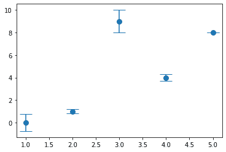
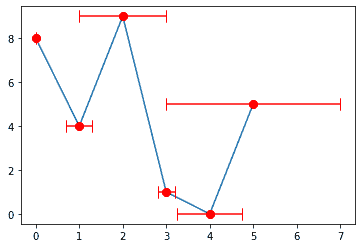
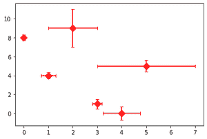

# 在 Matplotlib

中为误差线添加垂直帽

> 原文:[https://www . geeksforgeeks . org/add-vertical-caps-to-error-bar-in-matplotlib/](https://www.geeksforgeeks.org/add-perpendicular-caps-to-error-bars-in-matplotlib/)

**先决条件:**T2【马特洛特利

matplotlib 库 pyplot 模块中的 **errorbar()函数** 用于将 y 对 x 绘制为带有附加 errorbar 的线条和/或标记。对于我们的需求，我们需要特别关注这个函数的倾覆属性。简单地为它提供一个价值将会产生我们需要的功能。

> ***语法:**matplotlib . pyplot . error bar(x，y，yerr=None，xerr=None，fmt= "，ecolor=None，elinewidth =None，倾覆= None，barsabove=False，lolims=False，uplims=False，xlolims=False，xuplims=False，errorevery = 1，capthick=None，*，data=None，*\*kwargs)*
> 
> ***参数:**该方法接受以下描述的参数:*
> 
> *   ***x，y:** 这些参数是数据点的水平和垂直坐标。*
> *   ***fmt:** 该参数为可选参数，包含字符串值。*
> *   ***翻船:**这个参数也是可选参数。它是误差线的长度，以磅为单位，默认值为 NONE。*
> *   ***barsabove:** 该参数也是可选参数。它包含布尔值“真”，用于在绘图符号上方绘制误差线。其默认值为“假”。*
> *   ***错误每:**此参数也是可选参数。它们包含用于在数据子集上绘制误差线的整数值。*

### 方法

*   导入模块
*   创建数据
*   提供错误值
*   将所有值连同翻转属性及其值一起传递给 errorbar()函数
*   显示图

**例 1:**

## 蟒蛇 3

```py
import matplotlib.pyplot as plt

x_values = [5, 4, 3, 2, 1]
y_values = [8, 4, 9, 1, 0]

y_error = [0, 0.3, 1, 0.2, 0.75]

plt.errorbar(x_values, y_values,  yerr=y_error,
             fmt='o', markersize=8, capsize=10)

plt.show()
```

**输出:**



**例 2:**

## 蟒蛇 3

```py
import matplotlib.pyplot as plt

x_values = [0, 1, 2, 3, 4, 5]
y_values = [8, 4, 9, 1, 0, 5]

plt.plot(x_values, y_values)
x_error = [0, 0.3, 1, 0.2, 0.75, 2]

plt.errorbar(x_values, y_values,  xerr=x_error,
             fmt='o', markersize=8, capsize=6, color="r")

plt.show()
```

**输出:**



**例 3:**

## 蟒蛇 3

```py
import matplotlib.pyplot as plt

x_values = [0, 1, 2, 3, 4, 5]
y_values = [8, 4, 9, 1, 0, 5]

x_error = [0, 0.3, 1, 0.2, 0.75, 2]
y_error = [0.3, 0.3, 2, 0.5, 0.7, 0.6]

plt.errorbar(x_values, y_values,  xerr=x_error, yerr=y_error,
             fmt='D', markersize=8, capsize=3, color="r")

plt.show()
```

**输出:**

