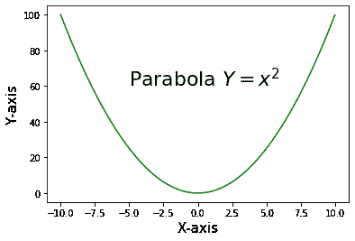
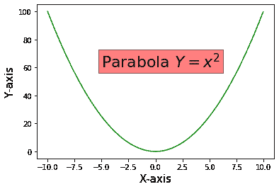
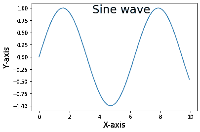
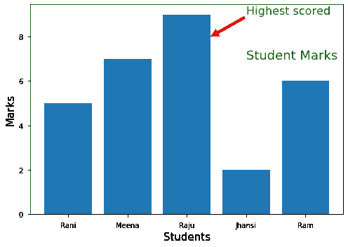

# 在 Matplotlib 中的图内添加文本

> 原文:[https://www . geesforgeks . org/add-text-in-plot-in-matplotlib/](https://www.geeksforgeeks.org/add-text-inside-the-plot-in-matplotlib/)

在本文中，我们将看到如何在 Matplotlib 中添加文本。 [matplotlib.pyplot.text()](https://www.geeksforgeeks.org/matplotlib-pyplot-text-function-in-python/) 函数用于在图内添加文本。该语法在轴的任意位置添加文本。它还支持数学表达式。

> **语法:** matplotlib.pyplot.text(x，y，s，fontdict=None，**kwargs)
> 
> **参数:**
> 
> *   其中 x，y——坐标
> *   s–要添加到绘图中的文本(字符串)
> *   font dict–可选参数。它会覆盖默认的文本属性
> *   * * kwargs–文本属性

**例 1:** 在图内加入数学方程式。

## 蟒蛇 3

```py
import matplotlib.pyplot as plt
import numpy as np

x = np.arange(-10, 10, 0.01)
y = x**2

#adding text inside the plot
plt.text(-5, 60, 'Parabola $Y = x^2{content}apos;, fontsize = 22)

plt.plot(x, y, c='g')

plt.xlabel("X-axis", fontsize = 15)
plt.ylabel("Y-axis",fontsize = 15)

plt.show()
```

**输出:**



**示例 2:** 使用关键字“bbox”在文本周围添加矩形框。bbox 是矩形属性的字典。

## 蟒蛇 3

```py
import matplotlib.pyplot as plt
import numpy as np

x = np.arange(-10, 10, 0.01)
y = x**2

plt.xlabel("X-axis", fontsize = 15)
plt.ylabel("Y-axis",fontsize = 15)

#Adding text inside a rectangular box by using the keyword 'bbox'
plt.text(-5, 60, 'Parabola $Y = x^2{content}apos;, fontsize = 22, 
         bbox = dict(facecolor = 'red', alpha = 0.5))

plt.plot(x, y, c = 'g')

plt.show()
```

**输出:**



**例 3:** 在图内加入文字“正弦波”。

## 蟒蛇 3

```py
import matplotlib.pyplot as plt
import numpy as np

x = np.arange(0, 10, 0.1)
y = np.sin(x)

plt.plot(x,y)

plt.text(3.5, 0.9, 'Sine wave', fontsize = 23)

plt.xlabel('X-axis', fontsize = 15)
plt.ylabel('Y-axis', fontsize = 15)

#plt.grid(True, which='both')
plt.show()
```

**输出:**



**示例 4:** 在绘图中使用注释和文本

## 蟒蛇 3

```py
import matplotlib.pyplot as plt
import numpy as np

x = ['Rani', 'Meena', 'Raju', 'Jhansi', 'Ram']
y = [5, 7, 9, 2, 6]

plt.bar(x,y)

plt.text(3, 7, 'Student Marks', 
         fontsize = 18, color = 'g')

plt.xlabel('Students', fontsize = 15)
plt.ylabel('Marks', fontsize = 15)

plt.annotate('Highest scored', xy = (2.4, 8), 
             fontsize = 16, xytext = (3, 9), 
             arrowprops = dict(facecolor = 'red'),
             color = 'g')

plt.show()
```

**输出:**

